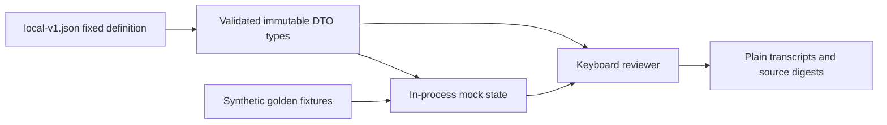

# PromptShield offline contract prototype

## Summary

Throwaway evidence for FSD-PROMPTSHIELD-V1#GOAL-001. This standard-library prototype exercises the approved local DTOs and Bahasa Indonesia keyboard flows using synthetic, in-process mocks. It does not implement the gateway, native authentication, inference, detection, token storage, or executable tool handling.

## High-Level Design



The mock and consumer load the same definition. The production consumer must later derive from the machine contract independently; prototype code is not a production seed.

## Run and verify

From the repository root, inspect an interactive scenario:

```powershell
rtk python .scratch/prototypes/promptshield-ui-v1/review.py --scenario pending --width 80 --plain
rtk python .scratch/prototypes/promptshield-ui-v1/review.py --scenario held --width 120 --plain
rtk python .scratch/prototypes/promptshield-ui-v1/review.py --scenario setup --width 80 --plain
```

Use numbered choices then Enter; `m` opens mode choices, `r` refreshes, `v` toggles metadata verbose, `c` cancels the active synthetic request, `s` stops the mock instance, and `q` disconnects the reviewer. Empty Enter never approves. Ctrl+C cancels the selected pending action and exits. Disconnect leaves a decision pending until its monotonic deadline. Mode changes retain the old selected revision until refresh or rejection so stale choices are visible.

Reproduce TEST-001 and TEST-002:

```powershell
rtk python -m unittest discover -s tests/contracts -p test_local_contract.py
rtk python .scratch/prototypes/promptshield-ui-v1/review.py --scenario-suite --widths 80,120 --evidence-dir .scratch/prototypes/promptshield-ui-v1/evidence
```

The suite uses a fixed clock; interactive review uses monotonic time with a 120-second deadline. Output always uses plain text with explicit focus and warnings. Set width to the physical terminal width; requesting a wider layout allows the host terminal to wrap it. No native Codex stdin is consumed because the reviewer is its own process.

Rebuild the golden catalog only after an authorized contract/fixture change:

```powershell
rtk python tests/contracts/build_fixtures.py
```

## Evidence and next action

[Verification](VERIFICATION.md) records the observed results, scope, source fingerprints, and review classification. [Scenario report](evidence/scenario-report.json) pins versions and digests; neighboring `.txt` files contain the walkthroughs. The offline goal is independent of production readiness. Product-owner review and the unresolved production qualification gates remain with `/sc-ui`, `/sc-prd`, and `/sc-plan`.

Authority: [FSD Sections 7, 8 and GOAL-001](../../../docs/fsd/fsd-promptshield-v1.md), [machine contract](../../../contracts/promptshield/local-v1.json), [fixture catalog](../../../tests/fixtures/synthetic/contracts-v1.json).
