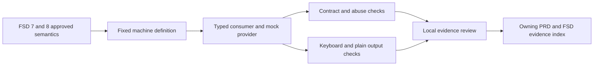

# GOAL-001 offline verification

## Summary

TEST-001 passes 15 tests; TEST-002 passes 46 scenario runs across 23 scenarios at 80 and 120 columns. All twelve PRD UI states have synthetic local evidence. Codex reviewed the contract, consumer/mock wiring and walkthroughs sequentially on 2026-10-04. Classification: **EVIDENCE**, limited to the approved offline enabler. Production integration and product-owner acceptance are not established by this record.

## High-Level Design

## Results and provenance

Environment: Windows 11 x64, observed Python 3.14.7, standard library, synthetic in-process transport, branch `feat/promptshield-v1`. Contract SCHEMA-001/CONTRACT-001 version 1.0.0 and fixture revision 1.0.0. [scenario-report.json](evidence/scenario-report.json) records UTC time, exact environment, commands and SHA-256 fingerprints for the contract, fixture, mock, consumer, UI, tests and fixture builder.

| Check | Actual result |
|---|---|
| `rtk python -m unittest discover -s tests/contracts -p test_local_contract.py` | Exit 0; 15 tests; no failures or skips |
| `rtk python .scratch/prototypes/promptshield-ui-v1/review.py --scenario-suite --widths 80,120 --evidence-dir .scratch/prototypes/promptshield-ui-v1/evidence` | Exit 0; 46 runs; no failures; all UI-STATE-001..012 |
| Golden catalog rebuild parity | Stored catalog equals deterministic builder output |
| Machine/projection parity | Both sides validate requests/responses through SCHEMA-001; echoed identity, operation/result discriminants and receipt semantics checked |

Test-first evidence observed during this session: the initial missing consumer failed the fixed-field test; missing mock failed the CAS test; terminal choice tests failed on NOT_READY before successful dispositions existed; missing fixtures failed the state projection test. Additional regressions failed before correction for receipt version/decision mismatches, absent explicit setup, Ctrl+C inside the mode menu and cancellation of completed requests. The corresponding final tests pass. One early cancellation test reached an AttributeError on a missing success result; an explicit success assertion was added before asserting the receipt, without weakening the required behavior.

## Goal-backward verification

| Observable truth / wiring | Evidence |
|---|---|
| Input is limited to fixed DTO fields, types, IDs, enums, bounds and 64 KiB envelopes | TEST-001 rejects duplicate keys, nonfinite values, invalid UTF-8, unknown operations/fields, bool-as-int, overflow versions, injected metadata and nested bound/allowlist violations |
| A mode/policy change invalidates old pending decisions while preserving a sent snapshot | CAS, version monotonicity and two-client race tests; [stale 80-column walkthrough](evidence/stale-80.txt) |
| Manual, variable, edit and cancel are terminal for the old action | Receipt and replay tests; [manual](evidence/manual-80.txt), [variable](evidence/held-120.txt), [edit](evidence/edit-80.txt); no executable or provider interface exists in the mock |
| Setup requires an explicit choice and communicates exposure | Initial setup regression; [setup](evidence/setup-80.txt), [unsafe mode](evidence/unsafe-120.txt) |
| Errors preserve valid policy and provide safe recovery | Safe exception/no-echo test; [auth](evidence/auth-80.txt), [upstream](evidence/upstream-80.txt), [tool limit](evidence/tool-limit-120.txt), [incomplete stream](evidence/stream-invalid-80.txt) |
| Cancel, disconnect and deadline have distinct finite outcomes | Expiry, idempotent cancel/stop and Ctrl+C tests; [disconnect](evidence/disconnect-80.txt), [Ctrl+C](evidence/ctrl-c-80.txt), [cleanup](evidence/cleanup-120.txt) |
| Essential controls remain readable using keyboard and plain text | All 46 transcripts enforce the configured line width, include Cancel and MOCK markers, and emit no ANSI controls; [long-label keyboard case](evidence/keyboard-80.txt) |

State coverage is local simulation. Loading, readiness and degradation use scripted status snapshots; the suite does not measure Laya timing, native provider streaming, named-pipe permissions, detector quality, map memory cleanup or native terminal concurrency.

## Terminal walkthrough and review

Actual PTY runs used `rtk proxy python .../review.py --scenario pending --width 80 --plain` and `--scenario held --width 80 --plain`. Pending review rejected blank/unknown input, changing mode produced policy version 2, the old choice returned STALE, refresh exposed revision 2, and Cancel ended the action. On the final-source held walkthrough, key `1` returned MANUAL_HANDOFF, showed the manual next action, removed the pending item and displayed CANCELLED/revoked; `q` exited successfully. [Current held PTY transcript](evidence/held-pty-80.txt) retains the observed text after removing host-generated ANSI controls.

At 120 columns, the deterministic plain walkthroughs verify the requested layout. The Windows PTY surface itself was 80 columns and wrapped an earlier requested 120-column layout. Physical 120-column TTY and assistive-technology usability remain product review concerns; the two-width plain evidence does not claim those manual checks.

Read-only `/sc-ui` classification: **EVIDENCE**. No observable product or technical semantic change is proposed. Disposition: **promote decision** for the already-approved choices, stale rejection and terminal handoff semantics, limited to the offline evidence. Retain throwaway code as evidence; do not promote it as product implementation. Owning `/sc-plan` records local schema/derived revisions; `/sc-prd` receives the evidence link while the human experience baseline remains DRAFT.

Review followed the interface-design keyboard/focus and overflow retrieval. Logical focus is printed explicitly; error lines appear adjacent to repeated choices. The UI needs neither color nor cursor rewriting. Web/mobile hover, ARIA and touch requirements are N/A for this native CLI prototype. Review was sequential in-thread, without independent subagent review.

## Security review and limitations

No finding in the inspected offline boundary: DTOs reject value/map/credential/body injection; safe codes have static local recovery text; malformed input raises POLICY_INVALID without echo; immutable DTO collections protect validated snapshots; an instance lock serializes policy/decision mutations. The prototype imports no network client, credential accessor, process launcher or native executable tool adapter. Mock owner/locked-policy flags test simulated rejection only and prove no production authentication.

FSD OPEN-001..006 and OPEN-008 remain unresolved. OPEN-007 now has runnable evidence available, but native placement and user-product-owner review remain pending. Refreshed product readiness exits 1 with verdict BLOCKED only for `baseline` and `open-blockers`; local revision, derived-asset, verification-ref and runnable-evidence checks pass. No framework change was made.

## Next action and references

Review the linked evidence through `/sc-ui` before updating the PRD human baseline. Resolve the upstream/OS/dependency qualification facts before enabling GOAL-002. No live inference, dependency/model installation, user configuration changes, commit or push were performed for this implementation.

Authority: [GOAL-001 and TEST-001/002](../../../docs/fsd/fsd-promptshield-v1.md); [PRD states and acceptance](../../../docs/prd/prd-promptshield-v1.md). Machine identity: [local-v1.json](../../../contracts/promptshield/local-v1.json). Implementation authorization: user `$sc-work .scratch\promptshield-v1\issues\01-local-contract-enabler.md`, 2026-10-04.
