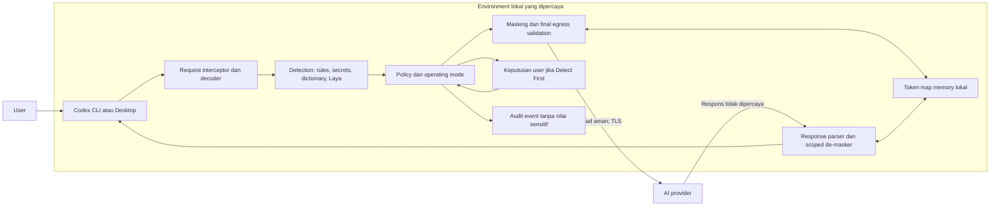
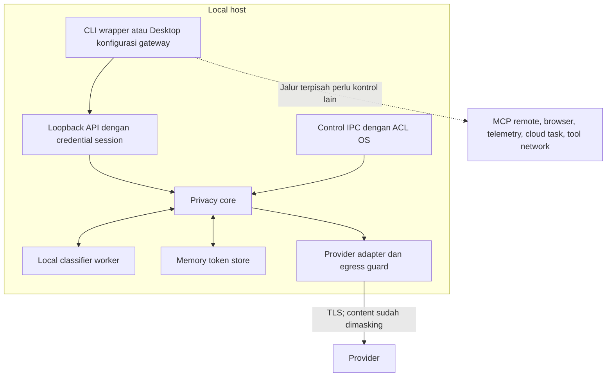
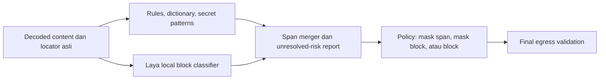

# PromptShield v1 — Business Requirements Document dan Architecture Exploration

## Summary

PromptShield adalah gateway lokal untuk mengurangi pengiriman data sensitif yang tidak disengaja ke AI provider. Jalur utama: periksa payload keluar, terapkan policy, ganti nilai dengan token, simpan pemetaan di memory lokal, kirim payload yang sudah dilindungi, lalu pulihkan token pada teks respons untuk user. Nama produk: **PromptShield**; nama command yang diusulkan: **ai-guard**.

Rekomendasi: satu aplikasi Python dengan proxy Responses API, CLI pengendali, detector deterministik, dan Laya sebagai classifier lokal. Dukungan Codex CLI menjadi MVP; integrasi native Codex Desktop menggunakan gateway yang sama pada fase berikutnya. Semua empat mode masuk MVP. Lifecycle token, log aman, dan isolasi session minimum juga harus masuk MVP karena masking reversible tidak aman tanpa komponen tersebut.

Dokumen ini mencakup 16 keluaran yang diminta, business acceptance, model ancaman, dan daftar keputusan terbuka. Bagian desain adalah **proposal eksplorasi**, belum menjadi kontrak implementasi. Tidak ada klaim accuracy, latency, kompatibilitas runtime, atau compliance yang sudah dibuktikan oleh implementasi.

## Profile Gate

Profile: HIGH_RISK  
Tier: full; trigger: T1, T2 — kemampuan produk baru, data sensitif, dan integrasi eksternal.  
Delivery: BRD → PRD → FSD → GOAL → IMPLEMENTATION → VERIFICATION.  
UI profile proposal: STANDARD untuk terminal/control UI; streaming dan mode switching memerlukan bukti runtime sebelum release.

## Metadata

ID: BRD-PROMPTSHIELD-V1  
Status: APPROVED  
Revision: 1.1 — approval dan keputusan MVP subscription/tool fallback, 2026-10-04.  
Tanggal: 2026-10-04, Asia/Jakarta  
Branch saat eksplorasi: feat/promptshield-v1; belum ada commit.  
Source utama: requirement user “AI Sensitive Data Protection Gateway”, sesi 2026-10-04.  
Approval: user pemohon menyatakan `$sc-prd BRD Approved` pada 2026-10-04 dengan keputusan DEC-001/DEC-002 di bawah. Business scope dan batas MVP disetujui; detail implementasi pada A1–A16 tetap proposal untuk FSD. Approval ini bukan bukti kompatibilitas runtime, penerimaan residual risk legal organisasi, atau izin implementasi.

### Keputusan approved pada handoff PRD

| ID | Keputusan user | Efek pada scope / authority |
|---|---|---|
| DEC-001 | “API belum perlu, pakai subscription chatgpt.” | MVP wajib memakai Codex dengan subscription ChatGPT; jalur API key/billing API ditunda. Proposal API-key A8/A9 digantikan; compatibility dan entitlement masih memerlukan evidence |
| DEC-002 | De-masking teks jawaban diterima; pemulihan otomatis pada tool arguments tidak diizinkan | Tool call yang membutuhkan nilai asli ditahan; pilihan tindakan manual, panduan variable lokal seperti `.env`, atau cancel. Controlled tool restoration masuk pengembangan berikutnya |

Approval provenance: instruksi user pada sesi ini, 2026-10-04. Technical uncertainties tidak ditutup dengan approval bisnis. Guideline `.env` tidak mengizinkan PromptShield menyalin token map ke file atau mengisi secret otomatis.

Konteks lokal: package.json yang diperiksa adalah framework Super Compound, bukan runtime produk PromptShield. Knowledge search menghasilkan referensi framework, bukan desain gateway yang dapat langsung dipakai. Graph MCP gagal dengan `Transport closed`; pemeriksaan konteks memakai dokumen lokal sebagai fallback. Command `codex --version` melalui RTK mengembalikan `codex-cli 0.160.0`. Belum dilakukan request AI, pengujian interception, instalasi dependency/model, atau pengubahan konfigurasi user.

## High-Level Design



Diagram adalah view dari BRD-PROMPTSHIELD-V1:BREQ-001 sampai BREQ-012. Token map tidak memiliki jalur menuju provider atau audit sink.

## Business Contract

### Masalah, tujuan, dan stakeholder

Pengguna coding agent dapat mengirim secret, data pelanggan, atau informasi infrastruktur melalui prompt, konteks repository, serta hasil tool. Perlindungan hanya pada argument prompt tidak mencakup seluruh aliran tersebut. Belum ada baseline insiden, volume request, biaya operasional, atau accuracy detector pada organisasi pengguna.

Tujuan: mengurangi exposure pada jalur model yang dilindungi, mempertahankan kegunaan coding assistant, memberi indikator mode yang jelas, dan menghasilkan bukti kontrol tanpa merekam nilai sensitif. Target kinerja dan kualitas di bagian A14 adalah target usulan untuk evaluasi, bukan hasil pengukuran.

| Peran | Tanggung jawab dan hak keputusan |
|---|---|
| Product owner / user pemohon | Menyetujui scope, mode, keterbatasan UX, dan tahapan release |
| Developer pengguna | Memilih default saat setup dan mode session dalam batas policy organisasi |
| Security owner | Menyetujui trust boundary, exception, cakupan detector, dan residual risk |
| Privacy/legal owner | Menetapkan dasar pemrosesan, sharing, transfer, retensi, DPIA, dan kewajiban hukum |
| Platform/IT owner | Mendistribusikan paket/config, mengelola egress enforcement, upgrade, dan rollback |
| Maintainer/QA | Membuktikan protocol compatibility, kualitas deteksi, isolasi, dan performa |

Role organisasi di atas masih berupa fungsi tanggung jawab; nama pemegang peran ditetapkan sebelum pilot dengan data nyata.

Terminologi: **request** adalah satu pengiriman inference, **turn** adalah satu giliran user yang dapat memicu beberapa request/tool, **thread/conversation** adalah konteks multi-turn, dan **client session** adalah lifetime koneksi logis yang diautentikasi. Token map harus mengikuti conversation scope yang diverifikasi; satu user atau proses dapat memiliki lebih dari satu thread. **Masking** dalam dokumen ini berarti substitusi reversible; **classification signal** tidak sama dengan span entity yang sudah ditemukan.

### Business requirements

| ID | Requirement | Prioritas / increment | Acceptance |
|---|---|---|---|
| BREQ-001 | Periksa seluruh content payload model yang termasuk cakupan adapter sebelum dikirim | Must / MVP | BA-001, BA-006 |
| BREQ-002 | Support detect-first, detect-only, always-mask, off dan pemilihan default saat setup | Must / MVP | BA-002 |
| BREQ-003 | Nilai yang ditetapkan policy sebagai sensitif tidak keluar dalam bentuk asli pada protected request | Must / MVP | BA-001, BA-003 |
| BREQ-004 | Token map lokal, reversible, terisolasi, terbatas kapasitas dan lifecycle | Must / MVP | BA-004 |
| BREQ-005 | Pulihkan token yang sah pada respons user tanpa membuka map kepada provider | Must / MVP | BA-005 |
| BREQ-006 | Fail closed saat pemeriksaan/masking yang diwajibkan gagal | Must / MVP | BA-006 |
| BREQ-007 | Modul deteksi mendukung rules, secrets, custom dictionary, dan evaluasi Laya lokal | Must / MVP | BA-007 |
| BREQ-008 | Codex CLI melalui integration layer yang mencakup multi-turn dan tool-result request | Must / MVP | BA-008 |
| BREQ-009 | Codex Desktop memakai core yang sama dengan bukti kompatibilitas terpisah | Must / fase 2 | BA-009 |
| BREQ-010 | Logging dan audit tidak memuat nilai sensitif, prompt, respons, token map, atau credential | Must / minimum MVP, operasional fase 2 | BA-010 |
| BREQ-011 | Provider abstraction dapat berkembang tanpa mengubah aturan privacy di core | Must / seam MVP, adapter tambahan fase 3 | BA-011 |
| BREQ-012 | Perlindungan lokal dengan overhead terukur, instalasi sederhana dan status yang akurat | Must / MVP | BA-012 |
| BREQ-013 | Policy kategori dapat dikembangkan dan dikelola organisasi | Must / policy dasar MVP, pengelolaan fase 2 | BA-007, BA-013 |
| BREQ-014 | Mendukung evidence kontrol PDP/GDPR/ISO tanpa klaim sertifikasi otomatis | Must / desain dan pilot | BA-014 |
| BREQ-015 | MVP menggunakan subscription ChatGPT melalui Codex, tanpa kebutuhan API key atau fallback ke billing API | Must / MVP; DEC-001 | BA-015 |
| BREQ-016 | Tahan tool call yang membutuhkan nilai asli; sediakan tindakan manual atau panduan variable lokal tanpa auto-restoration | Must / MVP; DEC-002 | BA-016 |

### Scope, aturan, dan non-goals

- Protected modes: `detect-first` dan `always-mask`. `detect-only` dan `off` secara sengaja mengizinkan original content keluar; tampilan wajib menunjukkan kondisi tersebut.
- Pada protected modes, jaminan adalah terhadap **nilai yang terdeteksi atau diwajibkan policy**, pada endpoint/type yang didukung. Tidak menjanjikan deteksi seluruh data sensitif yang mungkin ada.
- Fase 1: traffic inference Codex CLI melalui gateway lokal; input teks, multi-turn replay, SSE, function call/result yang didukung. Fase 2: native Desktop, kontrol organisasi, operasional session. Fase 3: adapter provider/host tambahan.
- Deteksi PII bebas seperti nama/alamat belum boleh disebut lengkap hanya berdasarkan regex. Rilis menyertakan coverage matrix per kategori dan bahasa.
- Default enterprise yang direkomendasikan: `always-mask`. Setup tetap meminta user memilih; jika belum dipilih, protected launch berhenti. `enabled` diturunkan dari mode agar tidak ada dua sumber status yang bertentangan.
- Minimum lifecycle dan audit aman dipindahkan dari fase 2 ke MVP sebagai dependency BREQ-004/010; persistence audit, SIEM, admin policy distribution tetap fase 2.
- Non-goals MVP: API-key provider/billing API, universal desktop interception, TLS MITM, jalur subscription di luar Codex yang belum diverifikasi, cloud agent protection, scanning gambar/audio/binary, controlled secret restoration untuk tool execution, token persistence lintas restart, central multi-tenant vault, dashboard enterprise, dan sertifikasi compliance.
- Gateway tidak menggantikan sandbox, network egress policy, secrets manager, incident response, kontrak provider, atau governance organisasi.
- Prompt/data yang sudah terkirim sebelum gateway aktif tidak dapat ditarik kembali. Mengaktifkan masking belakangan tidak menghapus disclosure terdahulu.

### Alternatif arsitektur

| Opsi | Keuntungan | Kekurangan | Rekomendasi |
|---|---|---|---|
| Proxy provider lokal + wrapper CLI/control | Memeriksa request aktual, multi-turn, tool results; dapat digunakan Desktop | Perlu kompatibilitas protocol dan session metadata | Pilih untuk core produk |
| Wrapper yang hanya mengubah prompt awal | Implementasi kecil dan mudah dicoba | File context/tool output dapat keluar tanpa pemeriksaan; sulit respons/tool streaming | Demo terbatas saja |
| Fork Codex atau interceptor OS/TLS | Potensi kontrol sangat luas | Biaya pemeliharaan, sertifikat, hak akses dan compatibility tinggi | Tunda; hanya bila API resmi tidak cukup |

Rekomendasi dipilih karena kontrol ditempatkan pada payload keluar yang benar-benar dikirim. Interception melalui skill/MCP yang dipanggil agent secara opsional tidak memberikan enforcement terhadap setiap request.

## Architecture Exploration — 16 Keluaran

Bagian A1–A16 menjawab requirement desain user. Rincian interface, schema, angka batas, dan pilihan dependency akan difinalkan dalam PRD/FSD setelah BRD disetujui.

### A1. Product architecture

Satu produk per-user di workstation, terdiri dari command `ai-guard`, proses gateway lokal, dan model worker lokal jika Laya diaktifkan. Core tidak memanggil jaringan; hanya provider adapter yang memiliki egress inference. Tidak membutuhkan database, Redis, message broker, LangChain, atau Kubernetes untuk MVP.

Pisahkan control plane dan data plane. Control plane mengelola setup/status/mode/approval melalui IPC dengan ACL OS. Data plane menerima request Codex yang terautentikasi pada loopback dan meneruskan payload yang lolos policy. Map hanya dapat diakses melalui operasi lookup yang dibatasi konteks; tidak ada endpoint dump map.

MVP dapat menjalankan satu gateway per `ai-guard wrap codex`. Daemon bersama bagi Desktop/session paralel baru dipromosikan setelah bukti isolasi tersedia. Dukungan banyak conversation dalam satu proses Codex bergantung pada metadata session/thread yang diverifikasi; connection TCP atau IP localhost bukan identitas conversation.

### A2. High-Level Design dan batas cakupan



Cakupan pemeriksaan: user/assistant messages yang direplay, instructions, text content, function-call arguments pada outbound history, function-call outputs, teks file yang di-inline, tool description/schema bila membawa content organisasi, dan metadata yang dapat diisi user. Parse dengan schema; jangan regex seluruh JSON atau mengganti semua string secara membabi buta.

Field routing/protocol seperti `type`, role, item ID, call ID, enum dan model harus divalidasi sebagai metadata. Jika field semacam ini memuat sensitive content yang tidak bisa diganti tanpa merusak protocol, blokir. Custom model/tool name dapat mengungkap nama proyek; katalog organisasi harus direview.

Endpoint/type yang belum didukung, file reference/upload, remote image URL, binary/base64 attachment, encrypted context tanpa provenance, dan body yang tidak dapat dibaca: blokir pada protected mode. Opaque provider-generated artifact hanya dapat direplay tanpa transformasi bila provenance dan binding conversation terbukti; sebelum itu fitur yang memerlukannya dinonaktifkan. Jangan menganggap URL/file ID aman karena bukan teks prompt.

Untuk MVP HTTP Responses, gunakan replay context. Nonaktifkan WebSocket, incremental continuation yang belum dibuktikan, background mode, dan provider-hosted tools yang dapat memperoleh original data di luar gateway. Endpoint compaction/token counting/upload perlu adapter dan verifikasi tersendiri bila dipakai client; tidak boleh diteruskan tanpa inspection.

OpenAI mensyaratkan Responses compatibility mencakup SSE, continuation, serta function call/output pairing. Health check dan satu respons teks tidak membuktikan kompatibilitas tersebut. [Gateway compatibility requirements](https://learn.chatgpt.com/docs/enterprise/gateway-compatibility).

### A3. Component architecture dan interface proposal

| Komponen | Interface konseptual | Tanggung jawab dan data yang diterima |
|---|---|---|
| Host adapter / interceptor | decode(request) → envelope | Autentikasi lokal, session binding, inventory field/content, batas body |
| Detection coordinator | inspect(content, policy) → report | Menjalankan semua detector wajib; menggabungkan span dan unresolved risk |
| Detector | detect(text, context) → spans/signals | Rules/secret/dictionary menghasilkan span; classifier dapat menghasilkan block risk |
| Policy engine | decide(report, mode, version) → action | Pass, mask, pending-user, block; mengatur exception eksplisit |
| Masker | protect(envelope, context) → protected payload | Tokenisasi lossless, field-aware; map commit atomik sebelum egress |
| Token manager | intern / resolve / revoke | Scope owner/session/thread/request, allowed-token set, TTL dan kapasitas |
| Provider adapter | send(protected payload) → events | Endpoint allowlist, upstream credential, TLS, error normalization |
| Response processor | transform(event, context) → event | SSE state, de-mask teks, validasi structured output/tool calls |
| Control service | status / change-mode / decide-pending | IPC autentikasi, mode version, approval terikat payload aktual |
| Safe audit sink | emit(allowed event) | Hanya schema event yang diizinkan; tidak menerima envelope/map |

Envelope menyimpan locator field dan text segment secara transient. Detection span memakai offset karakter Unicode pada teks yang sudah didecode, kategori, confidence, rule/engine ID; tidak menduplikasi raw value dalam report yang dapat diserialisasi/log. API internal membedakan `ProtectedRequest` dari input mentah agar provider adapter tidak bisa menerima raw envelope secara rutin. Bentuk tipe final ditentukan FSD.

Core bergantung pada interface; adapter bergantung pada core. Provider-specific event/JSON berada di adapter protocol. Dua seam utama: detector dan provider protocol. Jangan memecah tiap langkah menjadi microservice.

### A4. End-to-end workflow dan operating modes

```mermaid
sequenceDiagram
    participant C as Codex
    participant G as Gateway lokal
    participant D as Detector dan policy
    participant T as Token map
    participant U as User melalui control UI
    participant P as Provider
    C->>G: Request lengkap dan identitas lokal
    G->>D: Decode, inspect, policy snapshot
    alt Detect First dan ditemukan sensitive data
        G->>U: Kategori/count; request ditahan
        U->>G: Mask, edit, atau cancel
    end
    alt Error wajib atau content tak didukung
        G-->>C: Request diblokir, error aman
    else Protected request disetujui
        G->>T: Buat/reuse token dan commit map
        G->>P: Payload dimasking setelah final validation
        P-->>G: SSE / response events
        G->>T: Resolve hanya token yang diizinkan
        G-->>C: Teks dipulihkan; tool call dibatasi
    end
    Note over C,G: Setiap tool result dan follow-up kembali melalui inspection
```

| Mode | Ditemukan sensitive data | Error detector wajib | Tampilan |
|---|---|---|---|
| detect-first | Tahan; Mask & Continue, Edit Prompt, Cancel; tidak ada Send Original pada dialog ini | Block | Protection: DETECT FIRST; pending action |
| detect-only | Tampilkan kategori/count kemudian kirim original; tanpa approval per-request | Warning degraded; tetap kirim original karena mode sudah dipilih, jika protocol valid | Protection: DETECT ONLY — data asli dikirim |
| always-mask | Mask otomatis; tidak meminta confirmation per finding | Block | Protection: ON; jumlah nilai dimasking |
| off | Tidak melakukan detection/classification/masking/tokenization/de-masking | Tidak menjalankan detector | Protection: OFF |

Safe request tetap dikirim setelah seluruh detector wajib selesai pada protected modes. Error parsing/auth/TLS bukan detection warning; gateway tetap dapat menolak request invalid di semua mode. Tidak ada retry melalui jalur langsung ke provider ketika gateway mati.

Detect First berjalan untuk **setiap** outbound request, termasuk hasil tool otomatis. Gateway tidak dapat meminta input melalui stdin Codex ketika terminal sedang dikuasai UI Codex. Proposal MVP: control terminal terpisah `ai-guard review`; wrapper menunjukkan cara membukanya. Request tetap lokal sampai keputusan diterima. Satu approval hanya berlaku untuk fingerprint payload, session, action, dan policy version yang sama; timeout/cancel memblokir. Noninteractive usage memerlukan control reviewer yang tersambung; jika tidak tersedia, block dengan pesan aman.

Edit pada prompt awal dikembalikan untuk diedit dan disubmit ulang. Untuk tool-result request, jangan menulis ulang output tool atau conversation secara diam-diam: hentikan turn, lalu user dapat mengedit sumber/prompt dan mengulang. Jangan meminta persetujuan lagi untuk replay yang identik dan masih terikat approval yang valid; content baru memerlukan keputusan baru.

Mode switch memakai version monotonic. Request queued/pending dievaluasi ulang sebelum commit egress; approval lama batal jika payload/policy/mode berubah. Request yang sudah keluar tidak bisa ditarik kembali. Stream aktif menyelesaikan snapshot mode sebelumnya; UI membedakan mode request aktif dari mode request berikutnya. Saat masuk Off, tidak ada lookup map baru; map yang masih dipakai protected stream hanya bertahan sampai stream itu selesai lalu direvoke. Mode baru tidak memulihkan token lama setelah map dihapus.

### A5. Detection architecture



Laya mempublikasikan typed classification/decision API dan local inference. API yang ditinjau bukan jaminan entity span extraction PII. Karena itu Laya menjadi classifier block, bukan sumber tunggal posisi masking. Kinerja CPU juga tidak dapat disamakan dengan angka GPU pada README; kualitas bahasa Indonesia dan data organisasi belum terbukti. [Laya repository](https://github.com/NandhaKishorM/laya), [Laya Python API](https://nandhakishorm.github.io/laya/reference/).

| Kategori | Engine MVP | Aturan untuk ambiguity / coverage |
|---|---|---|
| Email, phone | Pattern + validator + context | Nomor telepon lokal/internasional, separator, contoh kode dan negative fixtures |
| NIK, passport, NPWP, customer ID | Pattern + context label + organization rule | Format bergantung yurisdiksi; angka saja tidak membuktikan identity |
| Nama, alamat, tanggal lahir | Label/context, dictionary, Laya risk; opsi local NER setelah eval | Free text tanpa span andal: mask seluruh text block atau block; coverage parsial wajib dilaporkan |
| Password, API/access/refresh/session token, client secret | Provider patterns, assignment parser, entropy pada candidate | Entropy tidak cukup untuk menyatakan aman/sensitif; generic secrets tidak boleh hanya mencari prefix `sk-` |
| Private key, connection string, cloud/database credential | Multi-line parser dan key/URI grammar | Secret multi-line, percent encoding, escaped JSON; jangan hanya first-line matching |
| IP, hostname, internal domain | IP parser + CIDR/domain policy + context | Private IPv4/IPv6 default protected; public IP mengikuti policy, bukan asumsi semua publik aman |
| Rekening, credit card, financial account, transaction ID | Context rules; checksum bila sesuai; custom registry | Luhn membantu kandidat kartu, bukan bukti bukan data finansial jika gagal |
| Customer/project/contract/document confidential | Local dictionary + rules + Laya block risk | Jaga dictionary lokal; contoh dummy dan keyword pendek memiliki false positive |

Rules dan classifier wajib memeriksa seluruh content yang termasuk cakupan. Hasil `safe` dari Laya tidak boleh melewati rules. Detector wajib timeout/crash → block pada protected mode. Optional detector hanya optional bila policy awal menyatakannya; runtime tidak boleh diam-diam menurunkan profile.

Untuk classifier positif tanpa span: proposal `on_unresolved: block`. Alternatif yang harus disetujui adalah tokenisasi seluruh text block sebagai CONFIDENTIAL_TEXT; aman terhadap nilai block tetapi menghilangkan konteks kerja AI. Deteksi nama/alamat arbitrary memerlukan detector span lokal tambahan jika utility target tidak tercapai.

Normalisasi Unicode/whitespace hanya untuk detection view dengan pemetaan kembali ke source offset. Pertahankan byte/teks asli untuk pemulihan. Decoder menangani JSON escapes; jangan menormalisasi isi executable sehingga perilaku berubah. Overlap diselesaikan deterministik: union area sensitif tanpa menyisakan secret, pilih label menurut precedence severity/precision. Metadata dan schema yang sensitif diblokir jika tokenisasi mengubah kontrak tool.

Encoded/obfuscated data: bounded decode untuk format yang dikenali, depth/size/time cap; opaque data yang belum dapat diperiksa diblokir pada protected path. Tidak menjamin seluruh bentuk steganografi atau transformasi adversarial dapat ditemukan.

Model checkpoint diperoleh saat install/setup, dipin revision dan digest, disimpan lokal, diwarm sebelum gateway menjadi ready; inference tidak mengunduh model atau memakai remote classifier. Audit license code dan bobot secara terpisah. Worker classifier tidak memiliki network permission. Sliding windows harus mencakup seluruh dokumen; truncation tidak boleh dihitung sebagai scan selesai. [Laya documentation](https://nandhakishorm.github.io/laya/).

### A6. Masking & Token Map architecture

Contoh ringkas untuk pemahaman user tetap `{{IP_001}}`. Format produksi yang diusulkan menambahkan nonce acak agar placeholder tidak dapat ditebak dan tidak bertabrakan dengan teks literal: `{{PS1_<128-bit-random-namespace>_IP_001}}`. Nonce bukan hash/enkripsi nilai. Token dapat membocorkan kategori dan pola pengulangan; opaque category profile dapat dipertimbangkan untuk kebutuhan lebih ketat.

Local-only illustration dengan data dummy:

```text
Input  : Check server 10.10.10.15 using admin@example.com.
Upstream: Check server {{PS1_<nonce>_IP_001}} using {{PS1_<nonce>_EMAIL_001}}.
Local map: IP_001 -> 10.10.10.15; EMAIL_001 -> admin@example.com
Output : Connect to 10.10.10.15 using admin@example.com.
```

Map illustration ini hanya untuk desain; runtime tidak pernah mencetak mapping.

Record konseptual: owner principal, client session, verified thread scope, namespace, token ID/category, original value buffer, issuer request, timestamps, policy version, active references. Kontrol lookup: context identity **dan** token yang masuk allowed-token set request tersebut. Mengetahui token saja tidak memberikan hak resolve.

Lifecycle:

1. Create session setelah autentikasi; namespace memakai cryptographic RNG.
2. Scan/resolve span; token reuse hanya untuk nilai identik pada scope dan policy yang sama. Tidak menyatukan varian case/Unicode yang perlu dipulihkan berbeda.
3. Buat map delta; commit atomik sebelum pengiriman. Request canceled sebelum egress membuang delta yang tidak lagi direferensikan.
4. Masukkan token yang benar-benar dikirim/replay pada allowed-token set respons. Provider tidak dapat meminta semua map melalui respons.
5. Pertahankan mapping sepanjang conversation aktif, termasuk retry yang diizinkan dan follow-up. TTL per-request saja tidak cukup untuk multi-turn.
6. Session end, idle/absolute TTL, revoke, mode-off setelah stream drain, atau capacity limit memicu cleanup. Jangan evict entry yang masih dipakai stream; tolak request baru jika kapasitas habis.
7. Crash/restart kehilangan map: jangan menebak original atau mengambil map dari provider/history. Session lama dihentikan; user memulai protected session baru. Resume lintas restart belum didukung.

Proposal batas awal: idle TTL 30 menit, absolute TTL 8 jam, 10.000 token/session, raw value storage maksimal 16 MiB/session, request body 4 MiB. Semua batas memerlukan validasi workload; tidak silently truncate. Worker tunggal gateway memakai memory store; jangan mengaktifkan multi-worker HTTP server tanpa desain ownership yang benar.

Simpan map di memory, tanpa disk cache atau plaintext dump. Ini mengurangi persistence, tetapi bukan jaminan tidak ada swap, hibernation, crash dump atau memory copy. Python tidak menjamin zeroization seluruh string. Enterprise endpoint hardening harus mengelola full-disk encryption, dump policy, process isolation, dan bila diperlukan vault native dengan memory locking yang diuji.

Token collision/literal: namespace reserved, literal input yang menyerupai token tidak otomatis dipercaya. Known token replay hanya diterima pada scope yang benar. Token asing, expired, mutated, atau malformed tidak pernah diperluas; teks dipertahankan sebagai placeholder dengan indikator aman, executable context ditolak. Replacement satu pass tanpa recursive lookup sehingga original yang menyerupai token tidak diekspansi lagi.

### A7. Security model, response de-masking, dan streaming

Trust model: workstation/OS, guardian process, local policy dan model artifacts dipercaya sesuai kontrol endpoint; user-owned client diidentifikasi; provider response, repository content, tool output, network peers, dan browser origins tidak dipercaya. User lokal berhak memakai session miliknya, tetapi model tidak berhak mengubah mode, meminta map, atau memperluas permission.

Tiga boundary utama: client→gateway, gateway→local worker/map, gateway→provider. Di boundary pertama validasi auth/ownership/schema/length; IPC memakai OS ACL dan loopback HTTP memakai capability credential, exact Host checking, no CORS, menolak browser-origin requests, dan tidak menganggap localhost sebagai auth. Worker mengakses minimum content dan tanpa egress. Provider boundary memakai TLS certificate validation, destination allowlist, endpoint whitelist, dan response validation; redirect tidak boleh membawa auth/body ke host baru.

Otorisasi lokal gateway dan credential subscription upstream adalah dua batas kepercayaan yang berbeda. Credential login subscription hanya boleh diterima komponen lokal yang berwenang dan diteruskan sesuai protocol autentikasi ke tujuan upstream yang diverifikasi; tidak menjadi bagian prompt token map. User secret yang tertanam di prompt/body tetap dimasking. Jangan mask `Authorization` menjadi placeholder; jangan log header tersebut. Login/refresh tetap mengikuti mekanisme Codex yang didukung, bukan ekstraksi credential cache secara ad hoc.

Semua decode/validation/model errors dinormalisasi sebelum log atau respons; default validation exception dapat menyertakan input asli sehingga tidak boleh diserialisasi langsung. Serialize kembali JSON dengan escaping yang benar, render original value sebagai data biasa, dan escape terminal control sequences pada control UI. Jangan mengubah restored value menjadi HTML, shell template, format string, atau executable expression.

| Response surface | Behavior usulan |
|---|---|
| Assistant text untuk user | Resolve exact token yang sah; source of truth sama untuk delta, done dan completed snapshot |
| Provider reasoning text / metadata | Tidak menebak token atau membuka map pada field opaque; fitur unsupported dibatasi |
| Function/tool-call arguments | Tidak melakukan de-mask secret otomatis; buffer satu item, validasi, block jika membutuhkan resolve atau memuat active token |
| File patch / code yang akan dieksekusi | Perlakukan sebagai executable output; token-dependent operation memerlukan capability dan approval desain tersendiri |
| Error payload | Error code aman dan correlation ID lokal; jangan echo body/provider error mentah |
| Unknown/malformed token | Tidak resolve; warning metadata tanpa nilai, atau block pada executable context |

MVP mempertahankan tool loop biasa yang tidak membutuhkan nilai masked di argument, dan memeriksa kembali hasil tool sebelum dikirim. Mengubah `{{IP}}` menjadi IP asli di command yang dipilih model dapat menyebabkan exfiltration. Sesuai DEC-002, call semacam itu ditahan sebelum execution, dengan pilihan manual, panduan variable lokal atau cancel. Tidak ada tombol untuk memulihkan lalu menjalankan original arguments. Pemulihan eksekusi yang terkendali ditunda.

De-masked assistant text yang dikembalikan ke native Codex dapat tersimpan dalam local conversation history dan dibaca kembali agent. Interceptor menginspeksi ulang replay tersebut sebelum egress. Namun proxy saja tidak bisa menjamin de-masked text hanya terlihat manusia atau tidak pernah masuk local logs/tools. Untuk display-only restoration yang lebih kuat dibutuhkan host adapter/UI renderer tersendiri. Batas ini harus diterima untuk integrasi native.

SSE processor: incremental UTF-8 decoding → complete event parser → field transform → serialize event. Placeholder dapat terpecah lintas banyak delta; simpan suffix sepanjang maksimum token minus satu **per item/content index**, bukan buffer seluruh answer. Final suffix yang incomplete tidak di-expand. Ukuran event, pending buffer, nesting dan waktu stream dibatasi. Gagal stream mengakhiri respons dengan error/failure yang kompatibel; jangan membuat `response.completed` palsu.

Rewrite hanya field text yang diketahui. Item ID/call ID, event type, ordering dan usage provider dipertahankan; usage dihitung atas token provider, tidak direkayasa menurut teks asli. Function-call JSON dikumpulkan hingga lengkap dan divalidasi sebelum item bisa dieksekusi; sequence final difinalkan terhadap client target melalui test. Response snapshots harus sesuai delta agar final event tidak mengembalikan masked text secara tidak konsisten.

Protected mode memeriksa final serialized outgoing representation untuk leftover known raw values pada content terinspeksi, span yang tidak tercakup, unsupported content, dan map isolation sebelum socket send. Pemeriksaan ini defense tambahan terhadap nilai yang sudah dikenal, bukan bukti tidak ada false negative detector. Cross-field concatenation/encoding adversarial tetap residual risk dan masuk red-team corpus.

### A8. Configuration design

Contoh ini adalah **schema usulan**, belum format yang sudah diimplementasikan. Nilai dictionary/model revision diisi saat provisioning, bukan secret literal dalam repo.

```yaml
version: 1
protection:
  mode: always-mask
  on_error: block                 # berlaku pada protected modes
gateway:
  listen: 127.0.0.1
  port: 8765
  auth: session-capability
  allowed_paths: [responses]
  transport: http-sse
provider:
  adapter: codex-chatgpt-subscription
  base_url: verified-subscription-upstream
  credential_source: codex-managed-login
detection:
  required_engines: [regex, secrets, dictionary, laya]
  categories:
    pii: true
    credentials: true
    secrets: true
    financial: true
    infrastructure: true
    custom: true
  on_unresolved: block
  infrastructure:
    private_ip: mask
    public_ip: policy
    internal_domains: []
  custom_dictionary: user-local-protected-file
  laya:
    local_only: true
    checkpoint: provisioned-multilingual-checkpoint
    revision: pinned-at-install
    timeout_ms: 2000
masking:
  strategy: token-map
  local_only: true
response:
  restore_user_text: true
  restore_tool_arguments: false
token_map:
  storage: memory
  cleanup: session-end-and-ttl
  idle_ttl_seconds: 1800
  absolute_ttl_seconds: 28800
  max_entries_per_session: 10000
  max_value_bytes_per_session: 16777216
limits:
  max_request_bytes: 4194304
  max_pending_approval_seconds: 120
logging:
  verbose: false
  log_sensitive_value: false       # true ditolak oleh schema
  payload_logging: false
audit:
  sink: memory                    # metadata saja; persistence opt-in fase 2
```

`status.enabled` adalah computed `mode != off`; mode detect-only berarti detection enabled tetapi data protection tidak memasking. Warning harus membedakan keduanya. Validator menolak conflicting legacy `enabled`/`mode`, unknown field, invalid engine/category, engine wajib tidak tersedia, unlimited resource limit, dan settings yang membolehkan raw logs. CLI verbose hanya mengubah detail metadata.

Precedence proposal: immutable safety constraints → managed organization constraints → user defaults → session choice dalam batas organisasi. Project/repository file tidak boleh mematikan protection, mengganti upstream destination, memasang executable rule, atau mengubah credential. Custom regex harus bounded/time limited; organization dictionaries adalah data sensitif yang diberi ACL dan tidak ikut config export.

Hot reload melakukan schema validation dan compilation di snapshot baru, lalu atomic swap dengan version increment; gagal reload mempertahankan policy lama dan memberi status aman. Audit menyimpan policy version/hash atas config nonsecret, bukan hash dictionary berisi nama pelanggan. Export config menampilkan key reference dan kategori saja.

Audit schema proposal memakai allowlist, misalnya:

```json
{
  "schema_version": 1,
  "event": "sensitive_data_detected",
  "category": "API_KEY",
  "count": 1,
  "action": "masked",
  "provider": "openai",
  "mode": "always-mask",
  "policy_version": 1,
  "timestamp": "2026-10-04T00:00:00Z"
}
```

Safe events mencakup detection/action, blocked request, detector health, mode/policy change, session cleanup dan stream failure. Jangan menambah arbitrary metadata, original value, prompt/response excerpts, raw locator/path, stable user identity, token IDs, header, exception object atau hash nilai sensitif. Memory audit ring dibatasi; retention/export sink persisten di fase 2 membutuhkan ACL, integritas dan retention policy. Jika deployment mewajibkan durable audit dan sink gagal, block sesuai managed policy; jangan mencetak payload untuk menggantikannya.

### A9. CLI integration design untuk Codex CLI

Integration path utama yang akan dibuktikan adalah local inference proxy dengan login subscription ChatGPT milik Codex. Wrapper mempertahankan binary, argv, UI native dan mekanisme login/refresh yang didukung. Tidak meminta API key. Contoh TOML API-key pada revision 1.0 dihapus karena digantikan DEC-001; konfigurasi lengkap dan endpoint upstream ditentukan FSD setelah evidence pada client target.

Dokumentasi resmi menyebut custom provider dengan `requires_openai_auth = true` dapat menggunakan sign-in ChatGPT melalui proxy, dan `env_key` diabaikan pada mode tersebut. Ini supporting evidence, bukan hasil uji routing pada binary lokal. Otorisasi instance gateway tetap harus dipenuhi secara terpisah; flag tersebut saja bukan bukti isolasi session. [Codex authentication](https://learn.chatgpt.com/docs/auth).

HTTP hanya untuk loopback pada host yang sama; gateway di host lain memerlukan HTTPS dan desain autentikasi deployment terpisah. Endpoint path session bukan pengganti autentikasi. Pilih model yang benar-benar tersedia pada subscription; gateway tidak boleh merutekan fallback model/provider atau billing API otomatis saat protection gagal.

Custom provider/base URL didokumentasikan OpenAI. Provider routing keys harus ditempatkan pada user-level configuration, bukan project `.codex/config.toml`, pada dokumentasi yang ditinjau. Contoh ini belum diuji pada binary lokal 0.160.0. [Advanced configuration](https://learn.chatgpt.com/docs/config-file/config-advanced), [Configuration reference](https://learn.chatgpt.com/docs/config-file/config-reference).

Command surface proposal:

```text
ai-guard setup
ai-guard wrap codex
ai-guard status
ai-guard mode
ai-guard mode detect-first|detect-only|always-mask|off
ai-guard verbose on|off
ai-guard config
ai-guard test
ai-guard review
ai-guard stop
```

`setup`: pilih default mode, provider/auth path, policy profile; download model terpisah dengan provenance; uji dummy local readiness. `wrap`: membuat instance/session, menunggu readiness, launch Codex, menjaga child process/signals/exit code, revoke pada exit. Jangan menaruh raw prompt atau credential di command argument, shell interpolation, temp file atau diagnostic output; stdin/UI native dipertahankan. Contoh `codex "..."` dalam requirement bersifat ilustrasi; sintaks interaktif/noninteractive mengikuti client version yang diverifikasi.

`mode` tanpa argument menunjukkan active instance/default; mutation berlaku bagi instance current-user yang dipilih. Jika lebih dari satu instance, CLI meminta pilihan scope atau `--session`; tidak broadcast perubahan diam-diam. `test` menggunakan synthetic fixtures lokal dan tidak melakukan live upstream call secara default. `status` membedakan gateway ready, engine health, active mode, endpoint coverage, dan integration verified/unverified; status “Enabled” saja tidak membuktikan interception.

Auth MVP approved: subscription ChatGPT melalui Codex. Authentication path, refresh, entitlement/model access dan interception wajib dibuktikan bersama; jangan menganggap token native Codex identik dengan token third-party Sign in with ChatGPT. Jika compatibility belum terbukti, protected launch/release ditahan; tidak dialihkan ke API-key path. Evidence: `docs/research/2026-10-04-codex-subscription-gateway.md`.

### A10. Codex Desktop integration approach

Native approach fase 2: per-user gateway resident, provider configuration user/managed, credential resolver yang tersedia kepada proses Desktop, dan control UI lokal untuk status/Detect First. Native Desktop menjalankan inference lewat adapter sama; gateway harus mengetahui conversation identity yang stabil dari metadata yang diverifikasi, bukan menggabungkan semua thread satu pengguna menjadi satu map.

Dokumentasi gateway OpenAI memuat konfigurasi untuk macOS dan Windows, serta mencatat environment terminal belum tentu tersedia pada aplikasi yang diluncurkan dari desktop. Distribusi perlu memeriksa model katalog terhadap versi CLI yang dibundel. Ini dasar pendekatan, bukan hasil uji aplikasi pada mesin ini. [Connect to a gateway](https://learn.chatgpt.com/docs/enterprise/connect-to-a-gateway), [Deploy Codex through a gateway](https://learn.chatgpt.com/docs/enterprise/roll-out-a-gateway).

Jika UI native tidak mendukung warning/approval middleware, Detect First memakai companion control window/terminal; request tetap ditahan. Jangan mengganti command execution approval Codex menjadi persetujuan pengiriman data karena semantics berbeda. Multi-window, background task, restart, session resume, provider switching, catalog migration dan auto-update masing-masing masuk compatibility matrix.

Alternatif: frontend PromptShield di atas Codex app-server untuk kontrol rendering/approval lebih lengkap. OpenAI mendokumentasikan JSON-RPC thread/turn dan approval events pada app-server. Frontend tersebut adalah aplikasi tambahan, bukan bukti kompatibilitas native Desktop. [Codex app-server](https://learn.chatgpt.com/docs/app-server).

Gateway berjalan di environment tempat request aktual dibuat. Untuk remote host/WSL/cloud task, workstation proxy tidak otomatis mencakup egress host tersebut. No protection claim bagi remote surface sebelum adapter dan policy deployment di sana diverifikasi. Tidak ada rencana MITM TLS atau manipulasi GUI sebagai core interception.

### A11. Repository/folder structure proposal

Struktur berikut baru rencana; hanya BRD ini yang dibuat pada eksplorasi. Framework `.agent/`, `.agents/`, `.claude/`, `.codex/` dan dokumen yang ada dipertahankan.

```text
promptshield/
  pyproject.toml                  # package/runtime produk
  uv.lock
  src/promptshield/
    cli.py                       # ai-guard entry point
    service.py                   # composition, lifecycle, readiness
    core/
      pipeline.py
      policy.py
      detection.py
      masking.py
      tokens.py
      response.py
      audit.py
    detectors/
      regex_rules.py
      secrets.py
      dictionary.py
      laya_classifier.py
    adapters/
      codex.py
      openai_responses.py
      control_ipc.py
    transport/
      http_gateway.py
      sse.py
    config/
      schema.py
      load.py
  policies/
    default.example.yaml         # tanpa data organisasi nyata
  tests/
    unit/
    integration/
    security/
    compatibility/
    performance/
    fixtures/synthetic/
  docs/
    brd/brd-promptshield-v1.md
    prd/                         # setelah BRD approval
    fsd/                         # setelah PRD approval
  .scratch/prototypes/           # hanya evidence throwaway jika diperlukan
```

Model artifacts, token maps, keyring entries, user config/dictionary, dan raw corpus organisasi berada di lokasi user/OS yang terlindungi, tidak dalam source repository. Buat modul hanya saat kebutuhan nyata muncul; struktur bukan instruksi menghasilkan seluruh skeleton sekarang.

### A12. Technology stack recommendation

| Area | Pilihan usulan | Alasan / trade-off |
|---|---|---|
| Core/runtime | Python 3.12 sebagai kandidat awal | Ekosistem Laya lokal; satu bahasa menurunkan biaya integrasi; footprint ML cukup besar |
| HTTP transport | FastAPI + Uvicorn, single gateway worker | ASGI dan streaming; raw error/body logging harus dinonaktifkan |
| Upstream client | HTTPX AsyncClient dengan connection pool | Kontrol streaming, timeout, close/cancellation dan TLS secara eksplisit |
| CLI | argparse standard library; Rich hanya jika dibutuhkan | Hindari CLI framework besar sebelum ada kebutuhan |
| Validation/config | Pydantic dan safe YAML parser | Strict schema, bounded sizes, no object deserialization |
| Detection | Pattern/validator lokal, contextual secret scanner, dictionary, Laya | Deterministik untuk span; Laya untuk semantic signal |
| Model backend | Native Python Laya; ONNX kandidat optimization setelah parity eval | Jangan mengklaim packaging kecil atau parity tanpa ukur |
| Credential | OS keyring/approved helper; memory capability | Windows Credential Manager/macOS Keychain/Linux backend diverifikasi |
| Storage | Memory map; metadata audit sink | Tidak perlu database pada MVP |
| Quality tools | pytest, Hypothesis, Ruff, type checker, package/license audit | Property/security tests lebih bernilai daripada hanya contoh happy path |
| Packaging | uv-managed isolated tool environment; signed release bundle setelah validasi | Setup Python/dependency/model tetap perlu bootstrap |

FastAPI menyediakan streaming response dan HTTPX menyediakan async streaming/client lifecycle; implementation tetap perlu parser SSE sendiri. uv mendukung instalasi CLI dalam environment terisolasi. Rekomendasi stack adalah inferensi untuk scope ini, bukan ranking performa framework. [FastAPI streaming](https://fastapi.tiangolo.com/advanced/custom-response/), [HTTPX async support](https://www.python-httpx.org/async/), [uv tools](https://docs.astral.sh/uv/guides/tools/).

Alternatif Rust core + Python worker dapat memberi jalur memory control dan binary distribution lebih kuat, tetapi menambah build dan IPC. TypeScript + local ONNX juga perlu bukti parity terhadap Python. Mulai satu runtime; pindahkan komponen hanya bila latency/memory/security evidence membenarkannya. Compatibility gate mempin Python/package/model versions, memeriksa Windows wheels dan license sebelum FSD memilih stack definitif.

Install target: satu installer per OS atau `uv tool install` dari paket/release terverifikasi setelah produk tersedia. Jangan menyajikan nama paket belum dipublikasikan sebagai command install yang sudah berfungsi. Model download hanya saat provisioning, dengan size/provenance yang ditampilkan; offline bundle tersedia bagi enterprise. Tidak ada auto-download/auto-upgrade di tengah prompt processing.

### A13. MVP implementation plan

Urutan di bawah adalah rencana, bukan GOAL yang siap dieksekusi. Estimasi awal: 5–8 engineer-weeks untuk CLI pilot, ditambah 2–4 untuk native Desktop hardening, dengan QA/security support; confidence rendah hingga integration spike dan benchmark selesai. Tidak ada estimasi anggaran nominal tanpa tarif/tim/volume.

| Increment | Hasil yang harus ditinjau | Exit gate |
|---|---|---|
| M0 — feasibility | Synthetic protocol/session/auth evidence pada Codex target; Laya CPU quality/latency baseline | OPEN-RESEARCH-001/002/003/004 terjawab pada scope release |
| M1 — deterministic privacy core | Rules, overlap, strict config, memory tokens, exact restoration, bounded lifecycle | BA-001/003/004/006 pada mock upstream |
| M2 — Codex Responses adapter | Complete outbound inspection, SSE, multi-turn, safe tool loop, retry/cancel/error | BA-005/008; content canary tidak keluar |
| M3 — operating modes dan controls | Setup, status, four modes, Detect First review, hot switching, zero sensitive logs | BA-002/010/013 |
| M4 — Laya profile dan packaging | Local pinned worker, full-document coverage, threshold eval, offline setup | BA-007/012 pada supported OS/hardware |
| M5 — restricted pilot | Documentation, compatibility matrix, threat review, incident/rollback runbook | BA-001–008/010–014, risk acceptance organisasi |
| Fase 2 | Native Desktop, per-thread sessions, managed policy/dictionary, safe durable audit, performance optimization | BA-009; semua kontrol MVP tetap berlaku |
| Fase 3 | OpenAI generic, Anthropic, Gemini, local LLM, host adapters tambahan | Protocol/tool semantics diuji per adapter; tidak hanya mengganti URL |

Jika Laya tidak memenuhi kualitas/latency, pilih keputusan eksplisit: model/profile lebih cocok, tambah local span detector, atau scoped rules profile dengan klaim coverage lebih kecil. Jangan menghapus engine wajib secara diam-diam. Benchmark prototype, bila dibutuhkan kemudian, harus throwaway di `.scratch/prototypes/`, memakai synthetic data, dan tidak menjadi seed production.

Go/no-go pilot: belum boleh membawa data nyata jika authenticated session isolation, zero log leakage, protected failure behavior atau auth route belum terbukti. Rollback berarti menghentikan protected workflow atau kembali ke versi guardian yang telah diverifikasi; tidak otomatis mematikan protection atau merutekan raw request langsung.

Business value dihitung setelah pilot: reduced synthetic egress incidents, completion/utility rate, review burden dan latency dibanding baseline direct client pada task set yang sama. Biaya utama: engineering protocol maintenance, endpoint support, local model RAM/install size, quality corpus serta operations. Tidak mengasumsikan masking mengurangi biaya token; placeholder dapat menambah token dan mengurangi prompt cache hit.

### A14. Testing strategy dan performance gates

Semua fixture publik menggunakan data sintetis/nonaktif. Penilaian data organisasi nyata memerlukan purpose/legal basis, ACL dan retensi yang disetujui privacy owner. Hasil model/reference project tidak menggantikan eval PromptShield.

| Layer | Kasus minimum | Bukti yang diharapkan |
|---|---|---|
| Detector unit/eval | Tiap kategori, Indonesian/English, labelled positive/negative, near miss, Unicode, multi-line, secret tail | Precision/recall **span** per kategori/bahasa serta block-level classifier, severity weighting |
| Masking property | protect/restore identity, repeats, overlap, arbitrary chunk partitions, token-like literals | Exact round-trip untuk token yang dikembalikan verbatim; tidak recursive/cross-scope |
| Policy/modes | Safe/sensitive/error semua mode, no setup default, pending cancel/edit/timeout, no reviewer | Tak ada network send sebelum Detect First approval; no unexpected fallback |
| Gateway integration | Fake local provider merekam semua body/header/URL ke memory saja; synthetic canaries dalam nested fields | Tidak ada known original di upstream content/audit/crash fixtures pada protected mode |
| Responses compatibility | SSE event ordering, delta/done/completed, tool IDs/results, follow-up replay, model catalog | Actual tool loop dan final completion; schema passthrough tidak berubah |
| Session lifecycle | Parallel owners/threads, retries, duplicate input, TTL, disconnect, crash, mode switch | Token tak bisa dipulihkan di wrong context; cleanup dan capacity fail closed |
| Security/red-team | Local unauthorized calls, DNS rebinding/browser origin, policy tamper, map enumeration, malicious tool args, encoded values | Auth rejection, tidak ada map exfiltration, bounded decode/regex/resource usage |
| Logging/telemetry | Error path, validation error, verbose, access logs, SDK diagnostics, model hooks, exports | Capture seluruh sink; tidak ada prompt/value/map/auth/header/filename sensitif |
| Packaging/offline | Fresh Windows/macOS/Linux sesuai matrix, no network inference, corrupt model, keyring unavailable | Reproducible install, readiness fails aman, version/artifact digests |
| Performance | Direct baseline vs gateway, safe/mixed/heavy requests, cold/warm, concurrent sessions, slow stream | p50/p95/p99 overhead, time-to-first-byte, RSS, model RAM, queue wait dan throughput |

Target usulan pada hardware minimum pilot yang harus ditetapkan (kandidat CPU 4 core, RAM 8 GiB): deterministic pipeline warm p95 ≤50 ms untuk request 16 KiB; full profile dengan Laya warm p95 ≤500 ms untuk workload yang sama; normal text stream rewrite p95 tambahan ≤20 ms per event batch. Input 256 KiB dan sampai cap body diuji terpisah tanpa SLA palsu yang sama. Human review, provider/network time, dan model warmup dilaporkan terpisah, bukan dihapus dari UX measurement.

Candidate release quality gates: 100% canary egress containment pada mandatory security corpus; exact reversible restoration 100% untuk exact echoed tokens; high-confidence structured PII/secret span recall ≥99% dan precision ≥95% pada held-out corpus tiap kategori/bahasa yang diklaim; unresolved classifier cases diukur sebagai block/false block, bukan true positive span. Nama/alamat free-text mempunyai gate terpisah dan tidak ikut angka agregat yang menutupi kelemahan. Task utility target ≥90% terhadap agreed synthetic coding task set baseline. Angka perlu disetujui dan sample sizes ditentukan PRD, termasuk confidence interval.

Latency kecil bukan alasan mengirim request sebelum inspection selesai. Regex dikompilasi saat startup; network client dipool; rules scan linear/bounded; model worker tetap warm dengan concurrency terbatas; pending requests memiliki backpressure. Async membantu I/O, tetapi CPU inference tidak dikerjakan blocking di event loop. Detection cache off secara default; jika nanti digunakan, memory-only keyed HMAC dengan policy/model version, TTL, dan scope; cache `safe` tidak melewati final validation.

Tidak ada benchmark atau test runtime produk dijalankan dalam eksplorasi ini. Verification dokumen dicatat di Handoff setelah pemeriksaan selesai.

### A15. Threat model

Assets: prompt asli, secret/PII, local token map/dictionary, upstream credential, session capability, policy integrity, audit evidence, process availability dan tool execution authority. Actors: user sah, malicious repository/tool content, provider/model tidak dipercaya, proses/browser lokal tidak sah, dependency attacker, dan local admin/malware. Tujuan attacker: disclosure, policy bypass, cross-session resolve, tool exfiltration, atau denial of service.

Likelihood/impact di bawah estimasi desain (L/M/H), bukan hasil audit runtime. Semua mitigation berstatus **PLANNED**, belum verified. Security owner menerima residual risk sebelum pilot; privacy owner ikut untuk disclosure data pribadi.

| ID / STRIDE | Surface dan failure path | L / I | Planned control dan verification | Residual / owner |
|---|---|---|---|---|
| TH-01 / Spoofing | Proses lain/browser memakai loopback atau identitas thread palsu | M / H | Per-user ACL IPC, session capability, verified binding, Host/Origin checks; auth/forged-thread tests | Same-user malware; security/platform |
| TH-02 / Tampering | Repo/model response mengubah mode/policy/upstream | M / H | No repository control authority, strict schema, local authenticated mode command, versioned policy; tamper tests | User berwenang memilih unsafe mode; product/security |
| TH-03 / Repudiation | User/provider menyangkal mode/action; audit tidak mencatat failure | M / M | Safe action/policy/version/status events; persistence/integrity operational phase 2; error-path audit tests | Metadata tidak membuktikan content; security/operations |
| TH-04 / Information disclosure | False negative, metadata/path/file/upload atau tool-result bypass | H / H | Full supported content inspection, unknown type block, canary corpus, coverage report | Natural language/encoded semantics; security/privacy |
| TH-05 / Information disclosure | Map dipulihkan lintas session atau token ditebak | M / H | Random namespace, principal/thread/request binding, allowed-token set; concurrency/guess tests | Host compromise; security |
| TH-06 / Information disclosure | Value muncul di logs, tracing, dump, swap atau local history | M / H | Allowlist audit, disabled payload logs, scrub error handlers, endpoint dump/disk controls; sink canaries | Runtime string copies/local client persistence; platform/privacy |
| TH-07 / Information disclosure | Network redirect, debug proxy atau remote classifier memperoleh raw content/auth | M / H | Provider egress allowlist, TLS verify, no redirects/ambient proxy, offline ML; mock redirect/network tests | Approved upstream auth exposure dan provider metadata; security |
| TH-08 / Denial of service | Huge body, catastrophic regex, model OOM, slow SSE, pending review flood | H / M | Size/time/decode/queue/map caps, worker isolation, cancellation, rate limits; adversarial load tests | Protected workflow tidak tersedia; platform |
| TH-09 / Elevation of privilege | Model mengubah token menjadi executable secret-bearing command | H / H | No auto restore tool args; bounded item gate; preserve Codex sandbox/approval; malicious-call tests | Ordinary text dapat memengaruhi agent; security/product |
| TH-10 / Tampering + Elevation | Dependency/model/installer memasang code atau membaca vault | M / H | Locked versions/digests, provenance/license review, signed artifacts, no runtime downloads; install tests | Trusted supply-chain compromise; maintainer/security |
| TH-11 / Tampering + disclosure | Race mode change, retry, TTL eviction atau policy reload melewati scan | M / H | Snapshot/version, atomic map+egress commit, active refs, bounded retry; race tests | Request yang sudah terkirim; maintainer/security |
| TH-12 / disclosure + privilege | Agent memakai MCP/browser/shell network langsung ke service lain | H / H | Scope indicator, OS egress policy/sandbox dan connector policy terpisah; bypass route validation | Proxy saja bukan universal DLP; platform/privacy |

STRIDE coverage per komponen/flow; angka menunjuk TH di tabel, sehingga seluruh kategori diperiksa:

| Surface | S | T | R | I | D | E |
|---|---|---|---|---|---|---|
| Client / interceptor / localhost | 01 | 02,11 | 03 | 04,07 | 08 | 09,12 |
| Control / config / policy | 01 | 02,11 | 03 | 06 | 08 | 02,10 |
| Detector / worker / model | 01,10 | 10 | 03 | 04,06,07 | 08 | 10 |
| Masker / map / de-masker | 01,05 | 11 | 03 | 05,06 | 08 | 09 |
| Provider adapter / network / stream | 01,07 | 07,11 | 03 | 04,07 | 08 | 09,12 |
| Audit / diagnostic sink | 01 | 02,10 | 03 | 06 | 08 | 10 |
| Installer / local endpoint / tools | 01,10 | 10 | 03 | 06,12 | 08 | 09,10,12 |

Highest-risk attack chain: hostile file → agent reads secret locally → model requests tool/net action → response restoration exposes value → network request bypasses gateway. Prevent automatic secret restoration into executable output, inspect model-bound tool results, and enforce tool egress separately. Prompt instructions asking model to avoid leaking data are not an enforcement boundary.

Residuals requiring explicit treatment: arbitrary PII false negatives; context-based re-identification; local admin/malware; other network routes; native client persistence; service interruption from fail closed; unsupported resume/content/protocol. Incident response: stop affected protected session, retain safe metadata, assess disclosure through organization procedure, rotate exposed credentials through authorized owner, and re-enter only after control evidence. Never export raw maps to diagnose.

### A16. Compliance mapping — control support dan kewajiban tersisa

Reversible tokenisasi adalah **pseudonimisasi**, bukan anonimisasi otomatis. Context, kategori dan pola pengulangan dapat tetap mengidentifikasi seseorang. Lawful basis, provider agreement dan cross-border review tetap relevan. GDPR mendefinisikan pseudonymisation serta menetapkan prinsip minimisasi, privacy by design dan keamanan pemrosesan. [GDPR official text](https://eur-lex.europa.eu/eli/reg/2016/679/oj/eng).

| Regulasi / pasal | Control support PromptShield | Kewajiban organisasi di luar tool |
|---|---|---|
| UU PDP Pasal 16(2) | Minimisasi, local processing, lifecycle | Tujuan, transparansi, akurasi dan hak subjek |
| UU PDP Pasal 20 | Data flow/policy evidence | Dasar pemrosesan sah; consent bukan satu-satunya dasar |
| UU PDP Pasal 34 | Risk register, threat/test evidence | Penilaian dampak untuk processing berisiko tinggi |
| UU PDP Pasal 35–39 | Masking, isolasi, fail closed, safe logging | Pengamanan organisasi dan pengawasan processor |
| UU PDP Pasal 42–45 | Cleanup map lokal | Pengakhiran/penghapusan di seluruh sistem terkait |
| UU PDP Pasal 46 | Event insiden tanpa raw value | Penilaian dan pemberitahuan tertulis sesuai kewajiban; 3×24 jam |
| UU PDP Pasal 56 | Kurangi data yang ditransfer | Syarat transfer luar Indonesia: tingkat setara/lebih tinggi; jika tidak, perlindungan memadai mengikat; jika keduanya tidak terpenuhi, persetujuan |
| GDPR Art. 4(5), 5 | Pseudonymisation, minimization, retention | Accountability dan identifiability review |
| GDPR Art. 6, 9 | Category/risk policy | Lawful basis; special-category conditions |
| GDPR Art. 25, 32 | Default protection, isolation dan effectiveness tests | Technical/organizational risk treatment |
| GDPR Art. 28, 30 | Provider/data-flow inventory | Processor agreement dan processing records |
| GDPR Art. 33–35 | Safe incident evidence, threat assessment | Breach procedures/DPIA; Art.33 72 jam bila berlaku, Art.34 tanpa undue delay bila high risk |
| GDPR Chapter V | Least exposure sebelum outbound | Transfer mechanism dan assessment yang berlaku |

Pemetaan merupakan interpretasi desain terhadap sumber resmi, bukan keputusan legal organisasi. Sumber UU: [JDIH Kemkomdigi UU 27/2022](https://jdih.komdigi.go.id/produk_hukum/view/id/832/t/crc32/). Sumber GDPR: [EUR-Lex](https://eur-lex.europa.eu/eli/reg/2016/679/oj/eng). Scope applicability, aturan pelaksanaan dan putusan hukum yang relevan harus ditinjau legal saat deployment; jangan memakai tabel ini untuk menyatakan organisasi telah compliant.

| Standar / area kontrol kandidat | Control dan evidence yang direncanakan |
|---|---|
| ISO/IEC 27001:2022, termasuk amendment yang berlaku | Risk assessment/treatment, owner, monitoring, pilot acceptance, SoA evidence; bukan sertifikasi software |
| ISO/IEC 27002:2022 — 5.12 classification, 5.14 transfer, 5.34 PII/privacy | Category policy, egress coverage, review data flow dan sharing |
| 27002 — 8.11 data masking, 8.12 data leakage prevention | Token pipeline, canary egress tests, bypass/residual report |
| 27002 — 8.15 logging, 8.16 monitoring, 8.10 deletion | Safe audit, engine health, cleanup lifecycle evidence |
| 27002 — 8.24 cryptography | TLS/auth custody serta endpoint storage safeguards; token map sendiri bukan encryption |
| ISO/IEC 27701:2025 — PIMS | Privacy owner, processing purpose/roles, review lawful basis/retention/sharing dan DPIA linkage |

Nomor kontrol 27002 di atas adalah kandidat yang harus diverifikasi terhadap salinan standar berlisensi dan Statement of Applicability organisasi; teks kontrol lengkap tidak direproduksi. Public ISO pages mengonfirmasi edisi dan scope standar, tidak membuktikan implementasi memenuhi tiap kontrol. ISO/IEC 27701:2025 adalah edisi yang ditinjau untuk PIMS; tidak mengasumsikan 2019 tetap basis terkini. [ISO 27001](https://www.iso.org/standard/27001), [ISO 27002](https://www.iso.org/standard/75652.html), [ISO 27701](https://www.iso.org/standard/27701), [ISO data masking overview](https://www.iso.org/information-security/data-masking).

Evidence ownership: maintainer menyimpan hasil test sintetis/version/coverage; security owner menyetujui treatment dan residual; privacy/legal owner menghubungkan ke processing register, DPIA, transfer/vendor review; auditor menilai kontrol dalam scope organisasi. Jadwal review proposal: sebelum pilot, setiap client/provider/model/policy upgrade material, dan setelah insiden. Persistent audit retention ditetapkan organisasi; map TTL tidak menjadi retensi untuk semua data pribadi.

## Traceability dan Business Acceptance

Acceptance berikut adalah proposed release gates. Target numerik A14 belum disetujui dan tidak boleh dilaporkan sebagai achieved.

| ID | Business acceptance | Requirement / design locator |
|---|---|---|
| BA-001 | Synthetic sensitive canaries pada seluruh supported outbound content tidak muncul asli di provider capture pada protected mode | BREQ-001/003; A2/A5/A7/A14 |
| BA-002 | Empat mode, setup selection dan mid-session change mempunyai behavior/tampilan sesuai A4; Detect First tidak mengirim sebelum decision | BREQ-002; A4/A8/A9 |
| BA-003 | Semua span yang ditetapkan policy dimasking atomik; unresolved/unsupported content tidak bocor karena dianggap safe | BREQ-003/006; A5/A7 |
| BA-004 | Concurrent scopes tidak saling resolve; cleanup/restart/capacity aman; map tidak masuk disk/log/provider | BREQ-004; A6/A14 |
| BA-005 | Exact echoed tokens dipulihkan konsisten pada text delta/snapshot; tool args tidak auto-resolve | BREQ-005; A6/A7 |
| BA-006 | Engine wajib gagal, policy invalid, expired binding atau decoder gap → block; tidak fallback langsung | BREQ-001/006; A2/A4/A8 |
| BA-007 | Category/language coverage dan Laya evaluation dilaporkan per kelas; unsupported claims ditolak | BREQ-007/013; A5/A14 |
| BA-008 | Codex target real client menyelesaikan text, follow-up, tool call/output dan cancellation via gateway | BREQ-008; A2/A9/A14 |
| BA-009 | Native Desktop diverifikasi terpisah per OS/version/auth; multi-thread isolation dan companion review terbukti | BREQ-009; A10/A14 |
| BA-010 | Capture setiap audit/log/error sink tidak menemukan synthetic raw values/map/credentials; verbose tetap aman | BREQ-010; A7/A14 |
| BA-011 | Provider/host adapters dipisah dari core; penambahan adapter tidak membuka raw network API di core | BREQ-011; A3/A11 |
| BA-012 | Fresh install/offline inference/readiness berhasil pada supported matrix dan memenuhi approved latency/utility gates | BREQ-012; A12/A14 |
| BA-013 | User/repo cannot weaken locked organization policy; config change atomic dan audit mode/version akurat | BREQ-013; A4/A8 |
| BA-014 | Data flow, coverage, test evidence, responsible owners dan residual risk direview; tidak ada automatic compliance claim | BREQ-014; A15/A16 |
| BA-015 | Codex memakai subscription yang berhak, tanpa API key; login refresh dan inference route yang dilindungi terbukti, tidak fallback ke billing API | BREQ-015; DEC-001; A9/A14 |
| BA-016 | Secret-dependent tool call tidak dieksekusi; pilihan manual/variable/cancel tidak memulihkan map ke executable arguments, files atau command history | BREQ-016; DEC-002; A7/A9 |

Semua ID di tabel berada dalam BRD-PROMPTSHIELD-V1. PRD/FSD menggunakan qualified reference, misalnya `BRD-PROMPTSHIELD-V1:BREQ-004`. Tidak ada GOAL produksi dibuat pada tahap ini.

## Open Decisions, Assumptions, Dependencies dan Risk Ownership

| ID / status | Keputusan atau fakta yang belum selesai | Proposal / trade-off | Owner dan gate |
|---|---|---|---|
| OPEN-001 / RESOLVED | Jalur autentikasi MVP | DEC-001: subscription ChatGPT wajib; API-key path ditunda. Runtime feasibility masih OPEN-RESEARCH-001 | User pemohon, 2026-10-04 |
| OPEN-002 / RESOLVED | Batas de-masking dan tool fallback MVP | DEC-002: teks jawaban dipulihkan; secret-dependent tool call ditahan dengan manual/variable/cancel; controlled execution ditunda. Batas local persistence A7 tetap dinyatakan | User pemohon, 2026-10-04 |
| OPEN-003 / OPEN | Hardware minimum, performance/accuracy/utility target dan Laya profile wajib | Usulan A14; trade-off model latency/RAM terhadap free-text detection dan blocking | Product/security/QA; sebelum PRD acceptance |
| OPEN-004 / OPEN | Managed mode permission, scope deployment pertama dan penanggung jawab privacy/security | Windows workstation sebagai pilot kandidat; user tetap pilih default; enterprise policy dapat mengunci unsafe modes | Product/platform/privacy; sebelum pilot scope disetujui |
| OPEN-RESEARCH-001 / OPEN | Authentication/entitlement dan Responses feature set pada client 0.160.0 serta upstream nyata | Docs mendukung custom provider; belum ada runtime proof. Tidak mengklaim compatible berdasarkan docs saja | Maintainer; M0 sebelum FSD integration contract |
| OPEN-RESEARCH-002 / OPEN | Laya classifier/long-window quality, CPU latency/RSS, checkpoint/package compatibility dan licenses | Corpus ID/EN lokal sintetis; pin artifact; tidak mengadopsi angka reference project sebagai SLA | QA/maintainer; M0 sebelum FSD detector contract |
| OPEN-RESEARCH-003 / OPEN | Semua inference/compaction/counting/continuation endpoints dan SSE tool event sequence client target | Inventory capture dengan synthetic local provider; unknown paths block. Fitur esensial harus didukung sebelum release | Maintainer; M0/M2 |
| OPEN-RESEARCH-004 / OPEN | Stable session/thread metadata dan auth binding dari CLI/Desktop, multi-thread dan restart | Jangan scope by TCP/IP atau payload claim saja. Batasi verified surface; no multi-thread release tanpa evidence | Maintainer/security; M0 untuk CLI, sebelum fase 2 Desktop |
| OPEN-PRIVACY-001 / OPEN | Lawful basis/purpose, provider roles/agreement, transfer, retention dan kebutuhan DPIA | Synthetic-only feasibility sampai privacy review selesai; bukan blocking penyusunan desain | Privacy/legal owner; sebelum processing data nyata |

OPEN items di atas tidak menghalangi pembuatan draft eksplorasi ini; mereka menghalangi approval/implementasi/deployment yang bergantung pada jawaban tersebut. Tidak ada fallback yang diasumsikan disetujui dari diamnya user. Research yang membutuhkan runnable evidence dirutekan melalui `/sc-research` atau prototype throwaway dalam scope yang disetujui.

| Register ID | Assumption / dependency / business risk | Treatment, trigger dan owner |
|---|---|---|
| ASSUMP-001 | User menerima tambahan setup, model footprint dan local control UI Detect First | Validasi pilot UX; jika ditolak, pertimbangkan app-server UI; product owner |
| ASSUMP-002 | Native client dapat diarahkan ke local Responses endpoint pada scope auth terpilih | M0; bila tidak, re-scope auth/integration, bukan MITM diam-diam; maintainer |
| DEP-001 | Provider/model mendukung coding tools dan Responses protocol yang diperlukan | Route/model/version matrix; missing capability menghentikan release; platform |
| DEP-002 | OS credential/IPC controls tersedia di supported platform | Installer readiness proof; gagal tidak menyimpan secret plaintext; platform |
| RISK-001 | Detection false negatives menyebabkan egress | Corpus/coverage/fail closed unresolved; residual tetap H untuk arbitrary data; security/privacy approval |
| RISK-002 | Fail closed/overmask mengurangi utility atau memblokir kerja | Utility/latency/review metrics; rollback ke verified guardian atau stop; product owner |
| RISK-003 | Model/native client update mengubah endpoint/session behavior | Version matrix, upgrade gate, unknown-type block; maintainer/security |
| RISK-004 | Local history/malware/bypass routes melampaui provider-path control | Scope disclosure, endpoint/egress controls; sebelum enterprise claim; platform/privacy |
| RISK-INACTION-001 | Original data terus dapat dikirim tanpa warning/control | Baseline synthetic exposure test; nilai finansial insiden belum tersedia; product/security |

## Reference Patterns dan Evidence Provenance

| Sumber | Temuan yang digunakan | Pattern yang diambil / batas |
|---|---|---|
| [Headroom](https://github.com/headroomlabs-ai/headroom) | Local middleware/proxy memproses tool outputs/context | Pakai gagasan intercept request/context sebelum model; compression bukan jaminan privacy dan rehydration tidak boleh membuka raw map |
| [Caveman](https://github.com/juliusbrussee/caveman) | Skill/proxy developer workflow untuk pengurangan token | Ambil instalasi/workflow sederhana; skill tidak menjadi mandatory DLP dan backup original tidak diadopsi untuk data sensitif |
| [Laya](https://github.com/NandhaKishorM/laya) | Local typed decisions/classification | Classifier pendamping span detectors; performance/accuracy/version harus dibuktikan pada workload sendiri |
| [OpenAI gateway compatibility](https://learn.chatgpt.com/docs/enterprise/gateway-compatibility) | Responses/SSE/continuation/tool loop | Protocol target dan compatibility acceptance |
| [OpenAI gateway connection](https://learn.chatgpt.com/docs/enterprise/connect-to-a-gateway) | Native client provider configuration/auth environment | Jalur integrasi CLI/Desktop yang akan diverifikasi |

Semua web evidence ditinjau 2026-10-04; URL dokumentasi/live default branch bersifat mutable. Laya README saat review menyebut 0.3.26, tetapi tidak dilakukan install atau checkout pinned revision. Sebelum FSD memilih dependency, simpan source revision/tag, model digest, license dan corpus revision di evidence milestone M0. Tidak ada prototype yang dijalankan. Revision 1.1 mencatat approval BRD dan keputusan bisnis DEC-001/DEC-002 dari user; approval tersebut bukan runtime verification.

## Handoff dan Actions

Keluaran eksplorasi adalah BRD beserta proposal A1–A16; BRD kini APPROVED revision 1.1 berdasarkan instruksi user. [PRD](../prd/prd-promptshield-v1.md) mengubah intent menjadi perilaku observable dan coverage matrix; FSD berikutnya menetapkan schema/wire/lifecycle/offset/SSE/security contracts dan test/GOAL. Rekomendasi stack/folder/angka batas dalam BRD tidak boleh dianggap otomatis sebagai implementation authority.

BRD disetujui dan OPEN-001/002 diselesaikan oleh user pada 2026-10-04; route aktif `/sc-prd`. Output downstream: `docs/prd/prd-promptshield-v1.md`. Target hardware/profile, compatibility evidence dan privacy deployment gates yang belum terjawab tetap terbuka pada scope terkait. Stage approval tidak sekaligus mengizinkan implementation, commit, push atau deployment.

Verification dokumen revision 1.1: `rtk node .agent/tools/doc-lint.mjs docs/brd/brd-promptshield-v1.md --advisory --requires-hld` selesai exit 0 tanpa structural findings. Content review mencakup 16 bagian A1–A16, hubungan BREQ/BA/OPEN, approved DEC-001/DEC-002, source links yang ditinjau, references workflow lokal, four-mode behavior, dan perbedaan proposal versus runtime evidence. Native Codex/proxy/model runtime belum diverifikasi; belum ada klaim produk ready atau hasil benchmark.
