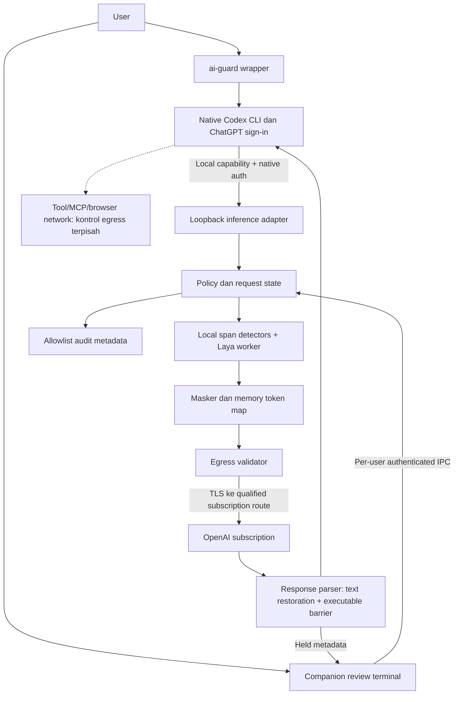

# PromptShield v1 — Functional Specification Document

## Summary

FSD ini menerjemahkan approved PRD menjadi kontrak teknis local privacy gateway untuk native Codex CLI dengan subscription ChatGPT. Nilai sensitif ditokenisasi sebelum inference, lalu dipulihkan hanya pada teks jawaban. Executable output yang membutuhkan original value ditahan; manual/variable/cancel tidak menjalankan call lama.

FSD dan issue pointers telah **APPROVED** oleh user melalui `Approved FSD, $sc-go commit and push`, 2026-10-04. Arah UI juga telah disetujui, tetapi runnable evidence, upstream qualification dan dependency/model qualification belum tersedia. GOAL-001 merupakan bounded offline contract enabler; semua integration/delivery goals tetap blocked. Otorisasi saat ini mencakup commit/push ke repository yang ditentukan, bukan execution GOAL. Enabler dapat dikerjakan setelah execution authorization terpisah, tanpa menebak upstream atau memakai data nyata.

## High-Level Design



Derived view dari PRD-PROMPTSHIELD-V1#FR-001, FR-004, FR-009..FR-014 dan BRD-PROMPTSHIELD-V1#DEC-001/DEC-002. Egress validator tidak memperoleh token-map export capability; provider adapter hanya menerima payload yang sudah diproses menurut mode.

## Metadata

ID: FSD-PROMPTSHIELD-V1  
Artifact contract version: `2.0.0`  
Revision: 1.1  
Status: APPROVED  
As of: 2026-10-04, Asia/Jakarta  
Tier: full; triggers T2/T3/T5.  
Upstream: [PRD-PROMPTSHIELD-V1 revision 1.1](../prd/prd-promptshield-v1.md) APPROVED; [BRD-PROMPTSHIELD-V1 revision 1.1](../brd/brd-promptshield-v1.md) APPROVED.  
Approval provenance: user `$sc-ui Approved PRD`, kemudian `$sc-pan Approved Baseline UI` ditafsirkan sebagai `/sc-plan`, lalu `Approved FSD, $sc-go commit and push to https://github.com/aultramen/promptshield`, 2026-10-04.  
FSD approver: user pemohon; runtime/security/privacy evidence dan risk-owner approval yang applicable tetap gate sebelum dependent implementation/pilot.  
ADR applicability: NOT_REQUIRED — keputusan lokal dalam TDEC register; tidak ada accepted ADR yang diperlukan saat ini.  
ui_delivery_profile: HIGH_INTERACTION  
ui_contract_readiness: BLOCKED  
topology: NETWORKED  
Contract version: 1.0.0  
Execution authorization: belum diberikan.  
Board: [.scratch/promptshield-v1/issues](../../.scratch/promptshield-v1/issues/01-local-contract-enabler.md).

Canonical cross-artifact references memakai `ARTIFACT#ID`. Rentang/slash grouping pada prose adalah shorthand manusia; pointer memakai exact qualified IDs. `TDEC-*` APPROVED sebagai kontrak desain dalam scope FSD. Approval tidak mengisi fakta yang masih OPEN, membuktikan compatibility, atau memberikan execution authorization.

## 1. Authority, Scope dan Evidence

### 1.1 Scope boundaries

MVP: native Codex CLI, empat mode, model-bound text inspection, reversible memory masking, response text, bounded executable barrier, companion review terminal, local policy/dictionary/Laya, minimum safe audit, cleanup dan offline self-test. Native Desktop fase 2; universal adapters fase 3. Controlled original-value execution merupakan pengembangan berikutnya dengan authority tersendiri.

Tidak mengubah native Codex sandbox/approvals. Tidak membaca credential cache atau menyalin token ke config. Tidak menambah API-key/billing fallback. Tidak membuat remote classifier, TLS MITM atau universal tool-network DLP. Existing framework `.agent/`, `.agents/`, `.claude/`, `.codex/` dan state files bukan product runtime dan tidak diubah.

### 1.2 Evidence dan compatibility pre-flight

| Evidence / item | Current / proposal | Status dan consequence |
|---|---|---|
| Native Codex | `codex-cli 0.160.0`, observed `rtk proxy codex --version` | Version observation; belum qualified inference/session/tool gate |
| Local Python | `Python 3.14.7`, observed `rtk python --version` | Cukup untuk planned stdlib offline enabler; bukan bukti ML wheel compatibility |
| Product Python | CPython 3.12.x kandidat BRD A12; exact patch/architecture belum dipin | OPEN-006 sebelum product install/build. Python 3.12 masih security-supported dalam [official lifecycle](https://devguide.python.org/versions/) |
| Laya | Opened `main/pyproject.toml` menyebut 0.3.26, Python >=3.10, Apache-2.0 code | Mutable source, bukan lock/install proof. Search cache sempat menyebut 0.3.21; fetched page dipakai untuk observation, tidak memilih versi dari search snippet. Bobot/model memiliki review terpisah. [Manifest](https://github.com/NandhaKishorM/laya/blob/main/pyproject.toml) |
| Transport | FastAPI/Uvicorn + HTTPX candidate BRD | Streaming tersedia dalam [FastAPI](https://fastapi.tiangolo.com/advanced/custom-response/) dan [HTTPX](https://www.python-httpx.org/async/); exact pins, wheels, license/SBOM/CVE posture belum diperiksa: OPEN-006 |
| Native subscription proxy | OpenAI-auth provider dan environment-populated headers didokumentasikan | Supporting facts, bukan runtime proof. [Auth](https://learn.chatgpt.com/docs/auth), [config reference](https://learn.chatgpt.com/docs/config-file/config-reference) |
| Upstream protocol | SSE, continuation dan tool pairing perlu preservation | OPEN-001/002; satu health check tidak cukup. [Gateway requirements](https://learn.chatgpt.com/docs/enterprise/gateway-compatibility) |
| Existing repository | Framework package `super-compound`, tanpa product source/lockfile | Tidak ada product migration/legacy callers; add product manifests kemudian, jangan mengganti framework `package.json` |
| Code graph | `list_projects` gagal `Transport closed` | Index status tidak dapat ditentukan; filesystem inventory fallback digunakan. Tidak mengklaim graph completeness |
| Local knowledge | LRN-2026-09-20-001, ERR-2026-09-03-001 | Advisory: control harus enforced pada executable boundary; jangan menyaring failure output menjadi klaim green |

Semua primary sources ditinjau 2026-10-04; halaman live tidak dianggap pinned dependency. [Research subscription](../research/2026-10-04-codex-subscription-gateway.md) tetap advisory. Pre-flight dependency yang tersisa wajib selesai sebelum product goals menjadi ready: package identity, exact version/hash, Windows x64 wheels, Python pair, transitive lock, code/model licenses, remote-code requirements, vulnerabilities dan rollback. Jangan menginstal atau mengunduh model pada tahap `/sc-plan`.

## 2. Decisions dan Dependency Direction

| ID / status | Technical decision dan batas | Upstream obligation |
|---|---|---|
| TDEC-001 / APPROVED | Offline enabler menggunakan Python standard library, fixed typed DTO validation dan versioned JSON contract definition; tidak memerlukan product/ML dependencies. Throwaway UI tidak menjadi production seed | PRD#FR-003, FR-014, UI-STATE-001..012 |
| TDEC-002 / APPROVED | Satu gateway process per wrapped Codex instance; core imports hanya core/stdlib; adapters/detectors/transport bergantung core; service menjadi composition root. Satu model worker terisolasi, bukan microservices | BRD#BREQ-011; PRD#FR-019/020 |
| TDEC-003 / APPROVED | Native subscription-only route; Codex mengelola sign-in/refresh. Loopback capability terpisah dari upstream auth; tidak membaca native credential cache. Actual subscription descriptor wajib qualified sebelum upstream adapter enabled | BRD#DEC-001; PRD#FR-001/022 |
| TDEC-004 / APPROVED | Structured field inventory, Unicode codepoint offsets, complete required-detector barrier, unresolved classifier risk block, bounded overlap union | PRD#FR-004/008/020 |
| TDEC-005 / APPROVED | Memory-only map, random scoped tokens, atomic pre-egress commit, exact allowed-token restoration hanya user text; tidak recursive resolve | PRD#FR-009/010/018 |
| TDEC-006 / APPROVED | Executable event barrier menahan item dari first executable event sampai validated terminal response. Risky/unknown items tidak diflush. Held call terminal manual/variable/cancel; no old-call resume | BRD#DEC-002; PRD#FR-011/012/013 |
| TDEC-007 / APPROVED | Per-user authenticated IPC untuk review/mode/status; monotonic snapshots, compare-and-set decisions, protected sent stream memakai snapshot awal | PRD#FR-005/014/015/017 |
| TDEC-008 / APPROVED | Strict local config, immutable no-sensitive-logging/no-tool-restore constraints; safe bounded audit ring; rollback menghentikan workflow atau verified version | PRD#FR-016/019/024 |
| TDEC-009 / APPROVED | HTTP-SSE pertama; unknown endpoint/opaque artifact/WebSocket/hosted fetch blocked sampai qualification. Tidak menyamakan provider-agnostic dengan protocol passthrough | PRD#FR-004/022 |
| TDEC-010 / APPROVED | Runtime/ML package/model pins dan production transport selection difinalkan melalui OPEN-006. Tidak mengganti Python/engine saat implementation karena mesin lokal punya versi berbeda | BRD#A12; PRD#FR-003/020/022 |

Pilihan yang dibandingkan: (a) Python core + local Laya worker, paling sederhana untuk current reference; (b) Rust core + Python worker, tambahan build/IPC tanpa measured need; (c) app-server frontend baru, mengubah native-host experience dan auth. Pilihan (a) tetap kandidat production sampai OPEN-006. Untuk GOAL-001, TDEC-001 lengkap tanpa menunggu keputusan production stack. Accepted product policy tidak berubah jika candidate gagal qualification.

## 3. Domain Model, Identifiers dan Invariants

### 3.1 Domain objects

| Object | Source of truth / fields / constraints |
|---|---|
| Instance | OS owner identity + random 128-bit `instance_id`; created by wrapper; one child process; registry berisi nonsecret locator/PID/time/version, tanpa capabilities |
| Conversation scope | Owner/instance + verified thread identity; provider-supplied ID tidak dipercaya sendiri. OPEN-003 sebelum concurrent/multiple-thread maps enabled |
| Request context | random `request_id`, mode snapshot, policy version, payload revision, scope, allowed-token set, cancellation token dan map lease; raw payload transient/private |
| Inspection report | Segment locator transient, Unicode start/end, category enum, detector/rule ID, confidence, unresolved reason. Tidak menyimpan value atau raw excerpts dalam DTO/log |
| Policy snapshot | Immutable validated nonsecret settings version; compiled rules/dictionary handles private; mode enum `detect-first|detect-only|always-mask|off` |
| Pending action | `pending_id`, action kind REQUEST_REVIEW/TOOL_HELD, request reference, mode/policy versions, monotonic deadline, revision, terminal disposition |
| Token lease | Scoped map handle + allowed-token set; internal map value tidak serializable oleh control/provider/audit interfaces |
| Qualified adapter descriptor | Exact client version/digest, methods/paths, protocol/event fields, auth/header allowlist, upstream TLS authority, thread binding, continuation policy, terminal-error mapping dan evidence identity |

Required invariants: no raw egress before complete protected inspection; no map available to audit/control DTO; one terminal decision per pending revision; no executable original-value restoration; no false stream success; no silent truncation/profile reduction; no direct-provider retry on failure; stale/foreign map never resolves. Detect Only/Off permit original content menurut approved behavior dan tampilkan exposure; transport/auth validation tetap berlaku.

### 3.2 Snapshot dan state semantics

Request states: RECEIVED → INSPECTING → WAITING_USER atau PREPARED → SENT → STREAMING → COMPLETED/FAILED/TOOL_HELD. CANCELLED/BLOCKED terminal sebelum send. Off menggunakan RECEIVED → PREPARED → SENT tanpa inspection/map. Detect Only tetap inspect informational, detector failure diberi DEGRADED lalu original dikirim bila transport/auth valid.

Satu mutex/async lock per conversation mengatur policy snapshot, decision validity, map commit dan send boundary. Laya worker completion mengembalikan request/version ID; late results tidak menghidupkan cancelled request. Mode change menaikkan instance version; unsent/pending request mengevaluasi ulang current mode sebelum commit. Already-sent request tidak dapat ditarik; status menampilkan active-request mode dan next mode secara terpisah. Off tidak melepaskan held item atau memakai map lama untuk request baru; active protected leases hidup sampai stream terminal lalu direvoke.

Approval terikat payload bytes digest **HMAC internal dengan ephemeral key**, scope, action dan versions; digest tidak dicetak/disimpan. Identical retry tidak otomatis mewarisi approval setelah request terminal. Provider retry tidak dilakukan guardian setelah request body mulai dikirim; native retry diperlakukan request baru dan dideduplikasi hanya terhadap side effect internal, bukan mengklaim inferensi provider exactly-once.

## 4. Request dan Detection Contract

### 4.1 Structured request inspection

Adapter decode → field inventory → inspector → masking plan → map transaction → protected serialization → final assertion → provider send. Jangan regex raw JSON. Reject invalid UTF-8, duplicate JSON keys, nonfinite numbers, depth overflow dan unknown risk-bearing fields. Preserve role/order/item/call IDs sesuai qualified schema; reject metadata sensitif yang tidak dapat ditokenisasi tanpa merusak protocol.

Minimal inventory: instructions, supported message content/history, tool outputs, outbound tool-argument replay, inline file text, user-writable metadata dan tool descriptions/schema defaults/examples. Routing fields divalidasi sebagai metadata. Opaque provider artifact hanya replay bila provenance/thread binding terbukti; sebelum itu block. File ID/remote URL/base64/image/audio/upload/compaction/token count bukan safe passthrough. Endpoint inventory final dan detailed JSON paths adalah OPEN-002; protected support tidak enabled sebelum fixture capture lengkap.

Core seam `inspect(segments, snapshot, cancellation) -> InspectionReport`, lalu `prepare(envelope, report, context) -> PreparedSend`. Provider seam hanya menerima `PreparedSend`; atribut `exposure = masked|original-detect-only|original-off` wajib explicit. Raw envelope bukan accepted routine provider argument. Pending request tidak memasuki network queue.

### 4.2 Detector semantics

Required default profile: regex/pattern validators, secret scanner, local dictionary, Laya. Safe signal dari satu engine tidak membatalkan finding/unknown/error engine lain. Worker no-network, checkpoint preprovisioned dan digest checked; ready hanya setelah warmup. `Router()` lazy download tidak dipakai di jalur request. Tidak memakai `trust_remote_code` atau model helper yang mengunduh code tanpa provenance approval.

Span: `[start,end)` pada original decoded Python string, `0 <= start < end <= len(text)`. Normalized detection view mempunyai reversible offset mapping; ambiguous mapping block. Merge overlapping/touching sensitive spans menjadi union, label precedence SECRETS → CREDENTIALS → FINANCIAL → PII → INFRASTRUCTURE → CUSTOM; precise subtype disimpan private. Replace dari kanan ke kiri atau single scan rebuild; repeated exact/category values reuse scoped token. Encoder hanya sesudah transform selesai.

Categories mengikuti PRD/BRD, bukan menjanjikan arbitrary-name NER. NIK/NPWP/passport/financial/custom IDs memerlukan label/context/validator; IP memakai address parser/CIDR rules; entropy hanya candidate signal; multiline private-key/connection strings wajib full match. Laya positive risk tanpa reliable span **BLOCK**, tidak otomatis menghapus seluruh block. Free-text nama/alamat tetap limited sampai held-out eval membuktikan coverage. Whole-block masking atau detector/model pengganti adalah material change dan kembali ke product/technical authority.

Laya profile memakai explicit checkpoint/window configuration yang dipin; full text dicakup windows dengan overlap sesuai tokenizer/model revision. Window count, thresholds/calibration, max length dan exact adapter API masih OPEN-004/006; no silent truncation. Enabler memakai scripted risk results sintetis, diberi label simulation; tidak mengklaim menjalankan Laya.

### 4.3 Bounded operational defaults

| Limit | Draft technical default | Failure |
|---|---|---|
| Request decoded body | 4 MiB; JSON depth 32; max 10,000 content segments | INPUT_LIMIT sebelum inspection/send |
| Decoder | Recognized encodings depth 2, total expanded bytes 4 MiB | UNSUPPORTED_CONTENT/INPUT_LIMIT; no partial scan |
| Classifier per request | 2,000 ms deadline; one worker active, queue 8 requests per instance | DETECTOR_TIMEOUT/QUEUE_FULL; protected block |
| Pending action | 120 seconds, 8 pending per instance | EXPIRED/PENDING_LIMIT; no default approve |
| SSE event | 1 MiB per framed event, idle 60 s | STREAM_INVALID/TIMEOUT, incomplete status |
| Whole response | 8 MiB decoded accumulated content, absolute 300 s sejak send | RESPONSE_LIMIT/TIMEOUT, incomplete status; release map leases |
| Executable barrier | 4 MiB per turn; 256 KiB arguments per item; 30 s since barrier starts | TOOL_GATE_LIMIT; no executable flush |
| Map | 10,000 entries, 16 MiB UTF-8 values per conversation | MAP_LIMIT; block before eviction/egress |
| Map lifetime | idle 1,800 s, absolute 28,800 s | New requests block expired scope; active lease completes finite deadline then revoke |
| Audit memory ring | 1,000 allowlisted events per instance | Drop oldest metadata; never spill payload to disk |

Ini safety/resource defaults, bukan approved performance benchmarks. Perubahan limits dapat dilakukan melalui bounded config sesuai Section 7; hardware/model tuning dan final release acceptance tetap OPEN-005. TTL memakai monotonic clock; wall-clock hanya timestamps metadata.

## 5. Masking, Map dan Response Contract

### 5.1 Map transaction

Token grammar: `{{PS_<32 uppercase hex namespace>_<CATEGORY>_<6 digit counter>}}`, namespace random 128-bit per conversation, counter mulai 000001. Category allowlist uppercase `[A-Z_]{1,24}`; maximum token length 80. Namespace/counter bukan user-selected. Map key adalah full token; internal reverse index scoped keyed HMAC over category+original value untuk dedup, tidak ada raw key di log.

Incoming literal dengan reserved `{{PS_` grammar yang tidak berasal dari current authorized map dianggap collision/untrusted token dan protected request diblokir; jangan intern token text sebagai value sehingga recursive expansion mungkin. Prepared map commit atomik sebelum send; failure membatalkan entries baru yang belum dipakai. Allowed tokens berasal dari inspected current payload, bukan semua instance map. Provider cannot request token-map lookup/export. Session end/stop/cancel cleanup melepaskan leases dan references; Python tidak menjamin zeroization semua copies, swap/dumps perlu endpoint controls.

Tidak menyimpan token map, sensitive-value hashes, capabilities atau auth dalam file/config/audit/crash reports. Local de-masked text dapat disimpan native Codex history; outbound replay discan kembali. Cleanup guardian tidak mengklaim menghapus native history/provider retention.

### 5.2 Streaming text restoration

Framed UTF-8 SSE parser memisahkan byte decoding, SSE frames, JSON event schema dan item classification. Only qualified user-answer text fields boleh resolve. Text suffix sampai 79 karakter ditahan bila dapat menjadi prefix token; independent buffer per text item. Exact token in allowed set resolves sekali, tanpa recursive scanning inserted original. Unknown/malformed/foreign token tetap literal + safe unresolved status di control UI; tidak menambahkan arbitrary diagnostic into native protocol text.

Final accumulated text dan final snapshot event direwrite dari raw provider text dengan map yang sama; jangan memulihkan output yang sudah restored dua kali. No de-mask reasoning, metadata, URLs, JSON tool arguments, patch/write-file items, schema atau provider error body. Unknown text/event type block affected response, bukan guessing berdasarkan field bernama `text`.

### 5.3 Executable barrier dan terminal hold

Sebelum native client melihat item executable pertama, adapter menahan **semua events sejak boundary tersebut**, termasuk item-added, partial arguments, completed items dan terminal snapshot. Prefix user-answer text yang sudah validated dapat ditampilkan. Bounded buffer preserve order/IDs/sequence; inspect seluruh executable items sesudah terminal provider success. Hanya jika semuanya safe dan structurally valid, flush sesuai qualified protocol sehingga native Codex tetap memakai permission/sandbox sendiri.

Known reserved placeholders, unknown sensitive placeholder, recognized original-dependent call atau unsafe structural event → tidak ada buffered executable events yang dilepas. `TOOL_HELD` disimpan locally dengan category/count/safe purpose. Native response diakhiri dengan **qualified incomplete/error disposition**, tidak dibuat fake `response.completed`, fake tool result atau call ID. Exact event/error mapping wajib dibuktikan melalui OPEN-002 sebelum adapter implementable; jika native API tidak dapat enforce barrier, route unsupported dan protected launch block.

Manual → MANUAL_HANDOFF; variable → VARIABLE_GUIDANCE; cancel → CANCELLED. Ketiganya terminal held-call dispositions. Tidak ada `resume`, `restore`, `execute-original`, env loading, command execution, clipboard export, file write atau map export action. Safe template berisi `SERVER_HOST=<isi secara lokal>`/`API_TOKEN=<isi secara lokal>` saja. User mengisi sendiri dan submit revised task yang diproses sebagai input baru. Normal variable-reference tool dapat dijalankan native client setelah permissions; raw output discan ulang sebelum model. Direct network tool egress tetap di luar guardian.

## 6. Integration dan Local Authentication

### 6.1 Codex adapter qualification contract

Local inference target: `127.0.0.1:<ephemeral-port>/v1/responses`, HTTP-SSE, satu instance per native process. Path ini kontrak gateway yang akan diuji, bukan assertion endpoint subscription asli. Unknown path/method/type tidak diteruskan. Reject non-loopback bind, wrong Host, browser Origin, unauthenticated requests, redirects dan arbitrary upstream URL. Local control bukan HTTP browser endpoint.

Wrapper menggunakan subprocess argv array, no shell interpolation; native interactive stdin/stdout/stderr/signals/exit code dipertahankan. Gateway messages masuk wrapper/control channel dan tidak disisipkan ke native protocol/stdin. Sensitive prompt lebih aman melalui native UI/stdin; wrapper tidak menyalin/log argv, membuat prompt temp files, atau menampilkan upstream credentials. `ai-guard wrap codex -- <native flags>` rejects routing/proxy overrides yang melewati guardian; unknown passthrough flag whitelist perlu actual client help qualification.

Candidate config mechanism: supported custom provider dengan `requires_openai_auth=true`; `env_http_headers` memuat **local capability** dari child-only environment melalui nama variable `PROMPTSHIELD_SESSION_CAPABILITY`. Header `X-PromptShield-Session` diverifikasi constant-time di loopback, lalu distrip upstream. Nilai capability 256 random bits, tidak masuk argv/config export/log. Upstream `Authorization` milik native login hanya ke qualified TLS destination. Authentication path untuk refresh tetap Codex-owned. Metadata account headers hanya di-forward dari exact allowlist yang qualified; tidak derive JWT/token scope berdasarkan decode tanpa validasi.

Documented `env_http_headers` belum membuktikan keberadaan header pada request CLI 0.160.0. Exact invocation/config override, fallback source precedence, websocket/compaction off flags, subscription upstream URL/method/headers/model entitlement dan renewal harus dicatat dalam qualified descriptor. **Tidak ada launch recipe/live endpoint yang diasumsikan** sebelum OPEN-001/002 selesai. Jangan memakai `api.openai.com/v1` sebagai native subscription default dari contoh third-party OAuth. Tidak mengubah user-global `.codex/config.toml` atau menyalin auth cache untuk memaksa routing; per-launch mechanism resmi wajib terbukti, kalau tidak block.

Provider HTTP client: TLS verification ON, redirects OFF, `trust_env=False` untuk ambient proxies, fixed qualified upstream authority/method/path, finite timeouts; strip local/unknown headers dan raw provider errors. Upstream destination tidak dapat dipilih prompt/repo/request URL. Native tool environment policy wajib mengecualikan `PROMPTSHIELD_*`; mekanisme supported dan child-tool canary proof menjadi bagian OPEN-003 sebelum capability-through-environment enabled. Jika tidak dapat enforced, candidate ini tidak qualified dan route tetap blocked. Capabilities masih dapat dibaca same-user malware melalui process environment; jangan mengklaim gateway kebal compromised host.

### 6.2 Local control transport

Primary Windows plan: per-owner named pipe dengan DACL yang hanya mengizinkan current logon SID dan SYSTEM, reject remote clients, serta client PID/OS owner verification. Unix nanti memakai Unix domain socket directory 0700, socket 0600 + peer credentials; belum support claim. Connection memakai length-prefixed UTF-8 JSON bytes (uint32 little-endian, max 65,536 bytes); **tidak pickle**, tidak arbitrary command dispatch. Implementation library/API serta DACL proof perlu OPEN-006/003; native product control tidak enabled sampai security tests passed.

Registry `%LOCALAPPDATA%/PromptShield/instances/<id>.json` berisi schema version, random instance ID, pid/start timestamp, pipe locator dan version only, ACL current owner. No prompt/token map/upstream credential/capability. Stale PID tidak dihapus/diterminasi hanya dari PID reuse; wrapper owner checks start identity. Runtime path menggunakan OS known folder API; request/repo cannot choose arbitrary path. Model cache dan user config terpisah dan protected. Prototype GOAL-001 menggunakan in-process mock transport, bukan insecure named-pipe implementation.

## 7. Configuration, Control DTO dan Audit

### 7.1 Config version 1

Versioned config schema planned `contracts/promptshield/config-v1.json` (SCHEMA-002). Strict unknown-field rejection. Keys: `version=1`; `protection.mode`; detection required/optional engine lists, category booleans, on_unresolved=`block`, protected dictionary reference; limits/TTL/caps dari Section 4; `masking.strategy=token-map`, `local_only=true`; response `restore_user_text=true`, `restore_tool_arguments=false`; `token_map.storage=memory`; logging sensitive/payload flags **const false**, verbose bool; audit sink=`memory`. Operational upstream descriptor file reference protected-admin-only, bukan user-editable URL.

Parser memakai safe YAML load setelah dependency pin; bounded file size 64 KiB, no constructors/includes/executable rules. Immutable constraints → managed policy → user defaults → authorized session choice. No repository config authority. Initial setup tidak memilih mode otomatis; user memilih dari allowed four modes, Always Masking recommended. Missing initial config berarti NOT_READY. Hot reload validate/compile private snapshot → atomic swap/version bump; gagal update mempertahankan last valid policy + actionable warning. Safety constraints tidak dapat dilonggarkan oleh `off` settings selain approved Off behavior pada request baru.

### 7.2 Exact local control semantics — CONTRACT-001 / SCHEMA-001 @1.0.0

Delegated machine contract planned `contracts/promptshield/local-v1.json`. Equivalent structured contract definition, bukan generic REST/OpenAPI API ke provider. Validation/generation terbatas pada DTO discriminants/fields berikut; tidak membangun schema framework umum. JSON unknown fields/duplicate keys/nonfinite values rejected; identifiers lowercase hex 32 chars, versions integer 1..2^53-1; no free-form metadata payload.

Common request fields: `schema_version=1`, `id`, `instance_id`, `op`; envelope length <=64 KiB. Operations:

| Operation | Additional accepted fields | Result / state effect |
|---|---|---|
| status | None | Status DTO; no mutation |
| set_mode | `mode`, `expected_policy_version` | Atomic version increment; conflict → STALE, no change |
| set_verbose | `enabled: bool`, `expected_policy_version` | Detail metadata only; no payload visibility |
| list_pending | None | At most 8 PendingSummary DTOs; scoped owner only |
| decide | `pending_id`, `pending_revision`, `decision` | Request choices `mask|edit|cancel`; tool choices `manual|variable|cancel`; incompatible/stale choice rejected |
| cancel_request | `request_id` | Mark cancellation and finite cleanup; already terminal → idempotent terminal receipt |
| stop | None | Owner instance shutdown/revoke; no file/login deletion |

Common response: `schema_version=1`, echoed `id`, `ok: bool`, exactly one `result` or `error`. Safe error has `code` enum and `retryable` bool; localized message/next action derived from code table, no arbitrary exception body. Result discriminants: STATUS, PENDING_LIST, DECISION_RECEIPT, MODE_RECEIPT, VERBOSE_RECEIPT, CANCEL_RECEIPT, STOP_RECEIPT. Receipts contain new version/terminal state only; NEVER original values/tool arguments/map/credential.

Status DTO: instance ID, state enum, effective mode, policy version, active-request mode nullable, next mode, required-engine readiness booleans keyed allowed IDs, pending count 0..8, coverage profile ID, `integration_verified: bool`, token-store state `empty|active|expired|revoked`; map sizes/counts aggregated if requested, no token list. PendingSummary: pending ID, revision, action kind, local request ID, mode/version snapshot, time remaining 0..120, allowed categories/counts, permitted decision enum list, purpose code from static allowlist `CONNECTIVITY_CHECK|FILE_ACTION|GENERIC_TASK`; no generated arbitrary task excerpts.

Safe codes: NOT_READY, AUTH_REQUIRED, AUTH_FAILED, QUOTA_RESTRICTED, MODEL_UNAVAILABLE, DETECTOR_TIMEOUT, DETECTOR_FAILED, INPUT_LIMIT, RESPONSE_LIMIT, TIMEOUT, UNSUPPORTED_CONTENT, POLICY_INVALID, FORBIDDEN, STALE, EXPIRED, CANCELLED, MAP_LIMIT, MAP_EXPIRED, TOOL_HELD, TOOL_GATE_LIMIT, STREAM_INVALID, UPSTREAM_UNAVAILABLE, INTERNAL_ERROR. Provider error raw/body never returned. Local mode/config syntax errors use exit 2; blocked/protection/self-test failure exit 3; wrapper after successful child launch preserves native exit status and exposes guardian reason separately. Control commands success exit 0. Exact native-wire mapping of safe codes remains qualified descriptor, OPEN-002.

### 7.3 Audit schema — CONTRACT-002 / SCHEMA-003 @1.0.0

Planned `contracts/promptshield/audit-v1.json`. Allowed fields: schema_version=1; UTC timestamp; event enum `detection|request_blocked|tool_held|mode_changed|policy_changed|detector_health|session_cleanup|stream_failed`; action enum; mode; provider adapter ID; policy version; optional category enum/count; optional duration_ms bounded nonnegative. No original value, map/token string, internal field locator, path, header, model prompt/response, stable user identity, value hash or raw exception object. Global serializer handles only audit DTO; logging filters are additional defense, not sole protection. Worker debug/access/tracing/dump logging disabled; tests inspect stdout/stderr/temp/exception/export sinks. Native local client history is separate residual risk.

## 8. Screen & Interaction Contract

### 8.1 Surface dan data/action mapping

CLI control UI Bahasa Indonesia, literal mode values/OFF preserved. Native Codex screen tetap native. `ai-guard review --session <local-id>` di terminal terpisah tidak membaca stdin Codex. Keyboard numbered choices lalu Enter; tidak ada sensitive action default pada empty Enter. Ctrl+C cancels selected pending action and exits reviewer; disconnected reviewer request stays pending sampai deadline, tidak auto-approved. Static plain output tidak memakai cursor rewriting; TTY output harus menjaga logical focus dan cancel visibility. Unknown selection menghasilkan error dekat choice tanpa reset unrelated draft/status.

Production typed consumer planned `src/promptshield/adapters/control_dto.py` dan mock provider planned `tests/contracts/mock_control.py` sama-sama derive SCHEMA-001, bukan hand-copied shapes. GOAL-001 menghasilkan typed consumer prototype hanya di `.scratch/prototypes/promptshield-ui-v1/`; tidak menulis `src/`. Production consumer kelak diturunkan langsung dari machine contract, tidak menyalin prototype. Fixture catalog `tests/fixtures/synthetic/contracts-v1.json`, revision 1.0.0. Prototype memakai fixture catalog dan in-process transport; no live inference/tools/.env. Screenshots/transcript hanya synthetic safe metadata.

| Mapping ID | Journey / data dan action | PRD state refs | Contract / schema / result-error | Fixture / verification |
|---|---|---|---|---|
| UIMAP-001 | Setup mode radio/number choices, required readiness booleans; local save setup / status | UI-STATE-001,004,005,009 | CONTRACT-001 + SCHEMA-001/002; NOT_READY/POLICY_INVALID/STATUS | FIXTURE-001; TEST-001/002/009 |
| UIMAP-002 | No active session; local instance choice; status | UI-STATE-002,006 | CONTRACT-001 + SCHEMA-001; EMPTY/FORBIDDEN/STATUS | FIXTURE-002; TEST-001/002/005 |
| UIMAP-003 | Finding category/count/deadline; pending request decision mask/edit/cancel | UI-STATE-007,010 | CONTRACT-001 + SCHEMA-001; WAITING_USER/STALE/EXPIRED/DECISION_RECEIPT | FIXTURE-003; TEST-001/002/004 |
| UIMAP-004 | Masked count, submitted/completed distinction, native answer text | UI-STATE-003,008 | CONTRACT-001 + SCHEMA-001; STATUS/STREAM_INVALID; qualified provider text CONTRACT-003 | FIXTURE-004; TEST-003/006/007 |
| UIMAP-005 | Tool-held category/purpose/choices; manual/variable/cancel | UI-STATE-005,010 | CONTRACT-001 + SCHEMA-001; TOOL_HELD/MANUAL_HANDOFF/VARIABLE_GUIDANCE/CANCELLED | FIXTURE-005; TEST-001/002/003/008 |
| UIMAP-006 | Effective/active/next mode, pending revisions; set_mode | UI-STATE-006,007,011 | CONTRACT-001 + SCHEMA-001; MODE_RECEIPT/STALE/FORBIDDEN | FIXTURE-006; TEST-001/002/005 |
| UIMAP-007 | Engine health, coverage verification, error recovery; status/config reload | UI-STATE-001,004,005,008,009 | CONTRACT-001 + SCHEMA-001/002; STATUS/NOT_READY/POLICY_INVALID | FIXTURE-007; TEST-001/002/009 |
| UIMAP-008 | Verbose metadata toggle, audit counts, redacted config view | UI-STATE-003,004,006 | CONTRACT-001/002 + SCHEMA-001/002/003; VERBOSE_RECEIPT/POLICY_INVALID | FIXTURE-008; TEST-001/010 |
| UIMAP-009 | Cancel request, stop instance, expiry/restart/cleanup status | UI-STATE-005,007,008,010 | CONTRACT-001 + SCHEMA-001; CANCEL_RECEIPT/STOP_RECEIPT/MAP_EXPIRED | FIXTURE-009; TEST-001/002/006/008 |
| UIMAP-010 | Offline self-test pass/fail/skips summary and install/provision readiness | UI-STATE-001,003,005,009 | CONTRACT-001 + SCHEMA-001/002; local SELF_TEST result/NOT_READY | FIXTURE-010; TEST-001/009/011 |
| UIMAP-011 | Keyboard focus/choice, wrapped labels, plain-text essential status | UI-STATE-012 + seluruh named states | CONTRACT-001 + SCHEMA-001; same actions/results, no additional authority | FIXTURE-011; TEST-002/011 |

All visible control data masuk fixed DTO fields atau local static labels; no editable secret/map values. Inference network action `submit_inference` dimiliki CONTRACT-003 dan UIMAP-004, bukan control API. Upstream exact schema SCHEMA-004 belum didelegasikan ke implementation sebelum OPEN-001/002 selesai. UI protocol contract tidak boleh digunakan untuk menduga subscription protocol.

Hover/touch/mobile/browser ARIA: N/A untuk native CLI MVP. Selection/focus/pressed/submitted/loading/disabled/error harus jelas melalui text. Test terminal 80/120 columns, long labels dan plain output; terminal lebih sempit tetap wrap tanpa menyembunyikan cancellation. Safe draft selection retention mengikuti deadline/policy; stale approval tidak retained sebagai execution authority.

### 8.2 Contract inventory dan readiness index

| Contract / schema @1.0.0 | Planned artifact | Status |
|---|---|---|
| CONTRACT-001 / SCHEMA-001 | `contracts/promptshield/local-v1.json` | Definition in Section 7; machine asset absent; GOAL-001 |
| CONTRACT-002 / SCHEMA-003 | `contracts/promptshield/audit-v1.json` | Section 7.3 semantics; machine asset absent; GOAL-009 |
| CONTRACT-003 / SCHEMA-004 | `contracts/promptshield/codex-subscription-v1.json` | Exact native request/event/auth inventory blocked OPEN-001/002/003; not guessed |
| CONTRACT-004 / SCHEMA-002 | `contracts/promptshield/config-v1.json` | Section 7.1 semantics; machine asset absent; GOAL-008 |

Machine assets listed as **planned**, not existing paths/evidence. Initial index intentionally lists no materialized schema revision, derived asset or executed schema lint; readiness cannot pass just because planned TEST IDs exist. Once assets/evidence exist, owning `/sc-plan` pins digest/revision/result before promotion.

```yaml
ui_api_contract:
  id: CONTRACT-001
  version: 1.0.0
  ui_delivery_profile: HIGH_INTERACTION
  ui_contract_readiness: BLOCKED
  topology: NETWORKED
  authority: FSD-PROMPTSHIELD-V1@1.1#CONTRACT-001
  reviewer: user-product-owner-and-maintainer
  network_actions: [submit_inference]
  schema_ref: []
  revision: []
  schema_revision: []
  fixture_catalog: tests/fixtures/synthetic/contracts-v1.json
  generated_from: []
  schema_lint_refs: []
  fixture_validation_refs: []
  provider_contract_refs: [FSD-PROMPTSHIELD-V1#TEST-001, FSD-PROMPTSHIELD-V1#TEST-003]
  consumer_contract_refs: [FSD-PROMPTSHIELD-V1#TEST-002, FSD-PROMPTSHIELD-V1#TEST-003]
  responsive_accessibility_qa_refs: [FSD-PROMPTSHIELD-V1#TEST-002, FSD-PROMPTSHIELD-V1#TEST-011]
  first_slice_ref: FSD-PROMPTSHIELD-V1#GOAL-002
  blocking_open_refs: [FSD-PROMPTSHIELD-V1#OPEN-001, FSD-PROMPTSHIELD-V1#OPEN-002, FSD-PROMPTSHIELD-V1#OPEN-003, FSD-PROMPTSHIELD-V1#OPEN-006, FSD-PROMPTSHIELD-V1#OPEN-007]
```

Direction approved != verified interaction. Human approval diterima; `experience_baseline_status` baru VALIDATED setelah runnable behavior evidence ditinjau. Tidak ada exception risk/runtime yang diasumsikan dari approval design. Evidence interaksi belum ada.

Evidence checklist untuk prototype kelak: source digest, contract/fixture versions, environment, command, reviewer/date dan `discard|revise|promote decision` disposition. Checklist ini bukan locator hasil verification.

## 9. Security, Privacy dan Threat Controls

Assets/actors/boundaries mengikuti BRD A15: raw content, map, dictionary, login credential, capability, policy/permission dan availability. Boundary validation: native→gateway (local cap/strict body/schema); control→state (OS owner/revisions); core→worker (private bounded text/no network); gateway→subscription (qualified TLS, fixed destination, protected content); provider→native (untrusted event validation/barrier); core→audit (fixed DTO). Same-user malware/local admin, swap/dumps/native history dan direct tool network tetap residual, bukan zero-exposure claim.

Semua controls di bawah PLANNED. Likelihood/impact desain L/M/H, bukan findings dari audit implemented code. Security/platform/privacy owners belum bernama; real-data pilot blocked OPEN-008.

| Threat ID / STRIDE | Failure path / L-I | Planned mitigation → verification | Residual / owner |
|---|---|---|---|
| THREAT-001 / S | Forged owner/thread/capability; M-H | OS IPC ACL + local cap + verified scope → TEST-005/011 | Same-user malware; platform/security |
| THREAT-002 / T | Repo/model modifies policy/routes/pending action; M-H | Strict config/revision/CAS, no repo authority → TEST-004/005/010 | Authorized user unsafe choice; product/security |
| THREAT-003 / R | Wrong mode/action receipts or erased failure metadata; M-M | Terminal receipts + audit allowlist/version → TEST-005/010 | Memory audit non-durable; operations/security |
| THREAT-004 / I | Hidden text/metadata, missed PII or encoded content bypass; H-H | Full field inventory, unresolved block, coverage eval → TEST-003/007/011 | False negatives/re-identification; privacy/security |
| THREAT-005 / I | Cross-session restore or sink leaks; M-H | Allowed set/map leases + safe sinks → TEST-006/010/011 | Native persistence/dumps; platform/privacy |
| THREAT-006 / D | Huge body, pathological rules/ML/slow stream/pending flood; H-M | Caps, isolated worker, backpressure/deadlines → TEST-004/007/009/011 | Fail closed causes outage; platform |
| THREAT-007 / E | Model executes restored secret, variable export bypass; H-H | Item barrier; zero automatic restoration/export → TEST-003/008/011 | User-managed external tool network; security |
| THREAT-008 / T-E | Dependency/model code or installer compromised; M-H | Exact locks/digests/licenses, no request-time download → TEST-009/011 | Trusted supply chain; maintainer/security |
| THREAT-009 / I-T | Redirect/proxy/refresh emits raw/auth to wrong destination; M-H | TLS/redirect/proxy/header qualification → TEST-003/011 | Approved provider receives auth/metadata; security |

Every component/flow STRIDE review: client/gateway S001 T002 R003 I004/009 D006 E007; control/config S001 T002 R003 I005 D006 E007/008; worker/dictionary S001 T008 R003 I004/005 D006 E008; token core S001 T002 R003 I005 D006 E007; provider response S001 T002 R003 I004/009 D006 E007; audit/registry S001 T002 R003 I005 D006 E008. Numbers refer THREAT IDs, so all six categories are explicitly considered, not declared mitigated.

Privacy obligations inherited PRD#PRIV-001..004/FR-024: reversible tokenization is pseudonymization; protected context still visible; no legal basis/consent/transfer/retention certification generated by this tool. Organization owner decides applicability UU PDP/GDPR/ISO SoA and DPIA; exact legal mapping remains BRD A16, not a new legal opinion. No real PII/customer/credential corpus before that review. Synthetic inactive fixtures only. Minimum retention: raw request/private response buffers until terminal cleanup, map within bounded leases/TTL, audit ring only instance lifetime; provider/native client retention independent.

## 10. Verification, Rollout dan Operations

### 10.1 Planned executable verification contract

Commands below adalah **future artifacts**, tidak dijalankan pada planning dan files belum dibuat. Tests use `unittest` public seams; native live qualification opt-in only, separate protected synthetic workspace, authorized subscription account. No inference/quota or tool invocation hidden in offline test.

| ID | Future command / evidence | Obligation / exact decision refs |
|---|---|---|
| TEST-001 | `rtk python -m unittest discover -s tests/contracts -p test_local_contract.py` | Strict fixed DTO, no metadata/value injection, generated mock/client/fixture revision parity; TDEC-001/007 |
| TEST-002 | `rtk python .scratch/prototypes/promptshield-ui-v1/review.py --scenario-suite --widths 80,120`; keyboard walkthrough with safe transcript | Pending/hold/expiry/offline/focus/overflow, baseline evidence; TDEC-001/007 |
| TEST-003 | `rtk python -m unittest discover -s tests/compatibility -p test_codex_subscription.py`; separately `rtk python -m promptshield.qualify --profile codex-subscription --live --synthetic-only` | Actual sign-in/refresh/entitlement/routing, one known canary masked answer and held executable, unsupported/redirect failure, no API fallback; TDEC-002/003/006/009/010 |
| TEST-004 | `rtk python -m unittest discover -s tests/integration -p test_detect_first.py` | Send barrier, edit/cancel/timeout/no reviewer, CAS stale, late worker output, no duplicate submit; TDEC-004/007 |
| TEST-005 | `rtk python -m unittest discover -s tests/security -p test_control_policy.py` | Owner/DACL/Host/Origin/capability/repo/policy/mode snapshot isolation, child tools tidak mewarisi local capability, Off/DetectOnly original behavior; TDEC-003/007/008 |
| TEST-006 | `rtk python -m unittest discover -s tests/security -p test_token_lifecycle.py` | Exact restoration across byte/delta partitions; repeated/overlap, collisions, foreign/expired tokens, cap/lease/restart/replay; TDEC-004/005 |
| TEST-007 | `rtk python -m promptshield.evaluate --corpus tests/fixtures/synthetic/detection.jsonl --offline --report metadata`; `rtk python -m unittest discover -s tests/integration -p test_detection.py` | Per-category/language span/classifier false block, all windows coverage, no-network ML, mandatory failure; TDEC-004/010 |
| TEST-008 | `rtk python -m unittest discover -s tests/integration -p test_tool_boundary.py` | Safe native tools/result rescan, streamed item barrier, .env/clipboard/argv/map export absence, manual/variable terminal states; TDEC-006/009 |
| TEST-009 | `rtk python -m unittest discover -s tests/compatibility -p test_install_offline.py`; future `rtk uv sync --frozen` after lock/provenance review | Fresh install/model digest/no runtime downloads, self-test no live call, unload/offline/cleanup/version downgrade; TDEC-002/008/010 |
| TEST-010 | `rtk python -m unittest discover -s tests/security -p test_safe_sinks.py` | Exact audit schema, all logs/exports/errors/failures no canary, memory retention; TDEC-005/008 |
| TEST-011 | `rtk python -m unittest discover -s tests/integration -p test_release.py`; agreed benchmark/UAT suite and owner review | Merged traffic/security/auth/terminal/mode/tool loops, resource/performance/utility/privacy release gates; TDEC-001..010 |

Per evidence retain source/dirty digest, contract/fixture/model/client/runtime versions, sanitized configuration, arguments, start/end, actual pass/fail/skips and synthetic sink capture verdict. Never persist live auth/raw business payload. Proving commands cannot replace actual manual focus/accessibility judgment or legal review. Source QA fixtures no raw organization data; metadata-only result export. Sample sizes, hardware, confidence intervals and approved target thresholds still OPEN-005; candidate BRD numbers not PASS conditions until resolved.

### 10.2 Rollout dan rollback

No current product deploy/migration/database. First offline enabler has no user-config or host-network effects; discard prototype after accepted decision, retain evidence. Diagnostic first slice is synthetic-only/not production-ready, validates narrow captured scope; whole MVP support requires all goals/evidence and final hardening.

Qualification artifacts pinned per client/model/auth/protocol revision; affected update invalidates proof and support status. Installer package/model downloads only explicit provisioning with size/digest/metadata; no prompt-time installs. Models/config registry paths ACL protected. Do not auto-update during active requests. Rollback: cancel/stop, revoke map/capabilities, preserve safe diagnostic metadata, restart only previously verified version; if absent remain stopped. Never switch Off/raw/API billing automatically.

Release: PRD GATE-001..006, accepted residual risks and ownership, baseline VALIDATED, first actual integration verified, all scale-out verified, final merged hardening/UAT. Human UI-direction approval alone does not certify tool gate/auth/accessibility. FSD approval tercatat pada revision 1.1; commit/push authorization tidak mengizinkan execution GOAL atau release produk.

## 11. AI Context and Output Contract

No new hosted AI detection provider. Context selection is actual model-bound request only; preserve actor/source attribution, role/order/call-result links and source model/client/policy versions. No extra `.env`/browser/file fetching by guardian. Inspection completeness/result unresolved explicitly binds source fields; omission/truncation/inaccessible reference blocks protected send. Mixed/empty/ambiguous language keeps native response language; control labels Bahasa Indonesia only.

Response untrusted regardless model confidence. Restoration only exact allowed scoped token in qualified answer text; validation cannot infer factual answer correctness. Model/repo/prompt cannot approve pending request/change mode/tool restoration. Review decisions tied to original local actor and payload/version. Regenerate/revised task is new request; retry cannot replay held executable. Manual outcome can be entered as new nonsecret text and rescanned, not fabricated matching tool result. No prompt appendix/map/dictionary export to provider. Optional detection cache OFF until separately scoped secure design/eval.

## 12. Goals — Canonical Packets

GOAL-001..GOAL-010 are the sole authored goal serialization. Suggested branches only; current branch `feat/promptshield-v1` unchanged. Sequential delivery by default; no subagents/worktrees planned. Shared schemas/fixtures/runtime locks have one writer per goal and explicit dependencies. No task ledger or second handwritten dependency DAG. Derived DAG via `goal-waves.mjs` below.

### GOAL-001 — Offline local contract and UI evidence

- Action/outcome: materialize CONTRACT-001/SCHEMA-001 fixed DTO definition, strict typed validator/consumer and mock provider, deterministic fixtures, and throwaway CLI state prototype for all 12 states. Independently proves local behavior; no product gateway/live inference/native tool/ML install.
- UI delivery role: CONTRACT_ENABLER; required_gate: NOT_APPLICABLE; contract refs: FSD-PROMPTSHIELD-V1@1.0.0#CONTRACT-001, #UIMAP-001..UIMAP-011.
- Upstream: PRD-PROMPTSHIELD-V1#AC-002, #AC-005, #AC-012, #AC-013, #AC-014, #AC-015, #AC-017; BRD-PROMPTSHIELD-V1#DEC-002.
- Technical refs: TDEC-001, TDEC-007; dependencies: None.
- Scope: `contracts/promptshield/local-v1.json`, `tests/contracts/`, `tests/fixtures/synthetic/contracts-v1.json`, `.scratch/prototypes/promptshield-ui-v1/`; fixture/consumer code there only. No `src/`, user-global config, credentials, real data, code/model dependency install or upstream endpoint discovery.
- Verification refs: TEST-001, TEST-002. Done: machine/projection parity and abuse fixtures pass; keyboard/plain/80/120-column walkthrough evidence reviewed, source digest recorded; classify `/sc-ui` evidence and update owning authority through `/sc-prd`/`/sc-plan` without promoting prototype code.
- Stop: OPEN-009 pending separate execution authorization; FSD sudah approved. Upstream/production compatibility gaps do not block this offline scope. Any requested behavior beyond approved UI/Section 7 returns owning authority. Suggested branch `feat/promptshield-local-contract`.

### GOAL-002 — First native subscription protected turn

- Action/outcome: one synthetic native Codex CLI turn on qualified subscription route, masks deterministic email canary, restores echoed answer text and withholds original-dependent executable item; actual sign-in/permission and representative protection failure proven. Diagnostic narrow slice, not full-category/MVP support claim.
- UI delivery role: FIRST_VERTICAL_SLICE; required_gate: READY_FOR_SLICE; contract refs: FSD-PROMPTSHIELD-V1@1.0.0#CONTRACT-001, #CONTRACT-003, #UIMAP-004, #UIMAP-005.
- Upstream: PRD-PROMPTSHIELD-V1#AC-001, #AC-003, #AC-004, #AC-008, #AC-010, #AC-012, #AC-022; BRD-PROMPTSHIELD-V1#DEC-001, #DEC-002.
- Technical refs: TDEC-002, TDEC-003, TDEC-004, TDEC-005, TDEC-006, TDEC-009, TDEC-010; dependencies: GOAL-001.
- Scope: minimal `src/promptshield/{service.py,cli.py,core/pipeline.py,core/tokens.py,core/response.py,detectors/regex_rules.py,adapters/codex.py,adapters/openai_responses.py,transport/http_gateway.py,transport/sse.py}`, `contracts/promptshield/codex-subscription-v1.json`, product manifest/lock once qualified, tests/compatibility. Keep minimal supported synthetic text/type set; synthetic diagnostic config expressly scoped, never secretly removes required engines from user production profile.
- Verification refs: TEST-003, TEST-006, TEST-008; done: captured descriptor and protected actual turn/held-call trace with native permission unchanged, no canary upstream/no executable held event, auth/quota/error distinctions. Actual echo/tool behavior nondeterministic; deterministic event fixtures plus actual native trace needed, not mock-only evidence.
- Stop: OPEN-001/002/003/006/007/009, unknown auth/protocol; no production source until contract pins/security evidence present. Targeted research fills qualified descriptor first; failure routes to research/product, not API fallback. Suggested branch `feat/promptshield-subscription-slice`.

### GOAL-003 — Detect First review before egress

- Action/outcome: actual pending request control for mask/edit/cancel with no-reviewer/timeout/stale behavior, including automatic tool-result request; follows Section 7 typed protocol.
- UI delivery role: SCALE_OUT_SLICE; required_gate: FIRST_VERTICAL_SLICE_VERIFIED; refs: FSD-PROMPTSHIELD-V1@1.0.0#CONTRACT-001, #UIMAP-003.
- Upstream: PRD-PROMPTSHIELD-V1#AC-005, #AC-014, #AC-017.
- Technical refs: TDEC-004, TDEC-007; dependencies: GOAL-002.
- Scope: `core/{pipeline.py,policy.py}`, `adapters/control_ipc.py`, `cli.py`, `tests/integration/test_detect_first.py`; shared contract immutable unless owner version changes.
- Verification refs: TEST-004, TEST-005; done: zero upstream before exact decision, edit terminates affected turn/rescans input, expiry/cancel/stale/late worker no send; native stdin/focus preserved.
- Stop: OPEN-003/006/007/009; ambiguous owner/payload or insecure IPC. Suggested branch `feat/promptshield-review`.

### GOAL-004 — Four modes and truthful active-session status

- Action/outcome: mode/status/verbose operations on selected owner instance, snapshot races, unsafe indicators and detector-degraded Detect Only behavior.
- UI delivery role: SCALE_OUT_SLICE; required_gate: FIRST_VERTICAL_SLICE_VERIFIED; refs: FSD-PROMPTSHIELD-V1@1.0.0#CONTRACT-001, #UIMAP-002, #UIMAP-006, #UIMAP-007.
- Upstream: PRD-PROMPTSHIELD-V1#AC-006, #AC-007, #AC-014, #AC-015, #AC-019.
- Technical refs: TDEC-007, TDEC-008; dependencies: GOAL-002, GOAL-003.
- Scope: `core/policy.py`, `adapters/control_ipc.py`, `cli.py`, `tests/security/test_control_policy.py`.
- Verification refs: TEST-005; done: Off no new protection/map/de-mask, DetectOnly original warning, active stream mode distinct, held item never released, managed policy not weakened.
- Stop: OPEN-003/007/009; conflicting scope/managed policy. Suggested branch `feat/promptshield-session-modes`.

### GOAL-005 — Exact scoped restoration and lifecycle

- Action/outcome: repeated values/full replay/multi-turn token consistency, allowed set, map leases/caps/restart and stream/text snapshot parity.
- UI delivery role: SCALE_OUT_SLICE; required_gate: FIRST_VERTICAL_SLICE_VERIFIED; refs: FSD-PROMPTSHIELD-V1@1.0.0#CONTRACT-001, #CONTRACT-003, #UIMAP-004, #UIMAP-009.
- Upstream: PRD-PROMPTSHIELD-V1#AC-009, #AC-010, #AC-018.
- Technical refs: TDEC-004, TDEC-005; dependencies: GOAL-002.
- Scope: `core/{tokens.py,masking.py,response.py}`, `transport/sse.py`, `tests/security/test_token_lifecycle.py`.
- Verification refs: TEST-006; done: exact corpus roundtrip/partitions, no cross-owner/thread or recursive expansion, no silent active eviction/persistent recovery.
- Stop: OPEN-003/009; unresolved native thread identity. Suggested branch `feat/promptshield-token-lifecycle`.

### GOAL-006 — Local category coverage with qualified Laya

- Action/outcome: required detector composition, configured categories/dictionary and pinned no-network classifier with full-window ID/EN/mixed evaluations and unresolved blocking.
- UI delivery role: SCALE_OUT_SLICE; required_gate: FIRST_VERTICAL_SLICE_VERIFIED; refs: FSD-PROMPTSHIELD-V1@1.0.0#CONTRACT-001, #CONTRACT-004, #UIMAP-007.
- Upstream: PRD-PROMPTSHIELD-V1#AC-004, #AC-008, #AC-019, #AC-020, #AC-023.
- Technical refs: TDEC-004, TDEC-010; dependencies: GOAL-002, GOAL-005.
- Scope: `core/detection.py`, `detectors/`, `policies/default.example.yaml`, `tests/integration/test_detection.py`, synthetic corpus/eval module. One writer owns detector/model lock updates after compatibility evidence.
- Verification refs: TEST-007; done: agreed category/language gates, covered windows/offsets/overlaps, required timeout no-send, no downloads/network at inference; classifier risk not mislabeled span accuracy.
- Stop: OPEN-004/005/006/009; unresolved thresholds/license/provenance/hardware. No substitute engine/profile silently. Suggested branch `feat/promptshield-local-detection`.

### GOAL-007 — Safe tool loops and held-call recovery

- Action/outcome: native safe coding loop, tool-result rescanning, streamed mixed-item gate, safe manual/variable guidance and cancel end-to-end.
- UI delivery role: SCALE_OUT_SLICE; required_gate: FIRST_VERTICAL_SLICE_VERIFIED; refs: FSD-PROMPTSHIELD-V1@1.0.0#CONTRACT-001, #CONTRACT-003, #UIMAP-005, #UIMAP-009.
- Upstream: PRD-PROMPTSHIELD-V1#AC-004, #AC-011, #AC-012, #AC-013, #AC-017.
- Technical refs: TDEC-006, TDEC-009; dependencies: GOAL-002, GOAL-003, GOAL-005, GOAL-006.
- Scope: `core/response.py`, `adapters/{openai_responses.py,control_ipc.py}`, `cli.py`, `tests/integration/test_tool_boundary.py`; no secret env/file tooling.
- Verification refs: TEST-008; done: actual safe permission/result continuation, all original-dependent items held before client execution, choices terminal, new variable-reference task uses native permissions/no guardian injection/export.
- Stop: OPEN-002/003/009; unsupported executable gating/item type. Suggested branch `feat/promptshield-tool-hold`.

### GOAL-008 — Setup, offline install readiness and self-test

- Action/outcome: install/provision/setup/profile validation, offline self-test and bounded config reload/stop recovery with supported-version status.
- UI delivery role: SCALE_OUT_SLICE; required_gate: FIRST_VERTICAL_SLICE_VERIFIED; refs: FSD-PROMPTSHIELD-V1@1.0.0#CONTRACT-001, #CONTRACT-004, #UIMAP-001, #UIMAP-007, #UIMAP-010.
- Upstream: PRD-PROMPTSHIELD-V1#AC-002, #AC-003, #AC-018, #AC-019, #AC-021, #AC-022.
- Technical refs: TDEC-002, TDEC-008, TDEC-010; dependencies: GOAL-002, GOAL-004, GOAL-006.
- Scope: `config/`, `cli.py`, `service.py`, product manifest/lock/package/installer, config contract, `tests/compatibility/test_install_offline.py`; no framework-manifest replacement.
- Verification refs: TEST-009; done: chosen default persisted safely, frozen install/digests/offline test, user config/login preserved on stop/rollback, no implicit provider calls/production-ready claim from self-test.
- Stop: OPEN-005/006/009; missing platform/version or model/artifact supply-chain proof. Suggested branch `feat/promptshield-setup-offline`.

### GOAL-009 — Safe diagnostics and audit events

- Action/outcome: allowlist audit/verbose/error/config-export behavior across all four modes and failures with no sensitive value sinks.
- UI delivery role: SCALE_OUT_SLICE; required_gate: FIRST_VERTICAL_SLICE_VERIFIED; refs: FSD-PROMPTSHIELD-V1@1.0.0#CONTRACT-001, #CONTRACT-002, #UIMAP-008.
- Upstream: PRD-PROMPTSHIELD-V1#AC-016, #AC-024.
- Technical refs: TDEC-005, TDEC-008; dependencies: GOAL-002, GOAL-004, GOAL-008.
- Scope: `core/audit.py`, safe error adapter/CLI serialization, audit contract, `tests/security/test_safe_sinks.py`.
- Verification refs: TEST-010; done: approved schema only, canary stdout/stderr/temp/export/error sinks clean, unsafe logging rejected, audit retention bounded; no persistent operational dashboard.
- Stop: OPEN-009; zero-log violation or uncontrolled third-party debug sink. Suggested branch `feat/promptshield-safe-audit`.

### GOAL-010 — Merged MVP hardening and pilot evidence

- Action/outcome: final integrated auth/coverage/security/keyboard/performance/utility/UAT and incident/upgrade/rollback documentation, version-scoped release decision.
- UI delivery role: HARDENING; required_gate: FIRST_VERTICAL_SLICE_VERIFIED; refs: FSD-PROMPTSHIELD-V1@1.0.0#CONTRACT-001, #CONTRACT-002, #CONTRACT-003, #CONTRACT-004, #UIMAP-001..UIMAP-011.
- Upstream: PRD-PROMPTSHIELD-V1#AC-001..AC-024; BRD-PROMPTSHIELD-V1#BA-001..BA-008, #BA-010..BA-016; BA-009 Desktop deferred.
- Technical refs: TDEC-001..TDEC-010; dependencies: GOAL-002, GOAL-003, GOAL-004, GOAL-005, GOAL-006, GOAL-007, GOAL-008, GOAL-009.
- Scope: `tests/integration/test_release.py`, security/compatibility/performance suites, user/operator/release docs and safe eval metadata. Material feature change not a hardening shortcut; return owning authority.
- Verification refs: TEST-001..TEST-011; done: all applicable PRD release gates/evidence reviewed, baseline/runtime qualified, known risk owners accept residuals, live real-data pilot only after privacy approval. No automatic deploy/publish/commit.
- Stop: OPEN-001..OPEN-009 or any mandatory failed/uninspected gate. Suggested branch `feat/promptshield-mvp-hardening`.

## 13. Coverage dan Plan Verification

### 13.1 Requirement → contract → goal → evidence

| Qualified PRD requirement / acceptance | FSD sections / authority | Goal | Verification |
|---|---|---|---|
| PRD-PROMPTSHIELD-V1#FR-001 / AC-001 | 6; TDEC-003 | GOAL-002 | TEST-003 |
| PRD-PROMPTSHIELD-V1#FR-002 / AC-002 | 7/8; TDEC-007/008 | GOAL-001/008 | TEST-001/002/009 |
| PRD-PROMPTSHIELD-V1#FR-003 / AC-003 | 4/6/7; TDEC-002/010 | GOAL-002/008 | TEST-003/009 |
| PRD-PROMPTSHIELD-V1#FR-004 / AC-004 | 4/6/11; TDEC-004/009 | GOAL-002/006/007 | TEST-003/007/008 |
| PRD-PROMPTSHIELD-V1#FR-005 / AC-005 | 3/7/8; TDEC-007 | GOAL-001/003 | TEST-001/002/004 |
| PRD-PROMPTSHIELD-V1#FR-006 / AC-006 | 3/7/8; TDEC-007 | GOAL-004 | TEST-005 |
| PRD-PROMPTSHIELD-V1#FR-007 / AC-007 | 3/7/8; TDEC-007 | GOAL-004 | TEST-005 |
| PRD-PROMPTSHIELD-V1#FR-008 / AC-008 | 4; TDEC-004 | GOAL-002/006 | TEST-003/007 |
| PRD-PROMPTSHIELD-V1#FR-009 / AC-009 | 3/5; TDEC-005 | GOAL-005 | TEST-006 |
| PRD-PROMPTSHIELD-V1#FR-010 / AC-010 | 5; TDEC-005 | GOAL-002/005 | TEST-003/006 |
| PRD-PROMPTSHIELD-V1#FR-011 / AC-011 | 5/6; TDEC-006/009 | GOAL-007 | TEST-008 |
| PRD-PROMPTSHIELD-V1#FR-012 / AC-012 | 5/8; TDEC-006 | GOAL-001/002/007 | TEST-001/002/003/008 |
| PRD-PROMPTSHIELD-V1#FR-013 / AC-013 | 5/8; TDEC-006 | GOAL-001/007 | TEST-001/002/008 |
| PRD-PROMPTSHIELD-V1#FR-014 / AC-014 | 3/7/8; TDEC-007 | GOAL-001/003/004 | TEST-001/002/004/005 |
| PRD-PROMPTSHIELD-V1#FR-015 / AC-015 | 7/8; TDEC-007 | GOAL-001/004 | TEST-001/002/005 |
| PRD-PROMPTSHIELD-V1#FR-016 / AC-016 | 7/9; TDEC-008 | GOAL-009 | TEST-010 |
| PRD-PROMPTSHIELD-V1#FR-017 / AC-017 | 3/5/8; TDEC-006/007 | GOAL-001/003/007 | TEST-002/004/008 |
| PRD-PROMPTSHIELD-V1#FR-018 / AC-018 | 5/10; TDEC-005/008 | GOAL-005/008 | TEST-006/009 |
| PRD-PROMPTSHIELD-V1#FR-019 / AC-019 | 4/7; TDEC-004/008 | GOAL-004/006/008 | TEST-005/007/009 |
| PRD-PROMPTSHIELD-V1#FR-020 / AC-020 | 4; TDEC-004/010 | GOAL-006 | TEST-007 |
| PRD-PROMPTSHIELD-V1#FR-021 / AC-021 | 7/8/10; TDEC-008/010 | GOAL-008 | TEST-009 |
| PRD-PROMPTSHIELD-V1#FR-022 / AC-022 | 1/6/10; TDEC-003/009/010 | GOAL-002/008 | TEST-003/009 |
| PRD-PROMPTSHIELD-V1#FR-023 / AC-023 | 4/10; TDEC-004/010 | GOAL-006/010 | TEST-007/011 |
| PRD-PROMPTSHIELD-V1#FR-024 / AC-024 | 9/10; TDEC-008 | GOAL-009/010 | TEST-010/011 |

Upstream BRD BREQ/BA coverage melalui approved PRD traceability; BA-009 Desktop explicitly deferred. SEC-001..006, PRIV-001..004 dan NFR-001..004 → Sections 4..11/THREAT-001..009/TEST-003..011/GOAL-010. Exact TDEC IDs appear in canonical goal packets and TEST rows; no fuzzy semantic matching used to infer approval.

### 13.2 Ten-dimension review

Planning verification verdict: **NEEDS REVISION untuk full integration/execution** — material upstream/OS/dependency contracts dan UI evidence masih OPEN. **Offline enabler contract sudah approved**, dengan scope/DTO/mock/test authority yang dibatasi; UI/API readiness belum pass dan execution authorization belum diberikan. Whole-plan readiness failure tidak dinamai PASS WITH NOTES - ENABLER_ONLY hanya karena FSD telah disetujui. Semua issue tetap blocked; no runtime tests executed in `/sc-plan`.

| Dimension | Review target |
|---|---|
| 1 Coverage | PASS planning inspection: all 24 FR/AC mapped, security/privacy/NFR inherited, Desktop deferred |
| 2 Task completeness | PASS planning inspection: ten packets have action, scope, dependencies, done and tests |
| 3 Dependency | PASS: derived issue DAG acyclic, lower-number blockers, no hidden ready stream |
| 4 Key links | BLOCKED for product consumers: exact local DTO complete; upstream/OS/dependency gaps remain OPEN |
| 5 Scope | PASS planning inspection: MVP only, ten outcomes; enabler no production integration |
| 6 Must-haves | PASS planning inspection: modes/review/hold/cleanup/status/config/self-test/release errors mapped |
| 7 Sizing | NOTE: GOAL-002 single risky tracer; if qualification expands scope, reslice before execution |
| 8 Tests | PASS plan only: public synthetic + native/live opt-in, negative race/leak/stream cases; no tests executed |
| 9 Decisions | PASS exact-ID coverage: TDEC-001..010 approved design have goal/test refs; execution tetap menunggu authorization/readiness |
| 10 UI/API | BLOCKED: HIGH_INTERACTION; no proven interaction/machine assets; only bounded enabler candidate after approval |

## 14. OPEN Records dan Handoff

| ID / status | Missing fact/decision, impacted refs | Owner/gate / safe fallback |
|---|---|---|
| OPEN-001 / OPEN | Native subscription upstream route/auth/refresh/entitlement, model/client supported matrix; PRD OPEN-RESEARCH-001/OPEN-PRODUCT-002; TDEC-003, GOAL-002 | Maintainer/security; descriptor before adapter freeze. Targeted authorized synthetic qualification; unsupported launch blocked, no API fallback |
| OPEN-002 / OPEN | Actual request paths/JSON/event inventory, continuation/opaque artifacts and native held/error termination; PRD OPEN-RESEARCH-003; TDEC-006/009, GOAL-002/007 | Maintainer/security; before executable barrier/adapter ready. No guessed response/tool-result insertion; block feature if unenforceable |
| OPEN-003 / OPEN | OS control ACL/verified owner-instance-thread metadata, capability transport and concurrency binding; PRD OPEN-RESEARCH-004; TDEC-003/005/007 | Platform/security; before product control/map support. GOAL-001 mock only; no fake production auth |
| OPEN-004 / OPEN | Laya actual API/checkpoint/threshold/windows quality/CPU/RAM and model license/digests; PRD OPEN-RESEARCH-002; TDEC-004/010, GOAL-006 | Maintainer/QA; before detector contract freeze. No silent detector/model replacement or false span claim |
| OPEN-005 / OPEN | Minimum hardware/corpus sizes/language gates/final performance and supported pilot scope; PRD OPEN-PRODUCT-001/002; GOAL-006/008/010 | Product/security/QA; before eval/install/release acceptance. Candidate defaults remain measured proposals |
| OPEN-006 / OPEN | Exact production CPython/packages/lock/model provenance/Windows wheels/IPC library choice and vulnerability posture; TDEC-010, GOAL-002/003/006/008 | Maintainer/security; before product dependency install/code. Offline stdlib enabler independent; no claim ML support on observed Python 3.14.7 |
| OPEN-007 / OPEN | Runnable UI timing/focus/terminal evidence; PRD OPEN-UI-001/002; Section 8, GOAL-001/002 | UI/product reviewer; design approved, runtime not proven. GOAL-001 builds bounded evidence after FSD approval/execution; baseline stays DRAFT until reviewed |
| OPEN-008 / OPEN | Named org risk owners/lawful processing/vendor/transfer/retention/DPIA/managed policy; PRD OPEN-PRODUCT-003/OPEN-PRIVACY-001; GOAL-010 | Organization privacy/security owner; before real-data pilot. Synthetic-only scope does not require inventing legal acceptance |
| OPEN-009 / OPEN | Separate execution authorization untuk GOAL; FSD approval RESOLVED pada revision 1.1 | User pemohon; current request mengizinkan commit/push saja. No runtime/prototype/product source mutation under Git delivery |

Resolved business decisions not reopened: BRD DEC-001 subscription, DEC-002 answer-only restoration/held tools; PRD approval and UI direction/Indonesian labels accepted. Research failure may require scoped product change but never authorizes unsupported fallback.

Handoff order: FSD **approved** → current authorized commit/push → separate GOAL-001 execution authorization. Owning workflow generates machine/prototype evidence; `/sc-ui` returns review, `/sc-prd` absorbs validated baseline. Targeted subscription/OS/model qualification fills OPEN-001..006 before material integration contracts are finalized/enabled. `/sc-plan` refreshes readiness index/evidence and releases only GOAL-002 once gate passes; other slices require that real first slice `verified`. No additional approval of derived pointer/board fixes when semantics unchanged. Material technical or risk change returns technical owner.

## 15. Document Verification Record

Document lint PRD/FSD dan sepuluh pointers: exit 0 tanpa structural findings. Inspections: 24 FR/AC coverage rows, ten issue pointers, no missing local Markdown links/parent/dependency paths, all pointer FSD IDs defined; `src/` belum dibuat. Exact TDEC-001..010-to-goal/test coverage PASS; pointer required fields/PRD AC refs/dependency parity dengan canonical goal packets PASS. Script inspection awal memakai batas paragraph yang terlalu pendek; parser inspection diperbaiki sebelum hasil final ini dicatat, bukan menganggap false missing refs sebagai defect produk.

`rtk node .agent/tools/goal-waves.mjs --issues-dir .scratch/promptshield-v1/issues --max-workers 1 --json` exit 0: ten goals, seven dependency waves, acyclic DAG. Tool tetap mengelompokkan dependency-independent nodes pada wave yang sama; ini analisis dependency, bukan authorization parallel execution. Shared production files harus tetap sequential/single-writer.

`rtk node .agent/tools/readiness-gate.mjs --fsd docs/fsd/fsd-promptshield-v1.md --prd docs/prd/prd-promptshield-v1.md --issues-dir .scratch/promptshield-v1/issues --json` final exit 1, verdict BLOCKED. Failure list: baseline, revisions, derived-assets, verification-refs, high-interaction-evidence, open-blockers. Enums, ten canonical required state markers, eleven UIMAP rows, first-slice wiring, scale-out dependencies, hardening and enabler DAG checks PASS. Tool canonical state checks tidak sama dengan seluruh dua belas PRD state atau actual runtime verification.

Initial high-interaction marker sempat PASS karena regex membaca evidence checklist pada prose sebagai locator; content review menolak false positive tersebut. Checklist dipisahkan dari approval/absence statement dan gate direrun. Tidak ada hasil interaction yang dipromosikan dari marker parser.

Tidak ada code tests/live inference/model installs/Git mutations/user Codex config changes pada tahap planning. Planned commands/assets bukan evidence PASS runtime.

Source authority: linked approved BRD/PRD/user instructions. Procedures: `.agent/workflows/sc-plan.md`, writing-plans, issue-workflow, plan-verification and canonical UI readiness reference. Observed framework lessons advisory only; no framework public behavior changed.
