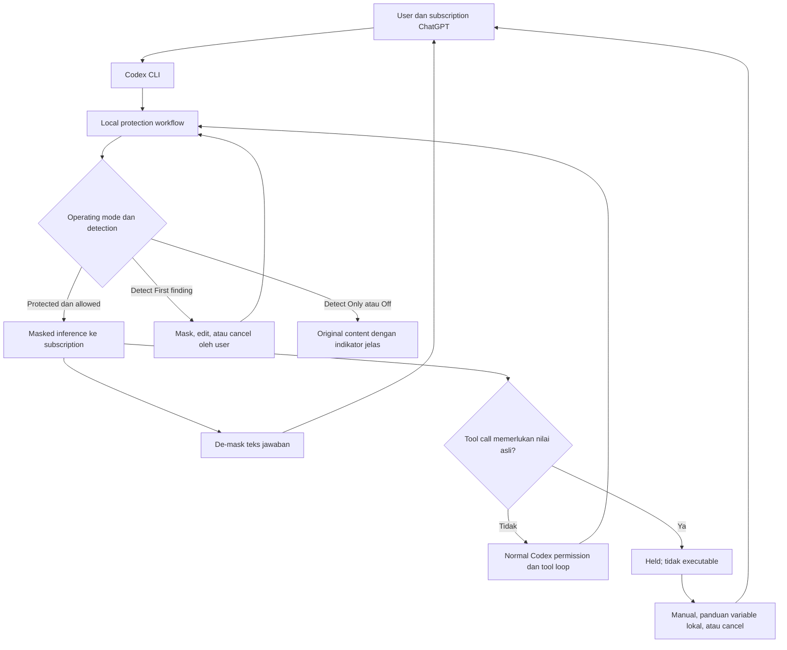
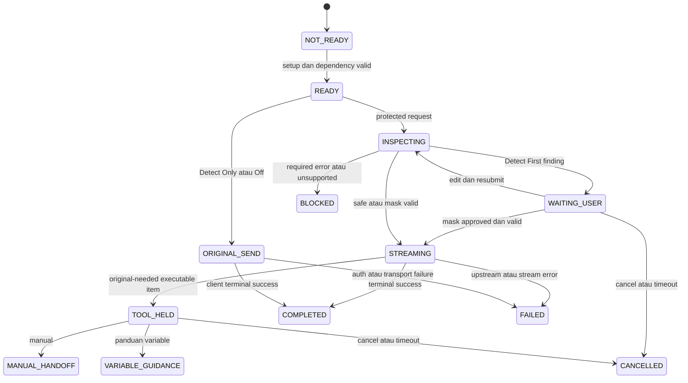

# PromptShield v1 — Product Requirements Document

## Summary

PromptShield melindungi jalur inference Codex dengan memeriksa content sebelum keluar, memasking nilai sensitif, dan memulihkan token pada teks jawaban. MVP wajib memakai **subscription ChatGPT melalui Codex**. Tool call yang membutuhkan nilai asli ditahan; user dapat melakukan tindakan manual, memakai panduan variable lokal seperti `.env`, atau membatalkannya. Pemulihan otomatis pada tool arguments dan controlled tool restoration berada di luar MVP.

PRD ini menetapkan pengalaman user, requirement observable, acceptance criteria, kondisi gagal, dan release gates. BRD disetujui user pada 2026-10-04 dengan DEC-001/DEC-002. PRD disetujui melalui `$sc-ui Approved PRD`; arah baseline UI disetujui melalui `$sc-pan Approved Baseline UI`, ditafsirkan sebagai `/sc-plan`. Subscription integration dan UI runtime belum dibuktikan. Status PRD APPROVED mencatat keputusan user; `experience_baseline_status: DRAFT` mencatat evidence runtime yang belum tersedia, bukan penolakan approval tersebut.

## Minimum Completeness Gate

Profile: HIGH_RISK; tier full (T1/T2). Dokumen mencakup metadata/approver, problem/evidence, outcome/metric, scope/actors, canonical rules/states, stories, FR/AC, failure/recovery, privacy/security/AI, risk/dependency/OPEN, UAT dan FSD handoff. N/A dicatat hanya untuk capability yang tidak termasuk scope.

## Metadata

ID: PRD-PROMPTSHIELD-V1  
Artifact contract version: `2.0.0`  
Revision: 1.1  
Status: APPROVED  
As of: 2026-10-04, Asia/Jakarta  
Upstream: [BRD-PROMPTSHIELD-V1 revision 1.1](../brd/brd-promptshield-v1.md), BREQ-001–BREQ-016, DEC-001/DEC-002, BA-001–BA-016.  
Business approver: user pemohon; `$sc-ui Approved PRD`, 2026-10-04.  
Security/privacy/operational owners: fungsi pada BRD; pemegang peran organisasi ditetapkan sebelum real-data pilot.  
ui_delivery_profile: HIGH_INTERACTION  
experience_baseline_status: DRAFT  
UI direction approval: APPROVED — user pemohon, `$sc-pan Approved Baseline UI`, 2026-10-04; evidence runtime belum tersedia.  
topology: NETWORKED — tindakan user mengatur pengiriman inference dan penahanan tool.  
experience reviewer: Codex, review read-only `/sc-ui` di bagian UI Experience Gate.  
implementation_authorization: belum diberikan; tidak ada GOAL produksi pada tahap PRD.

HIGH_INTERACTION dipilih karena pending approval asynchronous, streaming, perubahan mode saat request aktif, tool hold, cancel dan recovery offline. Ini memperinci klasifikasi UI pada BRD yang sebelumnya masih berupa proposal STANDARD; tidak mengubah scope bisnis.

## Overview — Problem, Evidence, Outcomes

Prompt, file context dan hasil tool dapat membawa PII/secret ke model. User ingin perlindungan lokal dengan sedikit gangguan dan tetap memakai subscription yang sudah digunakan Codex. Masking reversible perlu menjaga conversation isolation dan utility; user telah menerima penahanan tool yang memerlukan original value.

Evidence: requirement user, approved BRD, observasi CLI 0.160.0 dalam BRD, dan [research subscription](../research/2026-10-04-codex-subscription-gateway.md). Dokumentasi resmi menyebut OpenAI-auth custom provider dapat memakai sign-in ChatGPT melalui proxy; belum ada runtime proof pada integration PromptShield. [Codex authentication](https://learn.chatgpt.com/docs/auth).

| Outcome ID | Outcome / metric | Target dan status |
|---|---|---|
| OUT-001 | Sensitive-data containment pada protected route | Zero original canary pada seluruh supported content/security corpus; scope coverage diumumkan, bukan universal detection guarantee |
| OUT-002 | Subscription continuity | Tidak meminta API key; selected account/workspace/subscription dipertahankan; entitled inference, refresh dan route terbukti sebelum release |
| OUT-003 | Reversible user answer | Exact echoed token dipulihkan 100% pada test corpus; tidak resolve unknown/cross-session token |
| OUT-004 | Safe coding workflow | Ordinary safe tool loop tetap berjalan; zero automatic restoration/execution untuk held secret-dependent calls |
| OUT-005 | Performance / utility | Target candidate A14 BRD; hardware/sample/test conditions masih OPEN-PRODUCT-001 |
| OUT-006 | Mode transparency | User dapat membedakan ON, Detect First, Detect Only, OFF, pending request dan failure; perubahan mode tidak melepas held tool |
| OUT-007 | Zero guardian sensitive logging | Canary scan seluruh PromptShield diagnostic/audit/config export sink bersih; native client persistence dilaporkan terpisah |

Tidak ada baseline volume, benefit finansial, accuracy atau latency produk yang sudah diukur. Analytics MVP berupa local metadata/count/duration bila diaktifkan; tidak ada remote telemetry atau raw payload analytics. Dashboard/financial report: N/A — tidak diperlukan untuk local CLI MVP.

## High-Level Design



Diagram adalah view dari FR-001–FR-024 dan BRD-PROMPTSHIELD-V1:DEC-001/DEC-002. Off/Detect Only tetap merupakan mode yang dapat mengirim original data. Mengubah mode tidak memberikan approval execution untuk call yang sebelumnya ditahan.

## Product Contract

### Users, roles dan permission intent

| Actor | Job / akses yang diharapkan |
|---|---|
| Developer per-user | Setup, protected Codex launch, review findings, melihat answer, memilih mode/session dalam policy, dan melakukan fallback manual |
| Organization policy owner | Menetapkan kategori/batas dan mode yang diizinkan; distribusi managed policy operasional fase 2 |
| Local guardian | Memastikan protected request diperiksa dan call yang ditahan tidak diserahkan untuk execution |
| Codex client | Memegang login yang didukung dan permission/sandbox tool execution; tidak memperoleh token map export |
| Provider/model | Menerima content yang permitted; responsnya untrusted dan tidak punya authority untuk mengganti protection/policy |
| QA/security/privacy reviewer | Mengakses metadata dan synthetic evidence sesuai role; tidak otomatis mendapat map atau credential |

User hanya boleh mengelola session miliknya. Repository, prompt, skill, model response atau tool result tidak dapat mengganti mode, tujuan egress, permission atau policy yang dikelola organisasi. Subscription credential tidak memberikan akses ke control UI lokal dengan sendirinya. Uji binding identity wajib masuk integration qualification.

### Scope dan phases

**MVP:** native Codex CLI pada verified client/platform, login subscription ChatGPT, empat operating modes, text/content inspection termasuk multi-turn dan model-bound tool results, local detection/rules/dictionary/Laya profile, reversible memory tokens, streamed text answers, safe tool loop, held secret-dependent calls, manual/variable guidance, status/config/verbose/test, minimum safe audit dan session cleanup.

**Fase 2:** native Codex Desktop dengan evidence terpisah, policy/dictionary administration, persistent safe audit dan session operations. **Pengembangan berikutnya:** controlled tool restoration dengan approval/security contract tersendiri; belum dipastikan fase release. **Fase 3:** provider/host adapters universal termasuk API-key access jika kelak disetujui.

Non-goals MVP: API-key requirement, API billing fallback, third-party plan-usage OAuth frontend sebagai pengganti native client tanpa approval, TLS MITM, remote/cloud universal interception, unrestricted .env reading/writing/loading, auto secret injection ke tool, token map persistence/resume lintas restart, gambar/audio/binary protection, provider-hosted fetching of original data, central vault/dashboard dan automatic compliance certification.

Supported platform/version/transport/model matrix belum final; Windows workspace dan CLI 0.160.0 adalah observed context, bukan dukungan yang telah qualified. Jangan menampilkan label “Codex CLI/Desktop supported” hanya karena gateway health check berhasil.

### Canonical business rules

| Rule ID | Rule observable | Source authority |
|---|---|---|
| RULE-001 | Subscription ChatGPT wajib untuk MVP; auth failure tidak membuka API-key/default raw provider fallback | BRD:DEC-001/BREQ-015 |
| RULE-002 | User memilih default pada setup; Always Masking diberi label recommended; pilihan tersimpan tanpa credential | BRD:BREQ-002 |
| RULE-003 | Protected request tidak keluar sebelum required inspection, masking dan context binding selesai | BRD:BREQ-001/003/006 |
| RULE-004 | Detect First dengan finding menunggu Mask & Continue, Edit Prompt atau Cancel; no silent send-original option | BRD:BREQ-002/A4 |
| RULE-005 | Detect Only dan Off menampilkan peringatan original-data exposure; keduanya tidak membuat token map baru | BRD:A4 |
| RULE-006 | De-mask hanya exact valid token yang permitted pada teks jawaban; unknown/expired/foreign token tidak dipulihkan | BRD:BREQ-004/005 |
| RULE-007 | Tidak memulihkan original value pada tool arguments, patch/file change atau executable item secara otomatis | BRD:DEC-002/BREQ-016 |
| RULE-008 | Held call tidak otomatis dijalankan dari pilihan manual/variable, perubahan mode, retry atau timeout | BRD:DEC-002; safe fallback refinement |
| RULE-009 | Variable fallback hanya guideline/reference/template; user mengisi dan menyiapkan value secara lokal | BRD:DEC-002 |
| RULE-010 | Follow-up dan tool results kembali melewati inspection; .env reference bukan bypass untuk mengirim isi file | BRD:BREQ-001/003 |
| RULE-011 | Keputusan user terikat action, payload, policy, session dan version yang masih berlaku; tidak dapat dipakai untuk content lain | BRD:A4/BREQ-004 |
| RULE-012 | Tidak ada original value/map/credential dalam PromptShield logs, exports, audit atau telemetry | BRD:BREQ-010 |
| RULE-013 | Gateway melindungi verified model route; tool/MCP/browser/telemetry network paths lain membutuhkan controls terpisah | BRD:A2/A7/A15 |
| RULE-014 | Approval ini tidak menjadikan angka benchmark/proposal stack atau runtime compatibility sebagai hasil yang sudah verified | BRD:Metadata/A14/Handoff |

`BRD:` pada kolom source adalah singkatan internal untuk qualified authority `BRD-PROMPTSHIELD-V1:`. Approved DEC-001/002 mengungguli contoh teknis eksplorasi sebelum revision 1.1.

### Journeys dan user stories

| Story ID | User story / hasil | FR / acceptance |
|---|---|---|
| US-001 | Sebagai developer, saya menyiapkan protection dengan subscription Codex dan memilih default mode agar bisa mulai tanpa API key | FR-001/002/003; AC-001/002/003 |
| US-002 | Saya mengirim prompt dan context melalui Always Masking lalu membaca jawaban dengan data asli agar assistant tetap berguna | FR-004/008/009/010; AC-004/008/009/010 |
| US-003 | Saya meninjau finding Detect First sebelum data dikirim, lalu mask, edit atau cancel | FR-005/014; AC-005/014 |
| US-004 | Saya mencoba Detect Only/Off dengan indikator jelas agar memahami exposure mode yang dipilih | FR-006/007; AC-006/007 |
| US-005 | Saya menyelesaikan safe coding task dengan ordinary tools dan follow-up tanpa mengirim original tool-output secrets | FR-004/011; AC-004/011 |
| US-006 | Saya mendapat held tool warning dan melakukan pekerjaan manual tanpa guardian memasukkan secret ke tool | FR-012/013; AC-012/013 |
| US-007 | Saya menerima variable template lalu menyiapkan value lokal dan mengirim task yang direvisi | FR-013/004; AC-013/004 |
| US-008 | Saya memeriksa status/mengubah mode session dan verbose saat bekerja tanpa melepas request/call yang tidak sah | FR-014/015/016; AC-014/015/016 |
| US-009 | Saya menghadapi failure, auth expiry, cancellation atau map loss dengan recovery yang jelas dan aman | FR-001/003/017/018; AC-001/003/017/018 |
| US-010 | Saya menjalankan offline synthetic self-test dan mengubah local policy agar coverage sesuai kebutuhan | FR-019/020/021; AC-019/020/021 |
| US-011 | Sebagai reviewer, saya menilai compatibility, leakage, performance dan control evidence sebelum pilot | FR-022/023/024; AC-022/023/024 |

Setiap story adalah vertical user-value slice; goal sizing dan implementasi di FSD/GOAL, bukan task layer produksi pada PRD.

## Functional Requirements dan Acceptance Criteria

Semua FR di bawah Must untuk MVP kecuali extent managed organization administration yang dinyatakan fase 2. AC adalah required behavior/evidence; belum ada runtime test produk yang dijalankan.

| ID | Observable requirement | Acceptance ID |
|---|---|---|
| FR-001 | Protected launch memakai login/subscription Codex yang eligible; auth, refresh, model entitlement dan quota errors ditampilkan aman | AC-001 |
| FR-002 | Setup meminta default mode, memberi recommendation Always Masking dan menjelaskan unsafe modes sebelum menyimpan pilihan | AC-002 |
| FR-003 | Launch/status menunjukkan engine readiness, verified coverage dan login/integration readiness; failed required dependency memblokir protected send | AC-003 |
| FR-004 | Semua supported model-bound content diperiksa, termasuk instructions, prompt/history/file text, tool arguments replay dan tool results | AC-004 |
| FR-005 | Detect First menahan sensitive request hingga keputusan user yang valid; reviewer UI terpisah bila native UI tidak bisa menerima input | AC-005 |
| FR-006 | Detect Only menunjukkan kategori/count dan warning bahwa original dikirim, lalu submit tanpa mask/block atas finding | AC-006 |
| FR-007 | Off menjalankan tanpa detection/classification/masking/tokenization/de-masking untuk request baru dan menunjukkan Protection: OFF | AC-007 |
| FR-008 | Always Masking mengganti seluruh required spans otomatis, tanpa confirmation per finding; unresolved/error wajib memblokir | AC-008 |
| FR-009 | Mapping tidak diekspos provider/log/persistence, terikat conversation/request yang tepat dan dibersihkan sesuai lifecycle | AC-009 |
| FR-010 | Teks jawaban streaming/final memulihkan exact valid token secara konsisten, tanpa membuka map pada field lain | AC-010 |
| FR-011 | Tool loop yang tidak membutuhkan map restoration tetap mengikuti permission Codex; hasilnya diperiksa sebelum kembali ke model | AC-011 |
| FR-012 | Call yang membutuhkan original masked value atau memuat unresolved sensitive placeholder tidak diserahkan sebagai executable tool item | AC-012 |
| FR-013 | Held-call recovery menawarkan manual, variable guidance dan cancel; tidak mengubahnya menjadi consent otomatis untuk original-value execution | AC-013 |
| FR-014 | Mode dapat diubah per active session; pending decisions menjadi stale bila payload/policy/mode berubah; stream aktif punya status snapshot tersendiri | AC-014 |
| FR-015 | Status menunjukkan selected session, effective mode, scope, health, map lifecycle dan integration verification tanpa secret/identity mentah | AC-015 |
| FR-016 | Verbose/audit/config export hanya menambah approved metadata; tidak mengungkap value/map/credential/content/path sensitif | AC-016 |
| FR-017 | Cancel/disconnect/timeout/retry mempunyai terminal outcome yang jelas dan tidak membuka direct-provider fallback atau duplicate side effects | AC-017 |
| FR-018 | Session cleanup/map loss/restart tidak menebak original atau mengklaim session resumed terlindungi tanpa valid mapping | AC-018 |
| FR-019 | Policy kategori/rules/dictionary dapat dikonfigurasi lokal; config invalid/reload conflict tidak menurunkan protection diam-diam | AC-019 |
| FR-020 | Coverage report menjelaskan supported categories/languages, required/optional detectors dan unresolved findings | AC-020 |
| FR-021 | `ai-guard test` default memakai synthetic/offline fixtures dan melaporkan scope self-test tanpa memanggil provider/live tools | AC-021 |
| FR-022 | Setiap supported client/model/auth/transport combination memiliki qualification dan safe error distinctions | AC-022 |
| FR-023 | Performance/utility dan operational limits dilaporkan menurut workload/hardware yang disepakati, tanpa silently truncating inspection | AC-023 |
| FR-024 | Release evidence menyatakan privacy/control scope, ownership, residual risks dan bypass paths serta memerlukan privacy review untuk data nyata | AC-024 |

### Detailed acceptance

| AC ID | Given / when / then; negative dan evidence scope |
|---|---|
| AC-001 | Given eligible Codex subscription, saat protected launch dan turn berjalan, tidak diminta API key dan route tetap subscription. Auth missing/expired/revoked, model unavailable atau quota exhausted memberi safe reason dan recovery login/menunggu yang sesuai; tidak switch billing/provider. Token renewal tidak membypass inspection atau mereuse approval stale. Evidence actual entitlement/route tidak boleh hanya model catalog/health |
| AC-002 | Given setup belum lengkap, launch tidak memilih mode otomatis. User dapat memilih empat mode yang diizinkan; Detect Only/Off menjelaskan exposure sebelum choice disimpan. Cancel setup tidak memulai send. Tidak meminta raw secret untuk mencoba detection |
| AC-003 | Given required engine/config/auth/integration tidak ready, protected submission gagal sebelum outbound inference. User melihat reason dan next action tanpa input/value. Status “running” tidak disamakan dengan integration verified; setup/provisioning network dipisah dari prompt-time processing |
| AC-004 | Given synthetic canaries pada setiap supported text field termasuk nested/escaped/multiline/history/tool result, protected upstream capture tidak memuat original. Unknown endpoint/type, inaccessible file reference atau opaque attachment yang belum qualified diblokir sebelum send. Supported protocol fields/call pairing tidak berubah secara salah |
| AC-005 | Given Detect First finding, user melihat category/count, action options dan request scope; upstream belum menerima payload. Mask & Continue berlaku sekali bagi payload yang sama; edit resubmit discan ulang; cancel/no reviewer/timeout tidak send. Untuk finding pada automatic tool-result request, edit berarti menghentikan turn dan merevisi sumber/prompt, bukan menulis ulang tool result diam-diam |
| AC-006 | Given Detect Only selected, safe ataupun sensitive prompt dikirim original dengan exposure indicator; findings informational, no map/de-mask baru. Required detector error memberi degraded warning dan original tetap dikirim bila protocol/auth valid, sesuai mode. Tidak menampilkan false “masked” status |
| AC-007 | Given Off selected, request baru tidak menjalankan protection pipeline dan indicator literal OFF tersedia sebelum penggunaan. Transport/auth errors tetap dapat menolak invalid request. Held call dari protected mode tidak otomatis executable karena Off; stream protected yang telah dikirim diselesaikan menurut snapshot lama yang ditampilkan |
| AC-008 | Given Always Masking finding, request langsung diproses tanpa user approval per finding tetapi belum send sampai inspection/map/masking valid. Uncovered span, mandatory timeout/crash atau unresolved classifier risk memblokir; response tidak dilabeli successful send. Repeats/overlap tidak menyisakan bagian nilai sensitif |
| AC-009 | Given concurrent scopes, token session A tidak resolve di B dan provider hanya menerima protected representation. Token tidak menjadi map-export capability. TTL/end/limit/cancel cleanup teruji; active response tidak kehilangan mapping karena silent eviction. Export/log/crash fixtures tidak berisi map/raw values |
| AC-010 | Given provider mengembalikan exact allowed token, output user dipulihkan konsisten meskipun placeholder terbagi lintas delta. Final snapshot cocok dengan output stream. Foreign, expired, malformed atau modified token tetap unresolved dengan safe indicator; tidak guessing atau recursive expansion. Tool arguments/patch items tidak ikut dipulihkan |
| AC-011 | Given safe tool call tanpa perlu map restoration, native permission/sandbox tetap berlaku dan matching result/continuation selesai melalui protected route. Secret hasil read file/command dimasking sebelum upstream. Normal tool approval tidak memberikan authority untuk mengakses map atau mengganti protection |
| AC-012 | Given tool arguments/executable item berisi sensitive placeholder atau kebutuhan original yang dikenali, item ditahan sebelum client dapat mengeksekusinya dan status HELD terlihat. Tidak mengirim executable original/partial arguments saat streaming. Timeout, mode change, restart, retry atau prompt “approve” tidak memulihkan value. Unsupported event gating memblokir feature/release, bukan membiarkan execution |
| AC-013 | Given held call, manual menunjukkan safe task description dan menyerahkan pekerjaan kepada user di luar autoexecution; variable guidance memberi nama/reference/template tanpa nilai; cancel membatalkan. Memilih salah satu tidak mengisi .env, memuat env, meng-copy secret ke clipboard/file/argv, menjalankan command, atau melanjutkan original call. User dapat submit revised task/call sebagai input baru yang discan dan mengikuti native permissions |
| AC-014 | Given active session dan pending request/call, user mengubah mode dalam policy; next unsent request mengevaluasi mode/policy current. Approval stale ditolak; blocked tool tetap tidak executable. Sent stream menampilkan mode awal dan next-request mode terpisah; perubahan tidak diklaim menghapus data yang telah terkirim. Multiple instances memerlukan pilihan scope yang tidak ambigu |
| AC-015 | Given active/no-active/multiple sessions atau degraded engine, status memperlihatkan keadaan yang benar, effective mode dan verified coverage. Session handle bersifat lokal dan tidak memuat user email/secret. Mode/verbose command pada wrong owner atau ambiguous scope tidak mengubah instance lain |
| AC-016 | Given verbose on/off, validation error, upstream error, model hook, config export dan session events, semua PromptShield sinks bebas canary raw content/credential/map. Category/count/action/policy version dapat muncul; `log_sensitive_value=true` ditolak. Sensitive dictionary, filenames, raw exception body dan env values tidak ikut export |
| AC-017 | Given pending approval/stream/tool hold, user cancel, disconnect atau timeout menghasilkan safe terminal status dan cleanup; tidak fake-success. User retry membuat action baru/validated request yang semestinya, bukan replay executable held call. Automatic inference retry hanya bila protocol dan state mengizinkannya; tidak menggandakan tool effect |
| AC-018 | Given session end/restart/map expiry, lookup stale ditolak dan user diberitahu bahwa original restoration/resume tidak tersedia. User dapat memulai session baru; guardian tidak mencari map dalam provider history/file. Token cleanup tidak menghapus Codex login atau user file; re-enable setelah Off tidak memulihkan map yang sudah revoked |
| AC-019 | Given category/rule/dictionary config valid, effective policy diterapkan dan ditampilkan aman. Invalid update tetap memakai policy terakhir yang valid dengan warning; repo/model cannot weaken managed constraints. User dictionary tidak keluar ke provider atau config export. Unknown settings/unsafe logging ditolak |
| AC-020 | Given policy profile dan fixtures tiap minimal category, report membedakan span detection, classifier risk, unsupported/free-text limitations, false block dan unresolved cases. Laya safe score tidak melewati required deterministic inspection; long input tidak silently truncate. No category disebut fully supported sebelum eval scope bahasa/workload dipenuhi |
| AC-021 | Given offline workstation, self-test menjalankan hanya fixtures synthetic dan menampilkan actual pass/fail/skips serta feature coverage. Tidak consume subscription quota, mencoba credential pada provider atau mengeksekusi tool nyata. Passed self-test tidak dilabeli actual subscription/integration verification |
| AC-022 | Given target client/model route, real qualification mencakup subscription auth/refresh/entitlement, complete request coverage, SSE terminal state, multi-turn/tool pairing dan cancel/error. Auth, quota, unsupported feature, upstream outage dan protection block dapat dibedakan tanpa raw payload. Client update invalidates affected proof sebelum fitur supported kembali |
| AC-023 | Given agreed corpus/hardware, report memisahkan warm/cold detection, queue, network/provider, review time, memory dan utility. Input/resource cap gagal jelas tanpa partial scan/raw fallback. Target yang belum disepakati tidak diklaim PASS berdasarkan angka dari Laya/reference project |
| AC-024 | Given pilot candidate, stakeholder dapat melihat data flow/scope/coverage/test evidence/risk owners. Real-data processing hanya setelah lawful-purpose/vendor/transfer/retention/DPIA review yang applicable. Tokenisasi disebut pseudonimisasi; tidak ada label certified/compliant otomatis atau universal desktop DLP |

## Held Tool Recovery — Batas MVP yang Approved

Teks answer dan executable output berbeda. Jika native client tidak dapat memisahkan keduanya sebelum execution, fitur terkait ditahan sampai adapter qualified. Safety contract tetap sama walaupun native client perlu menghentikan turn untuk menampilkan held state.

| Tindakan user | Hasil yang diizinkan | Hasil yang tidak diizinkan |
|---|---|---|
| Lakukan manual | Safe description kategori/tujuan; user memakai nilai asli yang sudah dimilikinya di local workflow; held call menjadi MANUAL_HANDOFF | Guardian menyusun/menjalankan command dengan original values; menyatakan pekerjaan manual telah berhasil tanpa evidence |
| Panduan variable lokal | Template/reference nonsecret seperti SERVER_HOST/API_TOKEN; held call menjadi VARIABLE_GUIDANCE, user menyiapkan env dan merevisi task | Map diekspor ke .env, file otomatis dibaca/disource, variable otomatis diisi, secret diperlihatkan dalam preview |
| Batalkan | Held call menjadi CANCELLED; user dapat memulai task baru | Auto resume, approval permanent, fallback mode untuk menjalankan call lama |

Contoh guideline sintetis untuk control UI, bukan command yang dijalankan:

```text
Tool call ditahan: membutuhkan nilai sensitif asli.
Kategori: IP Address, API Token

1. Lakukan manual
2. Lihat panduan variable lokal
3. Batalkan

Template lokal yang Anda isi sendiri:
SERVER_HOST=<isi secara lokal>
API_TOKEN=<isi secara lokal>
```

Guideline menjelaskan bahwa `.env` tidak dikirim ke model, tidak ditambahkan ke source control, dan ekspansi variable tidak dicetak ke prompt/tool output. Nama variable yang disarankan memakai safe generic label; nama yang sendiri confidential tidak dimasukkan ke upstream. `.env` tidak otomatis diload hanya karena file tersebut ada.

Setelah user menyiapkan value lokal, reference variable boleh dipakai dalam task/call baru yang tidak membutuhkan token-map restoration. Execution tetap mengikuti native Codex permissions dan network policy. Ini bukan mekanisme guardian menginjeksi secret atau menjamin seluruh egress tool aman. Jika tool membaca/menampilkan value, model-bound result tetap diinspeksi. Network tool yang mengirim value langsung memerlukan egress control terpisah.

Manual completion tidak mensubmit original tool-output secret kembali ke model. User dapat menyampaikan nonsecret outcome atau hasil yang diperiksa sebagai input baru. Tidak ada command “resume original tool” pada MVP; controlled restoration memerlukan PRD/security approval berikutnya.

## Canonical States, Failures dan Recovery



State diagram adalah product view; exact transport/state implementation dimiliki FSD. Panah ke STREAMING hanya sesudah seluruh send prerequisites selesai. Manual/variable adalah terminal disposition held call; revised task merupakan request baru. Tidak ada panah dari TOOL_HELD langsung ke execution.

| Condition | Observable disposition / recovery |
|---|---|
| Tidak ada active session | Status EMPTY; tunjukkan setup/launch, tidak menyatakan protected connection |
| Login belum tersedia/expired/revoked | AUTH_REQUIRED/FAILED; user mengikuti supported Codex login, tidak meminta credential di guardian chat |
| Subscription limit/model access | Safe upstream restriction; tidak mengganti model/account/billing otomatis |
| Required detector timeout/crash/model belum diprovision | Protected BLOCKED; readiness reason; user bisa memperbaiki dependency dan retry |
| Optional detector unavailable | Degraded hanya bila optional dinyatakan sejak policy awal; status coverage jelas, tidak silent profile reduction |
| Unresolved PII/confidential classification tanpa span | Protected BLOCKED dengan kategori/risk label; tidak menyatakan data safe |
| Input cap/unsupported attachment/reference/endpoint | BLOCKED sebelum send; minta input/scope supported; tidak truncate atau fetch provider-hosted raw content |
| Unknown/mutated token dalam answer | Placeholder unresolved dan safe indicator; original tidak ditebak |
| Unknown/required token pada executable output | TOOL_HELD atau feature BLOCKED sebelum execution |
| Stale user decision/version conflict | STALE; tidak berlaku; review current action tanpa reuse approval lama |
| Offline/gateway mati | OFFLINE/NOT_READY; protected route berhenti, tidak direct-provider fallback |
| User cancel/terminal lost | CANCELLED/INTERRUPTED sesuai state client; finite cleanup, no hidden background send |
| Failed/incomplete SSE | FAILED/INTERRUPTED; partial text diberi status incomplete; no fabricated final success |
| Map expired/crash/restart | Session restoration/resume unavailable; new session required, no persistence recovery |
| Off saat protected stream sudah keluar | Stream aktif memakai snapshot lama; next mode OFF terlihat; held call lama tidak otomatis berjalan |
| Multiple sessions/window owner ambiguity | User memilih session/scope; tidak broadcast mode/decision ke semua instance |

Fail-closed requirement berlaku pada Detect First/Always Masking. Detect Only mendeteksi secara informational; Off melewati detection. Tool restoration tidak dijalankan pada mode apa pun. Off/Detect Only tidak menciptakan masked-value dependency baru; native calls pada mode itu tetap mengikuti normal Codex permissions. Batas unsafe modes dan stale protected call harus terlihat jelas pada UI.

## CLI Surface dan UX Content

Nama command mengikuti BRD; exact flags/session handle/output machine schema adalah FSD. Entry points yang perlu tersedia:

| Command/action | User-observable result |
|---|---|
| ai-guard setup | Pilih default mode dan lihat local readiness/subscription prerequisites |
| ai-guard wrap codex | Mulai protected native CLI session bila qualification/readiness valid |
| ai-guard status | Effective mode, coverage, health, active/pending state tanpa raw data |
| ai-guard mode / mode value | Tampilkan atau ubah mode selected session/default dengan scope jelas |
| ai-guard verbose on/off | Ubah detail metadata, tidak menampilkan sensitive value |
| ai-guard config | Lihat/edit configurable policy tanpa export dictionary/credential |
| ai-guard test | Offline synthetic self-test; no live inference by default |
| ai-guard review | Kelola pending request atau held-call fallback bagi selected session |
| ai-guard stop | Hentikan instance/session dan revoke lifecycle tanpa menghapus login/user files |

Normal Always Masking: “1 sensitive value masked”. Detect First: category/count + “Belum dikirim” + action choices. Detect Only: “Data asli akan dikirim; masking tidak aktif”. Off: literal “Protection: OFF”. Tool hold: “Tool call ditahan; tidak dijalankan” + manual/variable/cancel. Error: safe cause class dan action pemulihan; jangan tampilkan payload untuk menjelaskan failure.

Labels mengikuti arah baseline UI yang telah diterima user; native AI output language tidak diubah. Control UI menggunakan Bahasa Indonesia dengan istilah mode yang konsisten dan literal OFF. OPEN-PRODUCT-004 ditutup oleh approval baseline; dukungan locale tambahan merupakan pengembangan berikutnya.

## Security, Privacy, Compliance dan NFR Intent

| ID | Product-level requirement | Evidence / acceptance |
|---|---|---|
| SEC-001 | Authenticate/authorize current user/session; reject map lookup dan control action lintas owner/thread | AC-009/014/015; concurrent isolation tests |
| SEC-002 | Repository/model/tool tidak mengubah managed policy, egress route atau local tool-restoration authority | AC-012/019; hostile content tests |
| SEC-003 | Known sensitive content dan map tidak masuk upstream/log/export/telemetry; auth credential hanya untuk authorized transport | AC-004/009/016; canary sinks dan redirect/route tests |
| SEC-004 | Untrusted executable response tidak menerima restored values; .env fallback tidak menjadi secret-export path | AC-010/012/013; streaming tool-gate and file/clipboard/argv checks |
| SEC-005 | Resource/time limits, pending timeout dan cancellation tidak membypass protection | AC-003/008/017/018/023 |
| SEC-006 | Install/model/runtime updates memiliki provenance dan affected proof invalidation; inference tetap local-first | AC-003/020/022; package/model/version matrix |
| PRIV-001 | Tokenisation reversible dinyatakan pseudonimisasi; provider masih dapat melihat context/category dan melakukan inference | AC-024; BRD:A16 |
| PRIV-002 | Retensi map terbatas session/TTL; cleanup bukan penghapusan native history atau semua data organisasi | AC-009/018/024 |
| PRIV-003 | Native de-masked answer dapat muncul di local client history dan dibaca ulang; guardian rescans model-bound replay | AC-004/010; explicit scope statement dan local endpoint review |
| PRIV-004 | Lawful purpose/basis, vendor/transfer/retention dan DPIA jika applicable sebelum data nyata | AC-024; OPEN-PRIVACY-001 |
| NFR-001 | Guardian overhead/queue/memory/utility terukur pada agreed workload; tidak memblokir terminal tanpa reason | AC-023; OPEN-PRODUCT-001 |
| NFR-002 | Local detection/self-test tidak melakukan unnecessary network atau remote classifier calls | AC-020/021; offline/no-egress evidence |
| NFR-003 | Install/readiness/recovery jelas pada supported OS/client; unsupported setup gagal dengan scope reason | AC-003/018/022 |
| NFR-004 | Mode/status dan action options dapat digunakan keyboard dan terbaca tanpa bergantung warna | UI Experience Gate; AC-002/005/012/014/015 |

Compliance intent diwarisi BRD A16: technical privacy/security control untuk UU PDP, GDPR dan ISO/IEC family. Exact applicability/SoA/legal judgment tetap milik organisasi; guardian tidak menyediakan lawful basis, consent management platform, rights portal atau incident notification otomatis. Subscription workspace policies harus dipertahankan sesuai supported auth path; tidak menjanjikan data residency/retention hanya dari label subscription.

Target kandidat dari BRD:A14: warm deterministic p95 ≤50 ms/16 KiB, full profile dengan Laya ≤500 ms/16 KiB, incremental normal text rewrite overhead p95 ≤20 ms/event batch; exact restoration/mandatory canary containment 100%; supported high-confidence structured category span recall ≥99% dan precision ≥95%; task utility ≥90%. Ini target untuk disepakati bersama hardware, corpus size, confidence intervals dan workload pada OPEN-PRODUCT-001, bukan pengukuran. Free-text nama/alamat tidak boleh tertutupi aggregate metric.

## AI Context and Output

PromptShield memproses AI traffic tetapi tidak menambah AI provider lain untuk melakukan detection. Local classifier dan user/model content memiliki authority berbeda; confidence model tidak mengizinkan raw send atau execution.

| Context aspect | Product policy |
|---|---|
| Actor/source attribution | Pertahankan user/assistant/tool roles, source item/call association dan ordering; jangan flatten tool result sebagai instruksi user |
| Versions | Qualification pin client/model/policy/detector scope; source metadata yang dibawa tidak memuat nilai/path confidential. Exact protocol dimiliki FSD |
| Chronology | Replay mempertahankan urutan turn/call/result; response tidak dinyatakan completed sebelum terminal success client |
| Authorized selection | Semua supported content pada request aktual diinspeksi; gateway bukan agent yang memilih additional files, `.env`, browser data atau remote sources |
| Omission/truncation | Tidak silently drop risk-bearing content; unsupported/limit/incomplete scan memblokir protected request dan menjelaskan scope tanpa excerpts |
| Output-language policy | Guardian mempertahankan bahasa response provider/Codex/user task; tidak memaksakan bahasa dari classifier/control UI. Mixed/empty/ambiguous input tidak memicu translasi tambahan |
| Output validation | Exact scoped restoration untuk user text; unknown/malformed executable result ditahan sebelum use; no automatic map persistence |
| Review/edit/confirm | Detect First review hanya untuk protected send; manual/variable tool handoff tidak sama dengan execution consent; existing Codex approvals tetap terpisah |
| Retry/regenerate | Revised task/resubmit discan kembali; tidak reuse stale decision atau duplicate tool side effect |

AI eval mencakup ID/EN/mixed context, malformed output, foreign token, attribution/chronology preservation, incomplete context, adversarial prompt meminta map dan variable/raw-output leakage. Native model-generated answer quality tetap bergantung model/provider; guardian tidak menyatakan jawaban faktual benar hanya karena de-masking berhasil.

## UI Experience Gate

Critical journeys: US-001 setup/login, US-003 Detect First, US-006/007 held tools dan US-008/009 mode/cancel/recovery. Requirement refs: FR-001/002/005/012/013/014/017; corresponding AC IDs. Baseline DRAFT; coverage di bawah adalah **coverage requirement**, bukan hasil runtime verification.

| State ID / applicability | Required behavior dan evidence target |
|---|---|
| UI-STATE-001 loading — COVERED in specification | Setup/warmup/inspection menunjukkan phase; keyboard remains responsive; AC-003/023 |
| UI-STATE-002 empty — COVERED in specification | No active session/pending action menampilkan EMPTY dan next action; AC-015 |
| UI-STATE-003 success — COVERED in specification | Masked/submitted/completed dibedakan; manual handoff bukan tool success; AC-008/010/013/017 |
| UI-STATE-004 validation — COVERED in specification | Invalid mode/config/limit input diberi safe reason, tidak overwriting valid policy; AC-002/019 |
| UI-STATE-005 error — COVERED in specification | Auth/engine/upstream/tool-gate failures actionable tanpa content leakage; AC-001/003/012/017 |
| UI-STATE-006 forbidden — COVERED in specification | Wrong owner atau locked-mode change ditolak; tidak expose session/map; AC-014/015/019 |
| UI-STATE-007 stale/conflict — COVERED in specification | Stale approval/call scope ditolak; current state terlihat; AC-005/014 |
| UI-STATE-008 partial/degraded — COVERED in specification | Incomplete stream/detector optional/detect-only error dilabeli; tidak fake-safe; AC-006/010/017/020 |
| UI-STATE-009 offline — COVERED in specification | Protected launch/send blocked; self-test tetap local; AC-003/021 |
| UI-STATE-010 async/pending — COVERED in specification | Pending user decision, TOOL_HELD, cancel dan expiry; no background execution; AC-005/012/013/017 |
| UI-STATE-011 unsafe mode — COVERED in specification | Detect Only/OFF exposure sebelum use, selected session/mode jelas; AC-006/007/014 |
| UI-STATE-012 responsive/keyboard — COVERED in specification | Terminal sempit tidak menyembunyikan action/protection state; logical focus/order, no keyboard trap; AC-002/005/012/014/015 |

Responsive/accessibility intent: tampilkan essential mode/action/status terlebih dulu pada terminal 80 dan 120 columns; long category/session labels wrap tanpa raw values atau memotong pilihan cancel. Keyboard-only review dan cancellation harus tersedia dengan visible selection; stream tidak mengambil focus dari keputusan pending. Text status/warning tersedia dalam plain/non-color output untuk screen reader/noninteractive logs. HTML ARIA guidance hanya applicable jika companion web UI kelak dipilih, bukan requirement atribut HTML pada terminal.

### Read-only sc-ui review dan evidence

Review mode: read-only; reviewer Codex; date 2026-10-04. Tidak dibuat frontend/prototype atau source produk pada review. Targeted retrieval menggunakan:

```text
rtk python .agent/skills/interface-design/scripts/search.py "CLI terminal asynchronous approval keyboard focus actionable error protection status" --domain ux -n 4
```

Hasil: 4 guidance rows tentang focus, keyboard navigation, announced errors, submit feedback. Digunakan sebagai advisory principles untuk terminal, bukan bukti browser/CLI compatibility. State diagram dan UI matrix di PRD ini menjadi document review locators; sumber lokal retrieval adalah `.agent/skills/interface-design/data/ux-guidelines.csv`. Tidak mengimpor CSV penuh atau membentuk design system baru.

Classification: **EVIDENCE** → owning `/sc-prd`. Finding: specification telah mencakup named states, tetapi runnable evidence untuk asynchronous hold/cancel, streaming-mode switch, keyboard/focus, offline/readiness, dan terminal overflow belum tersedia. `experience_baseline_status` tetap DRAFT. Tidak ada disposition `promote decision` atas prototype karena tidak ada prototype yang dijalankan. OPEN-UI-001/002 harus diselesaikan melalui `/sc-ui` evidence sebelum baseline dapat VALIDATED; approver tetap user pemohon.

Approval arah baseline dicatat pada revision 1.1 setelah review read-only `/sc-ui`. Tidak ada evidence runtime baru, sehingga OPEN-UI-001/002 tetap terbuka untuk pembuktian. Tidak memakai NOT_APPLICABLE/EXCEPTION_APPROVED untuk melewati gate. Native Desktop state/runtime coverage memerlukan review fase 2 tersendiri; belum diverifikasi dari CLI UI evidence.

## Testing Decisions, UAT dan Release Gates

Highest practical behavior surfaces: native CLI→protected upstream capture, local control actions/status, rendered answer dan executable tool delivery boundary. Unit/property test membantu detector/maps, tetapi tidak menggantikan actual client/subscription/tool-loop evidence.

| Test ID | Scenario/evidence scope | Requirement refs |
|---|---|---|
| TEST-001 | Supported subscription sign-in, refresh, model entitlement, quota errors, protected route proof | FR-001/003/022; AC-001/003/022 |
| TEST-002 | Setup/mode/Detect First control, no-reviewer/timeout/stale, safe/unsafe states | FR-002/005/006/007/014/015 |
| TEST-003 | Canary containment seluruh supported content, category/language held-out eval dan unresolved errors | FR-004/008/019/020 |
| TEST-004 | Cross-session/thread isolation, exact round-trip, arbitrary delta partitions, map lifecycle/restart | FR-009/010/018 |
| TEST-005 | Actual safe tool loop; streaming original-needed call tidak executable; manual/variable/cancel | FR-011/012/013/017 |
| TEST-006 | Guardian .env/files/clipboard/argv/log/audit/exception/telemetry tidak menerima map/value export; output tool rescanned | FR-004/013/016 |
| TEST-007 | Keyboard-only terminal flows, narrow/long output, offline readiness, concurrent status/mode/stream | UI-STATE-001–012; OPEN-UI-001/002 |
| TEST-008 | Unauthorized control, hostile prompt/repo/response, policy tamper, bounded input/decoder/regex/model failure | SEC-001–006; FR-003/012/019/023 |
| TEST-009 | Agreed hardware/corpus warm/cold/queue/memory/utility comparison | FR-023; OUT-005; OPEN-PRODUCT-001 |
| TEST-010 | Privacy owner data-flow/transfer/retention/residual review, evidence/package/version provenance | FR-024; PRIV-001–004 |
| TEST-011 | Offline synthetic self-test distinction from real qualification, fresh install/readiness | FR-021/003/022 |

TEST IDs adalah planned acceptance coverage, bukan berkas/command tests yang sudah dibuat. FSD menetapkan exact test commands, source/corpus revisions dan expected result. Public fixtures menggunakan data dummy/nonaktif. Live qualification memakai content sintetis dan akun subscription yang diizinkan; bukan silent background inference pada authoring PRD.

| Gate | Prasyarat untuk release / owner |
|---|---|
| GATE-001 product readiness | Approved PRD, defined quality targets/supported matrix; product owner |
| GATE-002 UI readiness | HIGH_INTERACTION baseline VALIDATED dengan runnable evidence dan approval; UI/product reviewer |
| GATE-003 subscription readiness | Actual supported subscription route/auth refresh/tool-loop evidence; maintainer/security |
| GATE-004 privacy/security readiness | No unaccepted high risk, known canary containment, zero logs/map export dan real-data privacy review; security/privacy owner |
| GATE-005 performance/utility | Approved OUT-005 workload/hardware gates met; QA/product owner |
| GATE-006 operational readiness | Install/stop/cleanup/offline/upgrade/rollback dan diagnostic scope documented; platform owner |

UAT: user menyelesaikan synthetic safe coding task, membaca de-masked text, menghadapi Detect First finding, memilih manual/variable/cancel untuk held call, mengganti mode saat stream aktif, dan melakukan offline/error recovery. Success dinilai dari outcome/state/zero unintended send/execution; bukan hanya keberadaan command.

Stop criteria: original known value keluar pada protected route, held item executable, map/control cross-session access, credential leak, unknown endpoint passthrough, atau mode/status palsu. Containment: hentikan affected protected workflow, simpan safe metadata, lakukan authorized security/privacy response. Rollback ke verified guardian version atau tetap stop; tidak otomatis memilih Off, raw direct route atau API-key access.

## Risks, Assumptions, Dependencies dan OPEN Items

| ID | Risk / assumption / dependency | Treatment / owner |
|---|---|---|
| RISK-001 | False negatives atau semantic re-identification | Coverage/held-out corpus/unresolved block; residual tetap eksplisit; security/privacy |
| RISK-002 | Subscription provider/protocol/client changes membuat coverage salah | Affected qualification/version gate; no silent fallback; maintainer |
| RISK-003 | Native client mengeksekusi tool sebelum guardian hold dapat diterapkan | Gate actual tool event sequence sebelum support/release; maintainer/security |
| RISK-004 | Variable guidance dianggap izin auto-load/inject/exfil secret | Safe guidance dan new task semantics; .env canaries; product/security |
| RISK-005 | Fail closed/overmask/CPU overhead menurunkan task utility | Utility/latency/review measurements; approved target hardware; product/QA |
| RISK-006 | Native local history/tool network/MCP di luar gateway scope | Explicit scope, rescanning replay, endpoint/egress controls; platform/privacy |
| ASSUMP-001 | User menerima de-masked text dan hold-only tool boundary | Approved DEC-002; batas local persistence tetap dinyatakan, bukan zero-retention claim |
| ASSUMP-002 | Native subscription local proxy dapat diqualified tanpa mengganti host | Documentation candidate; OPEN-RESEARCH-001 belum runtime-proven |
| DEP-001 | Account/workspace/model eligible dan Codex login tersedia | Supported product mechanism; no raw credential collection; user/platform |
| DEP-002 | Local model/artifact/OS session controls tersedia pada supported matrix | Provision/readiness dan provenance evidence; maintainer/platform |

| OPEN ID / status | Missing decision/fact; impacted refs | Owner/gate / next action / fallback |
|---|---|---|
| OPEN-RESEARCH-001 / OPEN | Native subscription route, refresh, entitlement dan full coverage pada client target; FR-001/003/022 | Maintainer; sebelum integration FSD contract difinalkan/GATE-003. Targeted read-only/runtime evidence; block unsupported route, tanpa API-key fallback |
| OPEN-RESEARCH-002 / OPEN | Laya quality/CPU/RAM/package/model license/digest/long context; FR-020/023 | QA/maintainer; sebelum detector contract/release. Local synthetic corpus; no silently reduced required profile |
| OPEN-RESEARCH-003 / OPEN | Actual endpoints/opaque context/continuation/SSE tool gate semantics; FR-004/010/011/012/022 | Maintainer/security; sebelum adapter contract/release. Unsupported paths/features block |
| OPEN-RESEARCH-004 / OPEN | Verified principal/session/thread metadata/binding, concurrency/restart; FR-009/014/018 | Maintainer/security; sebelum multi-conversation support. No scope by TCP/IP atau payload identity saja |
| OPEN-PRODUCT-001 / OPEN | Hardware minimum, corpus sizes/intervals, category languages dan final performance/utility gates; FR-020/023, OUT-005 | Product/security/QA; sebelum acceptance final/GATE-001/005. Gunakan kandidat BRD hanya sebagai benchmark proposal |
| OPEN-PRODUCT-002 / OPEN | Supported initial OS/client/model/transport matrix dan target pilot scope; FR-001/003/022 | Product/platform; sebelum GATE-001/003. Observed Windows/0.160.0 belum support claim |
| OPEN-PRODUCT-003 / OPEN | Named security/privacy owners dan locked organization mode policy; FR-014/019/024 | Product/platform/privacy; sebelum real-data pilot. Synthetic-only; tidak self-assign legal approval |
| OPEN-PRODUCT-004 / RESOLVED | Control UI Bahasa Indonesia sesuai baseline yang diterima; native answer language dipertahankan; CLI Surface/AC-005/013 | User pemohon, `$sc-pan Approved Baseline UI`, 2026-10-04; tidak mengubah bahasa response model |
| OPEN-UI-001 / OPEN | Runnable interactive evidence untuk pending/hold/cancel/streaming/mode/offline/keyboard; UI-STATE-001/007/008/009/010/012 | `/sc-ui`, product reviewer; sebelum GATE-002. Baseline DRAFT; prototype throwaway atau current-runtime evidence, no false VALIDATED |
| OPEN-UI-002 / OPEN | Native CLI control placement dan terminal overflow/long label/readiness state proof; US-001/003/006/008 | `/sc-ui`, maintainer/product reviewer; sebelum GATE-002. Companion control UX tetap proposal sesuai BRD |
| OPEN-PRIVACY-001 / OPEN | Lawful basis/purpose, sharing/vendor/transfer/retention/DPIA applicability; FR-024/PRIV-004 | Privacy/legal owner; sebelum processing data nyata. Synthetic-only feasibility |

Resolved decisions: BRD-PROMPTSHIELD-V1:OPEN-001→DEC-001 subscription; OPEN-002→DEC-002 text restoration/held manual-variable tools. Jangan membuka kembali pilihan API/tool restoration hanya karena factual integration evidence masih pending. Bila native integration memerlukan product scope change, kembalikan ke `/sc-explore` dengan evidence, bukan mengganti ke custom frontend secara diam-diam.

OPEN items memiliki gate yang berbeda: PRD dan arah UI telah disetujui user; readiness yang bergantung pada evidence belum boleh dinyatakan terbukti. FSD dapat ditulis sebagai bounded draft dengan kontrak enabler dan blocked integration goals. FSD harus mempertahankan blocker dan menyiapkan bounded evidence goals dalam authority yang sesuai.

## Traceability

| Qualified BRD refs | PRD refs | Acceptance/test coverage |
|---|---|---|
| BRD-PROMPTSHIELD-V1:BREQ-001/BA-001 | FR-004, RULE-003/010, SEC-003 | AC-004; TEST-003/006 |
| BRD-PROMPTSHIELD-V1:BREQ-002/BA-002 | FR-002/005/006/007/014, RULE-002/004/005 | AC-002/005/006/007/014; TEST-002/007 |
| BRD-PROMPTSHIELD-V1:BREQ-003/BA-003 | FR-004/008, RULE-003 | AC-004/008; TEST-003 |
| BRD-PROMPTSHIELD-V1:BREQ-004/BA-004 | FR-009/018, SEC-001, PRIV-002 | AC-009/018; TEST-004 |
| BRD-PROMPTSHIELD-V1:BREQ-005/BA-005 | FR-010/012, RULE-006/007 | AC-010/012; TEST-004/005 |
| BRD-PROMPTSHIELD-V1:BREQ-006/BA-006 | FR-003/008/017, SEC-005 | AC-003/008/017; TEST-003/008 |
| BRD-PROMPTSHIELD-V1:BREQ-007/BA-007 | FR-019/020, NFR-002 | AC-019/020; TEST-003/008 |
| BRD-PROMPTSHIELD-V1:BREQ-008/BA-008 | FR-004/011/022 | AC-004/011/022; TEST-001/005 |
| BRD-PROMPTSHIELD-V1:BREQ-009/BA-009 | Phase 2 native Desktop, FR-022 inherited qualification intent | Deferred phase 2; no CLI-only evidence claim |
| BRD-PROMPTSHIELD-V1:BREQ-010/BA-010 | FR-016, RULE-012, SEC-003 | AC-016; TEST-006 |
| BRD-PROMPTSHIELD-V1:BREQ-011/BA-011 | Provider/host extensibility inherited BRD; technical seam FSD-owned | MVP core boundary + phase 3 adapters; architecture check in FSD, no invented schema |
| BRD-PROMPTSHIELD-V1:BREQ-012/BA-012 | FR-003/015/021/023, NFR-001/003/004 | AC-003/015/021/023; TEST-007/009/011 |
| BRD-PROMPTSHIELD-V1:BREQ-013/BA-013 | FR-014/019/020, SEC-002 | AC-014/019/020; TEST-002/003/008 |
| BRD-PROMPTSHIELD-V1:BREQ-014/BA-014 | FR-024, PRIV-001–004 | AC-024; TEST-010 |
| BRD-PROMPTSHIELD-V1:BREQ-015/BA-015/DEC-001 | FR-001/003/022, RULE-001 | AC-001/003/022; TEST-001 |
| BRD-PROMPTSHIELD-V1:BREQ-016/BA-016/DEC-002 | FR-012/013, RULE-007/008/009, SEC-004 | AC-012/013; TEST-005/006 |

Slash-grouped refs are compact readable views of the same artifact-qualified IDs; no downstream consumer should infer a new ID from slash concatenation. FR-001–024 each have explicit AC-001–024 and map to US-001–011 above. Future FSD/GOAL must expand exact qualified references.

## Handoff

FSD inputs: approved BRD revision 1.1, approved PRD revision 1.1 dan arah UI yang diterima user, research evidence, updated compatibility matrix, target hardware/corpus yang masih memerlukan keputusan, serta risk ownership. FSD owns exact config/wire schema, subscription endpoint/header routing/auth binding, detector offsets, token lifecycle limits, stream/item gating, CLI flags/IPC, module placement and verification commands. PRD does not prescribe a database schema or implementation internals. [FSD](../fsd/fsd-promptshield-v1.md) mempertahankan evidence gates yang masih terbuka.

Decisions FSD must not invent or weaken: subscription-only MVP, no billing API fallback, zero automatic tool restoration, manual/variable guidance without secret export, four-mode behavior, protected fail closed, scoped exact text restoration, full supported content inspection, no sensitive logs, and no universal compliance/interception claim. API protocol usage beneath subscription is distinct from API-key product access; DEC-001 defers the latter, not the network transport needed by Codex.

Compact FSD handoff manifest (index of authority, not implementation schema):

```yaml
artifact_id: PRD-PROMPTSHIELD-V1
artifact_revision: "1.1"
artifact_status: APPROVED
upstream_artifact_id: BRD-PROMPTSHIELD-V1
upstream_revision: "1.1"
upstream_status: APPROVED
approved_decisions:
  - BRD-PROMPTSHIELD-V1:DEC-001
  - BRD-PROMPTSHIELD-V1:DEC-002
ui_delivery_profile: HIGH_INTERACTION
experience_baseline_status: DRAFT
topology: NETWORKED
critical_acceptance_refs:
  - PRD-PROMPTSHIELD-V1:AC-001
  - PRD-PROMPTSHIELD-V1:AC-004
  - PRD-PROMPTSHIELD-V1:AC-009
  - PRD-PROMPTSHIELD-V1:AC-012
  - PRD-PROMPTSHIELD-V1:AC-013
fsd_planning_authorized: true
production_execution_authorized: false
next_route: /sc-plan
```

Next actions: `/sc-plan` menyusun FSD/goal pointers dan pekerjaan evidence yang terbatas. Targeted `/sc-research` mengisi subscription/session/protocol facts; `/sc-ui` meninjau runnable evidence setelah tersedia. Product owner menetapkan OPEN-PRODUCT items yang memengaruhi release acceptance. Approval PRD/UI telah diterima dan tidak diminta ulang; approval FSD serta execution authorization tetap checkpoint terpisah.

GOAL-001 evidence update, 2026-10-04: FSD approved dan user `$sc-work` mengotorisasi bounded offline enabler. [Runnable local verification](../../.scratch/prototypes/promptshield-ui-v1/VERIFICATION.md) tersedia: 15 contract tests dan 46 synthetic terminal scenario runs, all UI-STATE-001..012, 80/120 columns. Read-only review classification EVIDENCE, disposition promote decision untuk already-approved local behavior; tidak ada perubahan observable product semantics. `experience_baseline_status` tetap DRAFT sampai user-product-owner/native placement review; OPEN-UI-001/002 belum ditutup. Owning `/sc-plan` pins local contract/fixture revisions dan mempertahankan production blockers. Prototype code tidak menjadi production seed.

## Verification dan References

Verification dokumen: `rtk node .agent/tools/doc-lint.mjs docs/prd/prd-promptshield-v1.md --advisory --requires-hld` selesai exit 0 tanpa structural findings. Inspection mencatat 24 FR, 24 AC, 11 stories, 14 rules, 11 planned test scenarios dan 12 UI states; tidak ada duplicate/undefined references pada kelompok tersebut. Seluruh 16 BREQ/BA memiliki traceability row dan semua local Markdown links tersedia. Content review mempertahankan approved DEC-001/DEC-002, four-mode/failure behavior dan text-versus-tool boundary. Read-only UI review tercatat di atas; interactive evidence belum tersedia.

Tidak ada implementation/runtime test, login operation, live inference, package/model install, Git mutation atau perubahan Codex user configuration dalam tahap ini. Lint/inspection dokumen tidak membuktikan subscription integration, leakage containment, detector accuracy atau UI runtime readiness.

Authority: [approved BRD](../brd/brd-promptshield-v1.md), instruksi user `$sc-prd BRD Approved` 2026-10-04. Advisory: [subscription research](../research/2026-10-04-codex-subscription-gateway.md), [official auth docs](https://learn.chatgpt.com/docs/auth), [gateway compatibility](https://learn.chatgpt.com/docs/enterprise/gateway-compatibility). Internal procedure: `.agent/workflows/sc-prd.md`, `.agent/skills/prd-generator/SKILL.md`, `.agent/skills/agentic-delivery/references/ui-contract-readiness.md`.
