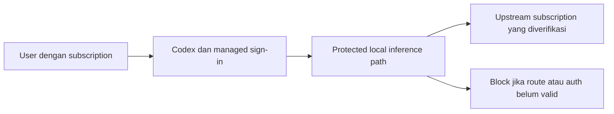

# Research Note: Codex subscription ChatGPT melalui gateway lokal

## Summary

Dokumentasi resmi mendukung sign-in ChatGPT pada custom provider/proxy, sehingga requirement subscription user memiliki jalur eksplorasi yang didukung dokumentasi. Native Codex subscription dan third-party Sign in with ChatGPT adalah jalur credential/entitlement yang berbeda. Belum ada runtime proof bahwa PromptShield mengintersepsi seluruh request subscription pada client target; OPEN-RESEARCH-001 tetap terbuka untuk bukti tersebut.

> Evidence only. Catatan ini tidak menggantikan approved BRD/PRD/FSD atau memilih policy autentikasi baru.

- **Status:** INCONCLUSIVE untuk runtime compatibility; evidence dokumentasi tersedia.
- **As of:** 2026-10-04.
- **Decision consumer:** `/sc-prd`, BRD-PROMPTSHIELD-V1:BREQ-015/DEC-001.
- **Decision owner/gate:** product/security owner; sebelum compatibility claim dan kontrak integrasi FSD difinalkan.
- **Return workflow:** `/sc-prd`.
- **Refresh trigger:** client version/auth/protocol/provider documentation berubah, atau evidence runtime tersedia.

## Research Question

Apakah requirement Codex subscription ChatGPT dapat dipertahankan pada desain gateway lokal tanpa menggantinya dengan jalur API key?

Scope: dokumen autentikasi/provider/gateway resmi, versi CLI lokal yang sebelumnya diamati, dan keputusan user. Non-goals: login akun, membaca credential cache, memanggil inference berbayar/quota, mengubah config, memasang proxy, atau menentukan endpoint dari asumsi.

## High-Level Design

Diagram merupakan candidate evidence view; route G→S belum dibuktikan runtime.

## Evidence Register

| ID | Finding | Sumber | Scope/version | Tanggal / confidence |
|---|---|---|---|---|
| EVID-001 | Codex mendukung subscription login dan custom provider yang menggunakan OpenAI auth melalui proxy; `requires_openai_auth` mengabaikan `env_key` | [Codex authentication](https://learn.chatgpt.com/docs/auth) | Dokumentasi live, bukan konfigurasi hasil uji | 2026-10-04 / high untuk documented behavior |
| EVID-002 | Provider base URL/auth/wire transport dapat dikonfigurasi; service login base URL bukan konfigurasi setiap tujuan network | [Configuration reference](https://learn.chatgpt.com/docs/config-file/config-reference) | Dokumentasi live | 2026-10-04 / high |
| EVID-003 | Gateway harus mempertahankan stream, continuation dan tool loop; health check tidak cukup | [Gateway compatibility](https://learn.chatgpt.com/docs/enterprise/gateway-compatibility) | Dokumen gateway umum; tidak otomatis membuktikan subscription endpoint | 2026-10-04 / high |
| EVID-004 | Third-party app-server dapat memakai token OAuth yang memang diotorisasi untuk ChatGPT plan usage | [Sign in with ChatGPT app-server](https://developers.openai.com/siwc/token-sharing-open-source/codex-app-server) | Jalur third-party berbeda dari native auth cache | 2026-10-04 / high |
| EVID-005 | CLI yang diamati sebelumnya adalah 0.160.0 | `rtk proxy codex --version`, BRD metadata | Lokal; belum ada interception test | 2026-10-04 / high untuk version observation |
| EVID-006 | API-key MVP ditunda dan subscription dipilih | Instruksi user `$sc-prd BRD Approved` | Business authority DEC-001 | 2026-10-04 / approved |

## Synthesis

**Facts:** ada documented custom-provider OpenAI-auth option. Dokumentasi third-party plan usage memerlukan token yang memang authorized untuk flow tersebut. Nilai URL atau flag sendiri tidak membuktikan access/usage billing maupun payload routing.

**Inference:** candidate native-login proxy path layak dipertahankan sebagai integration target. FSD dapat mengevaluasi provider/auth configuration resmi sambil mempertahankan login/refresh Codex dan separate local authorization.

**Contradiction resolved:** usulan API-key pada BRD revision 1.0 telah digantikan DEC-001. Bukan kegagalan keputusan subscription dan tidak menjadi fallback yang authorized.

**Unknowns:** endpoint/method/header/event aktual native subscription; cakupan compaction/counting/opaque context; stable conversation identity; refresh/expiry handling melalui proxy; supported transport/client version; validasi actual subscription entitlement. Custom third-party app OAuth registration tidak diasumsikan tersedia.

## Options And Recommendation

| Opsi | Evidence / trade-off | Verdict |
|---|---|---|
| Native Codex sign-in + protected local proxy | Sesuai DEC-001; EVID-001 mendukung arah; perlu runtime qualification | Candidate utama |
| Third-party plan-usage OAuth + custom app-server frontend | EVID-004; memerlukan flow authorization/registration dan frontend tambahan | Conditional; bukan pengganti native CLI/Desktop tanpa approval scope |
| API-key upstream | Dapat memiliki gateway umum tetapi bertentangan scope user saat ini | Deferred, bukan MVP fallback |

Recommendation: lanjut PRD dengan subscription requirement dan fail-closed compatibility gate. Jangan mengklaim login/token native bisa digunakan pada public API endpoint hanya karena contoh third-party app-server memakai endpoint tersebut.

## Delivery Impact

BRD DEC-001/BREQ-015 memegang policy; PRD mendefinisikan pengalaman login/entitlement/error dan tanpa API fallback. OPEN-RESEARCH-001: maintainer perlu bukti targeted synthetic payload, login refresh, protected route, turn/tool loop pada client target sebelum integration contract/release. Jangan menutup item ini dengan docs-only evidence.

Research ini read-only: tidak ada credential yang dibaca, login yang dijalankan, live inference atau perubahan akun/config. Local knowledge search untuk topik ini tidak menemukan record terkait. Verifikasi dokumen: `rtk node .agent/tools/doc-lint.mjs docs/research/2026-10-04-codex-subscription-gateway.md --advisory` selesai exit 0 tanpa structural findings; local Markdown links tersedia. Kesimpulan runtime tetap INCONCLUSIVE.
