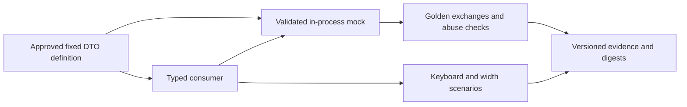

# Fixed offline control DTOs and terminal review evidence

## Summary

The PromptShield offline enabler uses one fixed machine definition for both sides of its DTO boundary. Contract tests and keyboard transcripts verify strict validation, correlated receipts and terminal review behavior while production qualification remains blocked.

## High-Level Design

## Problem
Materialize the approved PromptShield local control contract without depending on unqualified production transport/auth/model components.

## Symptoms
Initial behavioral RED checks detected absent fixed-field validation, mock CAS behavior, terminal dispositions and runnable fixtures. Additional RED checks exposed missing receipt correlation, implicit setup, nested Ctrl+C cancellation and terminal receipt preservation.

## Root cause
The approved prose contract had no executable DTO boundary or local interaction evidence. Structural schema validity alone also cannot enforce response correlation or pending-decision lifecycle.

## Solution
One fixed versioned JSON definition drives immutable typed DTO validation on both mock and consumer boundaries. Enforce strict fields/types/limits, correlated result discriminants, exact policy increments, monotonic snapshots and one terminal decision under a lock. Verify through synthetic golden exchanges and keyboard/plain transcripts at 80/120 columns; keep production authentication and provider qualification explicitly separate.

## Prevention
Reuse tests/contracts/test_local_contract.py and TEST-002 scenario suite after authorized contract changes; rebuild golden fixtures only within approved semantics. Never copy prototype code into production or interpret mock owner checks as OS authentication proof.

## Project
PromptShield GOAL-001

## Stack
Python standard library, fixed equivalent structured DTO definition

## Version
CONTRACT-001 1.0.0; fixture revision 1.0.0; observed Python 3.14.7
